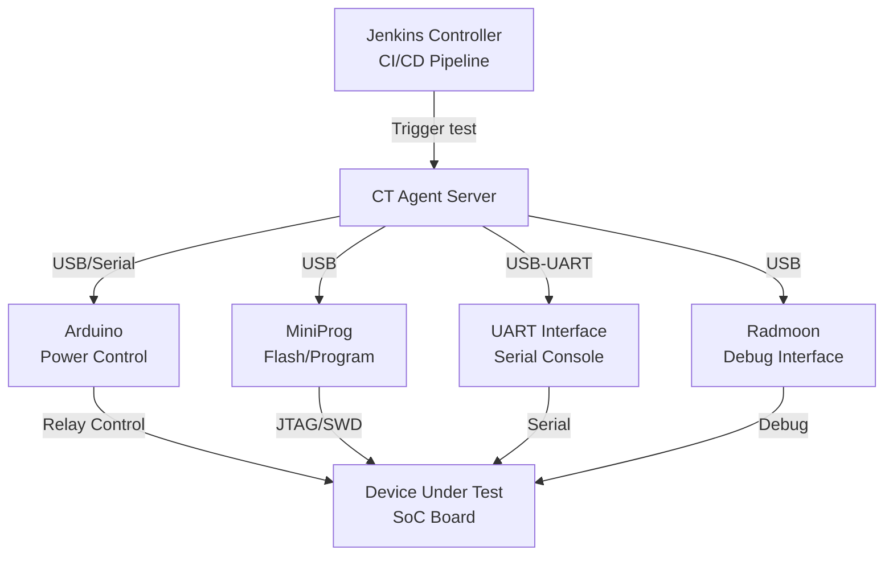

# Module 07: Hardware CT Lab — Peripherals
# மாடுல் 07: Hardware CT Lab — Arduino, MiniProg, UART, Radmoon

---

## 🎯 What? | என்ன?

**English:** Automate the setup of hardware-in-the-loop Continuous Testing (CT) labs — configuring Arduino controllers, MiniProg programmers, UART serial interfaces, and Radmoon peripherals for embedded SoC testing.

**தமிழ்:** Hardware-in-the-loop CT labs setup automate — Arduino controllers, MiniProg programmers, UART serial interfaces, Radmoon peripherals configure செய்வது embedded SoC testing-க்கு.

### Analogy | உதாரணம்
> Hospital ICU monitoring: Patient (SoC board) connected to monitors (UART), IV drip controller (Arduino for power), diagnostic tools (MiniProg for flashing). Nurse (Ansible) sets up all equipment consistently for every new patient.

---

## 📊 CT Lab Architecture



---

## 🛠️ CT Lab Host Configuration

```yaml
# roles/ct_lab_host/tasks/main.yml
---
# --- USB/Serial Permissions ---
- name: Install serial/USB tools
  apt:
    name:
      - picocom
      - minicom
      - screen
      - usbutils
      - libusb-1.0-0-dev
      - python3-serial
      - socat
    state: present

- name: Add CI user to dialout group (serial port access)
  user:
    name: "{{ ci_user }}"
    groups: [dialout, plugdev]
    append: true

# --- udev Rules (consistent device naming) ---
- name: Deploy udev rules for hardware peripherals
  template:
    src: 99-ct-lab.rules.j2
    dest: /etc/udev/rules.d/99-ct-lab.rules
  notify: Reload udev

# --- Arduino CLI ---
- name: Install Arduino CLI
  get_url:
    url: "https://downloads.arduino.cc/arduino-cli/arduino-cli_{{ arduino_cli_version }}_Linux_64bit.tar.gz"
    dest: /tmp/arduino-cli.tar.gz

- name: Extract Arduino CLI
  unarchive:
    src: /tmp/arduino-cli.tar.gz
    dest: /usr/local/bin/
    remote_src: true

- name: Initialize Arduino CLI
  command: arduino-cli core update-index
  become_user: "{{ ci_user }}"
  changed_when: false

- name: Install Arduino cores
  command: "arduino-cli core install {{ item }}"
  loop:
    - arduino:avr
    - arduino:megaavr
  become_user: "{{ ci_user }}"
  changed_when: false

# --- MiniProg (Cypress/Infineon PSoC Programmer) ---
- name: Install MiniProg dependencies
  apt:
    name: [libusb-1.0-0, libhidapi-hidraw0]
    state: present

- name: Deploy MiniProg tools
  copy:
    src: "miniprog/{{ item }}"
    dest: "/opt/miniprog/{{ item }}"
    mode: '0755'
  loop:
    - fw-loader
    - programmer-cli

- name: Deploy MiniProg udev rule
  copy:
    content: |
      # Cypress MiniProg4
      SUBSYSTEM=="usb", ATTR{idVendor}=="04b4", ATTR{idProduct}=="f15b", MODE="0666", GROUP="plugdev"
      # Infineon DAPLink
      SUBSYSTEM=="usb", ATTR{idVendor}=="0d28", ATTR{idProduct}=="0204", MODE="0666", GROUP="plugdev"
    dest: /etc/udev/rules.d/99-miniprog.rules
  notify: Reload udev

  handlers:
    - name: Reload udev
      shell: udevadm control --reload-rules && udevadm trigger
```

---

## 🛠️ udev Rules Template

```jinja2
# templates/99-ct-lab.rules.j2
# Consistent device naming for CT lab peripherals

# Arduino boards (by serial number → fixed symlink)

SUBSYSTEM=="tty", ATTRS{serial}=="{{ device.serial }}", SYMLINK+="{{ device.symlink }}", MODE="0666"


# UART adapters (FTDI/CP2102/CH340)

SUBSYSTEM=="tty", ATTRS{serial}=="{{ device.serial }}", SYMLINK+="{{ device.symlink }}", MODE="0666"


# Radmoon debug interface
SUBSYSTEM=="usb", ATTR{idVendor}=="{{ radmoon_vendor_id }}", ATTR{idProduct}=="{{ radmoon_product_id }}", MODE="0666", GROUP="plugdev", SYMLINK+="radmoon%n"
```

```yaml
# group_vars/ct_lab.yml
ct_devices:
  arduino:
    - serial: "55730323732351E0B121"
      symlink: "arduino-power-ctrl"
    - serial: "55730323732351E0B122"  
      symlink: "arduino-relay-board"
  uart:
    - serial: "FTDI_FT232R_A50285BI"
      symlink: "uart-dut-console"
    - serial: "FTDI_FT232R_A50285BJ"
      symlink: "uart-dut-debug"

radmoon_vendor_id: "1a86"
radmoon_product_id: "7523"
```

---

## 🛠️ UART Configuration

```yaml
# roles/ct_lab_host/tasks/uart.yml
---
- name: Create UART monitor scripts
  template:
    src: uart-monitor.sh.j2
    dest: "/opt/ct-lab/uart-monitor-{{ item.name }}.sh"
    mode: '0755'
  loop: "{{ uart_interfaces }}"

- name: Deploy UART systemd services (auto-start logging)
  template:
    src: uart-logger.service.j2
    dest: "/etc/systemd/system/uart-{{ item.name }}.service"
  loop: "{{ uart_interfaces }}"
  notify: Reload systemd

- name: Start UART loggers
  service:
    name: "uart-{{ item.name }}"
    state: started
    enabled: true
  loop: "{{ uart_interfaces }}"
```

```jinja2
# templates/uart-logger.service.j2
[Unit]
Description=UART Logger for {{ item.name }}
After=dev-{{ item.symlink }}.device

[Service]
ExecStart=/usr/bin/socat /dev/{{ item.symlink }},b{{ item.baud_rate }},raw,echo=0 \
  OPEN:/var/log/ct-lab/{{ item.name }}.log,creat,append
Restart=always
User={{ ci_user }}

[Install]
WantedBy=multi-user.target
```

---

## 📋 Cheat Sheet | விரைவு குறிப்பு

```
┌──────────────────────────────────────────────────┐
│    HARDWARE CT LAB PERIPHERALS CHEAT SHEET       │
├──────────────────────────────────────────────────┤
│ DEVICE MANAGEMENT:                               │
│   udev rules = consistent device names           │
│   SYMLINK = /dev/arduino-power-ctrl (not ttyUSB0)│
│   Serial-based matching (survives replug!)       │
│                                                  │
│ PERIPHERALS:                                     │
│   Arduino = relay control (power on/off DUT)     │
│   MiniProg = flash firmware via JTAG/SWD         │
│   UART    = serial console (logs, debug)         │
│   Radmoon = specialized debug interface          │
│                                                  │
│ PERMISSIONS:                                     │
│   dialout group = serial port access             │
│   plugdev group = USB device access              │
│   MODE="0666" in udev rules                     │
│                                                  │
│ TROUBLESHOOTING:                                 │
│   lsusb = list USB devices                       │
│   dmesg | grep tty = see device attach           │
│   udevadm info /dev/ttyUSB0 = device attrs      │
│   udevadm trigger = reload rules                │
└──────────────────────────────────────────────────┘
```

---

## 🎤 Interview Q&A | நேர்முகத் தேர்வு

**Q: How do you manage hardware peripherals reliably in CI?**
- udev rules with serial number matching → consistent device names regardless of USB port
- Symlinks (`/dev/arduino-power-ctrl`) instead of volatile names (`/dev/ttyUSB0`)
- Ansible ensures all CT racks have identical configuration
- Health check playbook verifies all devices are connected before tests

**Q: What happens if a USB device disconnects mid-test?**
- systemd service auto-restarts (Restart=always)
- Test framework detects timeout on serial read → marks test as INFRA_FAILURE (not test failure)
- Alert triggers for hardware team to check physical connection

---

## ✅ Self-Check | சுய மதிப்பீடு

- [ ] udev rules for persistent device naming write முடியும்
- [ ] Arduino CLI setup automate முடியும்
- [ ] UART logging service configure முடியும்
- [ ] CT lab host from scratch provision முடியும்
