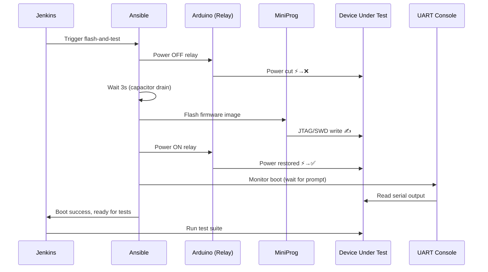

# Module 08: Power Sequencing & Flash Orchestration
# மாடுல் 08: Power Sequencing & Flash Orchestration

---

## 🎯 What? | என்ன?

**English:** Automate the physical test cycle: power off DUT → flash new firmware → power on → wait for boot → run tests → collect results. Arduino controls relays for power sequencing.

**தமிழ்:** Physical test cycle automate: DUT power off → firmware flash → power on → boot wait → tests run → results collect. Arduino relays control power.

### Analogy | உதாரணம்
> Factory assembly line: Robot arm (Arduino) positions the part (power cycle) → welder (MiniProg) programs it → inspector (UART) checks output → conveyor moves to next station.

---

## 📊 Flash & Test Sequence



---

## 🛠️ Power Control Role

```yaml
# roles/power_control/tasks/main.yml
---
- name: Upload Arduino power control sketch
  template:
    src: power_relay.ino.j2
    dest: /tmp/power_relay/power_relay.ino

- name: Compile and upload Arduino sketch
  command: >
    arduino-cli compile --upload
    --fqbn arduino:avr:mega
    --port /dev/arduino-power-ctrl
    /tmp/power_relay/
  when: flash_arduino | default(false)

# Power control via serial commands to Arduino
- name: Power OFF DUT
  command: >
    python3 /opt/ct-lab/power_control.py
    --device /dev/arduino-power-ctrl
    --action off
    --relay {{ dut_relay_channel }}
  register: power_off_result
  
- name: Wait for capacitor drain
  pause:
    seconds: "{{ power_drain_wait | default(3) }}"

- name: Power ON DUT
  command: >
    python3 /opt/ct-lab/power_control.py
    --device /dev/arduino-power-ctrl
    --action on
    --relay {{ dut_relay_channel }}
```

```python
# files/power_control.py (deployed by Ansible)
#!/usr/bin/env python3
"""Arduino relay control via serial protocol."""
import serial
import argparse
import sys
import time

def control_relay(device, relay, action):
    """Send relay command to Arduino."""
    with serial.Serial(device, 9600, timeout=5) as ser:
        time.sleep(2)  # Arduino reset after serial connect
        cmd = f"RELAY:{relay}:{action.upper()}\n"
        ser.write(cmd.encode())
        response = ser.readline().decode().strip()
        if response != "OK":
            print(f"ERROR: Expected OK, got: {response}", file=sys.stderr)
            sys.exit(1)
        print(f"Relay {relay} → {action}")

if __name__ == "__main__":
    parser = argparse.ArgumentParser()
    parser.add_argument("--device", required=True)
    parser.add_argument("--relay", type=int, required=True)
    parser.add_argument("--action", choices=["on", "off"], required=True)
    args = parser.parse_args()
    control_relay(args.device, args.relay, args.action)
```

---

## 🛠️ Flash Orchestration

```yaml
# roles/flash_firmware/tasks/main.yml
---
- name: Download firmware image
  get_url:
    url: "{{ firmware_url }}"
    dest: "/tmp/firmware/{{ firmware_filename }}"
    checksum: "sha256:{{ firmware_sha256 }}"

- name: Power OFF DUT before flash
  include_role:
    name: power_control
    tasks_from: power_off

- name: Flash firmware via MiniProg
  command: >
    /opt/miniprog/programmer-cli
    --device {{ target_device }}
    --interface {{ flash_interface | default('swd') }}
    --file /tmp/firmware/{{ firmware_filename }}
    --verify
  register: flash_result
  retries: 3
  delay: 5
  until: flash_result.rc == 0

- name: Power ON DUT after flash
  include_role:
    name: power_control
    tasks_from: power_on

- name: Wait for boot (monitor UART)
  command: >
    python3 /opt/ct-lab/wait_for_boot.py
    --device /dev/uart-dut-console
    --pattern "{{ boot_complete_pattern }}"
    --timeout {{ boot_timeout | default(60) }}
  register: boot_result

- name: Verify boot success
  assert:
    that: boot_result.rc == 0
    fail_msg: "DUT failed to boot after flash! Check UART logs."
```

```python
# files/wait_for_boot.py
#!/usr/bin/env python3
"""Wait for boot completion pattern on UART."""
import serial
import argparse
import sys
import time

def wait_for_pattern(device, pattern, timeout, baud=115200):
    """Monitor serial until pattern appears or timeout."""
    start = time.time()
    buffer = ""
    with serial.Serial(device, baud, timeout=1) as ser:
        while (time.time() - start) < timeout:
            line = ser.readline().decode(errors='replace')
            if line:
                buffer += line
                print(line, end='')  # Stream to Jenkins console
                if pattern in line:
                    print(f"\n✅ Boot complete! Pattern '{pattern}' found.")
                    return 0
    print(f"\n❌ Timeout ({timeout}s) waiting for '{pattern}'")
    return 1

if __name__ == "__main__":
    parser = argparse.ArgumentParser()
    parser.add_argument("--device", required=True)
    parser.add_argument("--pattern", required=True)
    parser.add_argument("--timeout", type=int, default=60)
    args = parser.parse_args()
    sys.exit(wait_for_pattern(args.device, args.pattern, args.timeout))
```

---

## 🛠️ Full Test Cycle Playbook

```yaml
# playbooks/ct_flash_and_test.yml
---
- name: Flash & Test Cycle
  hosts: "{{ target_rack }}"
  become: true
  vars:
    firmware_url: "{{ lookup('env', 'FIRMWARE_URL') }}"
    firmware_sha256: "{{ lookup('env', 'FIRMWARE_SHA256') }}"
    
  tasks:
    - name: Flash firmware
      include_role:
        name: flash_firmware
        
    - name: Run smoke tests
      command: >
        python3 /opt/ct-lab/run_tests.py
        --suite smoke
        --uart /dev/uart-dut-console
        --timeout 300
      register: smoke_result
      
    - name: Collect UART logs
      fetch:
        src: /var/log/ct-lab/uart-dut-console.log
        dest: "{{ artifacts_dir }}/uart-{{ inventory_hostname }}.log"
        flat: true
      
    - name: Power OFF DUT (cleanup)
      include_role:
        name: power_control
        tasks_from: power_off
      when: power_off_after_test | default(true)
```

---

## 📋 Cheat Sheet | விரைவு குறிப்பு

```
┌──────────────────────────────────────────────────┐
│    POWER & FLASH ORCHESTRATION CHEAT SHEET       │
├──────────────────────────────────────────────────┤
│ TEST CYCLE:                                      │
│   1. Power OFF (relay via Arduino)               │
│   2. Wait (capacitor drain, 2-3s)               │
│   3. Flash (MiniProg JTAG/SWD)                  │
│   4. Power ON                                    │
│   5. Wait for boot (UART pattern match)          │
│   6. Run tests                                   │
│   7. Collect logs                                │
│   8. Power OFF (cleanup)                         │
│                                                  │
│ RELIABILITY:                                     │
│   Flash with retries (3 attempts)                │
│   Verify after flash (--verify flag)             │
│   Boot timeout (don't wait forever)              │
│   SHA256 checksum on firmware download           │
│                                                  │
│ ARDUINO PROTOCOL:                                │
│   Serial 9600 baud                               │
│   Command: "RELAY:1:ON\n" / "RELAY:1:OFF\n"     │
│   Response: "OK\n" / "ERROR:msg\n"              │
└──────────────────────────────────────────────────┘
```

---

## 🎤 Interview Q&A | நேர்முகத் தேர்வு

**Q: How do you automate hardware-in-the-loop testing?**
- Arduino-based relay control for power cycling (serial protocol)
- MiniProg/JTAG for firmware flashing (with verify + retry)
- UART monitoring for boot validation (pattern matching with timeout)
- Ansible orchestrates the full sequence (power → flash → boot → test)
- Jenkins triggers the Ansible playbook per-patch or nightly

**Q: What if the DUT doesn't boot after flash?**
- Timeout on UART pattern match → mark as FLASH_FAILURE
- Retry flash (up to 3 times with delay)
- If still failing → alert hardware team, skip this DUT, use another rack
- UART logs collected as artifacts for post-mortem

---

## ✅ Self-Check | சுய மதிப்பீடு

- [ ] Power sequencing via Arduino explain முடியும்
- [ ] Flash orchestration with retry implement முடியும்
- [ ] Boot detection via UART implement முடியும்
- [ ] Full test cycle design முடியும்
