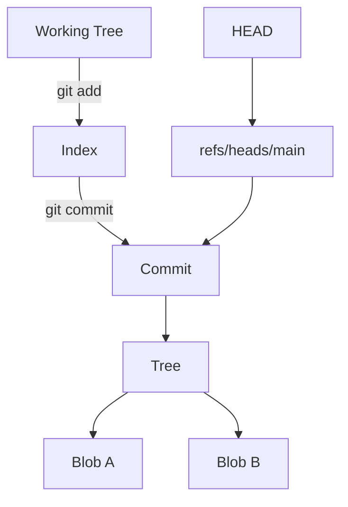

# Module 01: Git Mental Model and Internals

## Why this matters for your profile
You worked on complex CI/CT pipelines across AOSP, QNX, and AUTOSAR. Interviewers will expect you to explain Git beyond commands, especially for traceability and release auditability.

## Concept clarity
Git is a content-addressed snapshot system.

Core objects:
- Blob: file content
- Tree: directory structure
- Commit: snapshot metadata with parent links
- Tag: named pointer, often used for releases

Core areas:
- Working tree: files on disk
- Index: staged content for next commit
- Repository: object database and references

## Diagram: object and pointer model

## Command mastery
Run in order:

    mkdir m1 && cd m1
    git init
    git config user.name "Your Name"
    git config user.email "you@example.com"
    echo "v1" > app.txt
    git status
    git add app.txt
    git commit -m "feat: initial snapshot"
    echo "v2" >> app.txt
    git diff
    git add app.txt
    git diff --staged
    git commit -m "feat: update app"
    git log --oneline --graph --decorate
    git cat-file -p HEAD

## Practical lab: explain every state change
Goal: after each command, explain what changed in working tree, index, and commit graph.

Pass criteria:
- You can predict git status before running it.
- You can describe what HEAD points to.
- You can explain staged vs unstaged differences.

## Mock interview
1. What is the index and why is it useful?
Strong answer: It is a staging layer that allows precise commit composition, which is critical for clean audit trails in CI/CD.

2. What happens during git commit internally?
Strong answer: Git creates or reuses blob/tree objects, creates a commit object referencing the tree and parent, then moves the current branch pointer.

3. Why does this matter in enterprise DevSecOps?
Strong answer: Clean commit granularity improves traceability, policy gate debugging, and release confidence.

## Hands-on challenge
- Create three commits.
- Use git show on each.
- Draw your own commit graph and narrate it in 60 seconds.