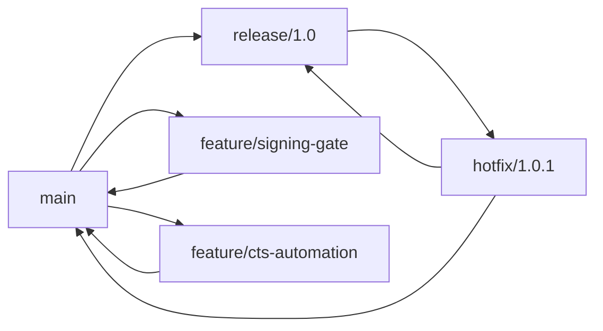

# Module 03: Branching and Integration Patterns

## Why this matters for your profile
You handled multi-stream build and validation workflows. Branch strategy quality affects release safety, conflict frequency, and CI cost.

## Concept clarity
Common branch models:
- Trunk-based: short-lived feature branches, frequent integration
- GitFlow-like: develop/release/hotfix branches
- Hybrid enterprise: trunk with controlled release branches

Recommended for your domain:
- Trunk-oriented development
- Short-lived feature branches
- Release branches for validation hardening

## Diagram: branch and release flow

## Command mastery

    git switch -c feature/secure-image-signing
    git push -u origin feature/secure-image-signing
    git switch main
    git pull --ff-only
    git merge --no-ff feature/secure-image-signing
    git branch -d feature/secure-image-signing

Release and hotfix:

    git switch -c release/2026.07
    git switch -c hotfix/2026.07.1 release/2026.07

## Practical lab: multi-stage release simulation
1. Create main, feature, and release branches.
2. Merge feature into main.
3. Create hotfix from release branch.
4. Merge hotfix back to both release and main.

Pass criteria:
- No orphan fixes.
- Main and release both contain hotfix.

## Mock interview
1. How do you choose branch strategy?
Strong answer: based on release cadence, compliance needs, and integration frequency; in CI-intensive environments I prefer trunk with short-lived branches.

2. Why avoid long-lived feature branches?
Strong answer: they increase merge complexity, delay feedback, and hide integration risk.

3. How do you control release stability?
Strong answer: branch protection, required CI gates, and strict cherry-pick policy for release branches.

## Hands-on challenge
- Simulate two parallel features plus one hotfix.
- Generate a graph view and explain final merge topology in 90 seconds.