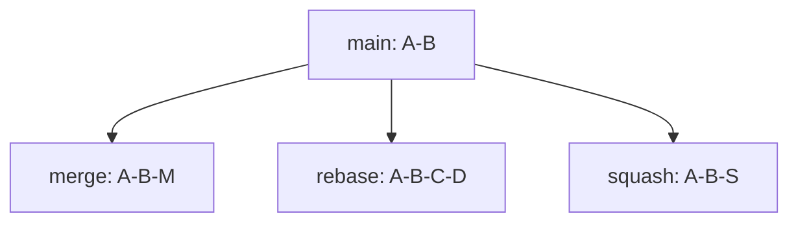

# Module 04: Merge vs Rebase vs Squash

## Why this matters for your profile
Interviewers test your judgment, not only syntax. In enterprise pipelines, wrong integration choice can harm auditability or incident recovery.

## Decision framework
Use merge when:
- You want explicit branch history
- Team values topology visibility

Use rebase when:
- You want linear local history before review
- You are cleaning your own feature branch

Use squash when:
- You want one final logical commit on target branch
- Intermediate commits are noisy

Avoid rebasing shared/public branches unless team policy allows and everyone is aligned.

## Diagram: same work, different outcomes

## Command mastery
Merge:

    git switch main
    git merge --no-ff feature/x

Rebase local branch:

    git switch feature/x
    git rebase main

Interactive rebase:

    git rebase -i HEAD~5

Squash merge:

    git switch main
    git merge --squash feature/x
    git commit -m "feat: x complete"

## Practical lab: compare all three outcomes
1. Create one feature branch with three commits.
2. Integrate once with merge.
3. Reset practice repo and integrate with rebase.
4. Reset and integrate with squash.
5. Compare git log --graph output for each.

Pass criteria:
- You can explain history trade-offs and rollback implications.

## Mock interview
1. Merge or rebase for enterprise CI/CD?
Strong answer: rebase on feature branches for clean review; merge on protected branches for traceable integration events.

2. When is squash harmful?
Strong answer: when intermediate commits carry meaningful forensic context needed for audits or root-cause analysis.

3. What is your safe policy?
Strong answer: never rewrite protected branch history; rebase only unpublished or team-approved branches.

## Hands-on challenge
- Prepare a feature branch with intentional noisy commits.
- Use interactive rebase to produce clean history.
- Defend your integration choice in a mock panel answer.