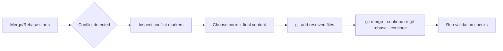

# Module 05: Conflict Resolution and Recovery Basics

## Why this matters for your profile
With parallel firmware, CT, and release streams, merge conflicts are guaranteed. Interviewers check whether you resolve conflicts safely and explain decisions.

## Concept clarity
Conflict types:
- Content conflict: same lines changed
- Rename/delete conflict
- Binary conflict

Resolution principles:
- Understand intent from both sides
- Resolve with minimal surprise
- Validate with build/tests
- Document in commit message if non-obvious

## Diagram: conflict lifecycle

## Command mastery

    git merge feature/x
    git status
    git diff
    git add <resolved-file>
    git merge --continue

For rebase:

    git rebase main
    git rebase --continue
    git rebase --abort

Useful helpers:

    git checkout --ours <file>
    git checkout --theirs <file>

## Practical lab: deliberate conflict simulation
1. Create branch A and B from same base.
2. Edit same lines differently.
3. Merge and resolve conflict manually.
4. Repeat with rebase.

Pass criteria:
- You can explain why final content is correct.
- No conflict markers remain.

## Mock interview
1. How do you reduce future conflicts?
Strong answer: short-lived branches, frequent sync with main, and clear ownership boundaries for high-churn files.

2. Ours vs theirs during rebase can be confusing. Explain.
Strong answer: during rebase, meanings are relative to replay context; I verify with diff and content intent, never by memory alone.

3. What is your safety check after conflict resolution?
Strong answer: run unit/integration checks and review final diff before concluding.

## Hands-on challenge
- Resolve one content conflict and one rename conflict.
- Write a one-paragraph explanation of your resolution logic.