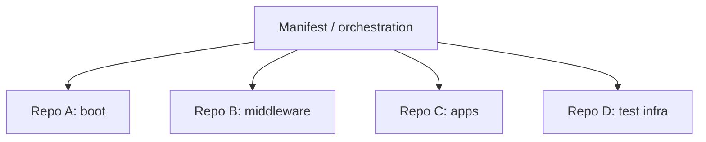

# Module 09: Monorepo and Multi-repo Strategies

## Why this matters for your profile
AOSP and embedded programs often involve many repositories with shared release windows and strict compatibility needs.

## Concept clarity
Approaches:
- Monorepo: one repository for many components
- Multi-repo: many repos with orchestration layer

Mechanisms you should know:
- Git submodule
- Git subtree
- Manifest-driven orchestration (common in AOSP ecosystems)

Trade-off summary:
- Monorepo improves atomic cross-component changes.
- Multi-repo improves ownership boundaries and independent release cycles.

## Diagram: orchestration model

## Command mastery
Submodule basics:

    git submodule add <url> third_party/libx
    git submodule update --init --recursive
    git submodule foreach 'git status'

Subtree basics:

    git subtree add --prefix=vendor/libx <url> main --squash
    git subtree pull --prefix=vendor/libx <url> main --squash

## Practical lab: dependency update workflow
1. Add a dependency via submodule.
2. Pin and update to a new commit.
3. Simulate CI break from dependency drift and rollback.

Pass criteria:
- You can explain pinning and reproducibility.
- You can justify submodule vs subtree for a scenario.

## Mock interview
1. Submodule vs subtree: when do you pick each?
Strong answer: submodule for strict external ownership and pinning; subtree for simpler contributor workflow when history import is acceptable.

2. How do you maintain reproducible multi-repo builds?
Strong answer: locked revisions via manifest/pinning, artifact immutability, and release tag baselines.

3. What is the common failure mode in multi-repo integration?
Strong answer: version skew across repos; solved with synchronized integration windows and compatibility tests.

## Hands-on challenge
- Build a small parent repo with one submodule.
- Break compatibility intentionally.
- Roll back cleanly and document the control point.