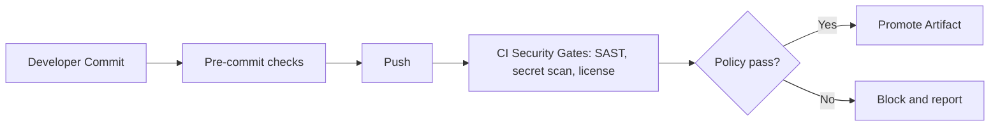

# Module 10: Git Security and Compliance

## Why this matters for your profile
Your CV highlights OPA, secret governance, signing, and policy gates. This module aligns Git behavior with enterprise security controls.

## Concept clarity
Security controls around Git:
- Signed commits and tags
- Secret scanning pre-commit and in CI
- Commit policy enforcement via hooks and server rules
- Protected branches and mandatory reviews

Compliance outcomes:
- Traceability
- Non-repudiation
- Preventing credential leaks

## Diagram: policy gate pipeline

## Command mastery
Signing and verification:

    git config commit.gpgsign true
    git commit -S -m "feat: signed change"
    git tag -s v1.2.0 -m "signed release"
    git verify-commit <commit>
    git verify-tag v1.2.0

Leak hygiene:

    git log --all -- .env
    git rev-list --all

## Practical lab: secure workflow simulation
1. Enable commit signing locally.
2. Create one signed commit and signed tag.
3. Add a fake secret and detect it.
4. Remove it using approved remediation path in a practice repo.

Pass criteria:
- You can prove signature verification.
- You can explain secret incident response steps.

## Mock interview
1. What is your approach if a secret is committed?
Strong answer: rotate secret first, contain access, then clean history if policy requires, and notify governance stakeholders.

2. Why sign commits/tags?
Strong answer: to guarantee author authenticity and release provenance in regulated environments.

3. How does Git policy integrate with DevSecOps gates?
Strong answer: local hooks reduce developer feedback loop time; CI/server gates provide enforceable organizational control.

## Hands-on challenge
- Build a pre-commit hook that rejects API-key-like patterns.
- Demonstrate blocked commit and corrected commit.