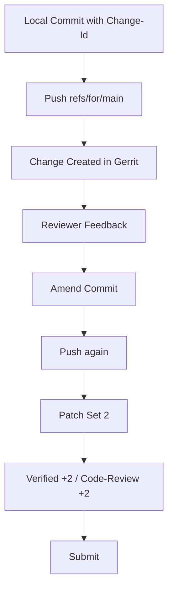

# Module 11: Gerrit Workflow Mastery

## Why this matters for your profile
You migrated and operated Gerrit-centric workflows, so interviewers may go deep on patch-set lifecycle and review discipline.

## Concept clarity
Gerrit essentials:
- Change is identified by Change-Id
- Multiple patch sets belong to one review change
- Submit strategy may vary by organization

Typical flow:
- Commit with Change-Id
- Push to refs/for/<branch>
- Update patch sets based on review

## Diagram: patch set lifecycle

## Command mastery

    scp -p -P 29418 user@gerrit.example.com:hooks/commit-msg .git/hooks/
    chmod +x .git/hooks/commit-msg
    git commit -m "feat: add validation stage"
    git push origin HEAD:refs/for/main

Patch set update:

    git commit --amend
    git push origin HEAD:refs/for/main

## Practical lab: review iteration simulation
1. Install commit-msg hook.
2. Create a change and push to refs/for/main.
3. Amend based on mock reviewer comments.
4. Push as next patch set preserving Change-Id.

Pass criteria:
- Same Change-Id across patch sets.
- Clean reviewer-friendly delta.

## Mock interview
1. Why is Change-Id critical?
Strong answer: it connects iterations as one logical review unit and preserves review history across patch sets.

2. How do you avoid noisy patch sets?
Strong answer: keep amendments focused, avoid unrelated reformatting, and use range-diff to show only intended changes.

3. What are common Gerrit anti-patterns?
Strong answer: pushing unrelated commits in one change, losing Change-Id, and ignoring CI verification feedback loops.

## Hands-on challenge
- Simulate three patch sets for one logical change.
- Write reviewer notes for each patch set delta.