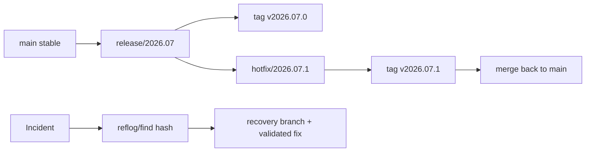

# Module 12: Release Engineering and Disaster Recovery

## Why this matters for your profile
Release traceability and rapid recovery are central in embedded DevSecOps, especially for firmware and multi-stage validation pipelines.

## Concept clarity
Release controls:
- Release branches with strict admission policy
- Annotated/signed tags for immutable release points
- Cherry-pick-only fixes after branch freeze

Disaster scenarios:
- Bad rebase on shared branch
- Wrong force push
- Deleted branch with pending fixes
- Breaking hotfix merged incorrectly

## Diagram: release and recovery flow

## Command mastery

    git switch -c release/2026.07
    git tag -a v2026.07.0 -m "release baseline"
    git cherry-pick <fix-commit>
    git tag -a v2026.07.1 -m "hotfix release"
    git reflog
    git checkout -b rescue/<ticket> <hash>

Incident safety:

    git fetch --all --prune
    git branch backup/main origin/main

## Practical lab: release freeze and emergency fix
1. Create release branch and baseline tag.
2. Deliver one approved hotfix using cherry-pick.
3. Tag patched release.
4. Simulate bad push and recover using reflog and backup branch.

Pass criteria:
- Release branch contains only approved fixes.
- Recovery path is documented and reproducible.

## Mock interview
1. How do you guarantee release provenance?
Strong answer: signed tags, immutable artifact references, and CI evidence linked to commit/tag IDs.

2. How do you handle an emergency fix during release freeze?
Strong answer: scoped cherry-pick with risk assessment, targeted validation, and mandatory back-merge to main.

3. What is your first action after a destructive Git incident?
Strong answer: stop further pushes, capture current refs, fetch remote state, and recover from reflog/backup pointers methodically.

## Hands-on challenge
- Run a timed recovery drill: recover a lost branch in under 10 minutes.
- Present the incident timeline and corrective actions like an SRE postmortem.