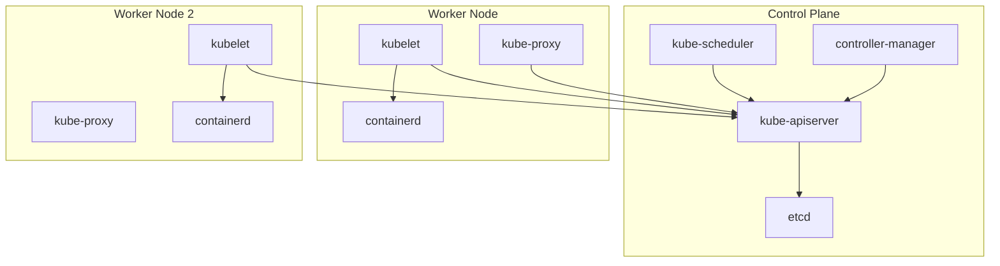

# Module 01: Kubernetes Architecture & Internals

## Why this matters for your profile
As a Technical Architect managing AKS/GKE clusters and on-prem Kubernetes for CI/CT workloads, interviewers expect you to explain cluster internals, not just `kubectl` commands. You need to articulate why components exist and how they interact.

## Concept Clarity

### Control Plane Components
| Component | Purpose |
|-----------|---------|
| kube-apiserver | REST API gateway, central hub for all operations |
| etcd | Distributed key-value store (cluster state) |
| kube-scheduler | Assigns pods to nodes based on constraints |
| kube-controller-manager | Reconciliation loops (Deployment, ReplicaSet, Node, etc.) |
| cloud-controller-manager | Cloud-specific logic (load balancers, routes, volumes) |

### Node Components
| Component | Purpose |
|-----------|---------|
| kubelet | Node agent — ensures containers are running per PodSpec |
| kube-proxy | Network proxy — maintains iptables/IPVS rules for Services |
| Container runtime | CRI-compliant (containerd, CRI-O) — runs containers |

### Key Abstractions
- **Declarative model:** Desired state → reconciliation → actual state
- **API resources:** Objects stored in etcd, versioned via API groups
- **Controllers:** Watch → Diff → Act loop
- **Admission chain:** Authentication → Authorization → Admission (Mutating → Validating)

## Diagram: Cluster Architecture



## Command Mastery

### Cluster inspection
```bash
# Cluster info
kubectl cluster-info
kubectl get nodes -o wide
kubectl get componentstatuses  # deprecated but useful to know

# API resources and versions
kubectl api-resources | head -20
kubectl api-versions

# Describe a node
kubectl describe node <node-name>

# Check control plane pods (kubeadm clusters)
kubectl get pods -n kube-system

# View etcd health (if you have access)
kubectl get endpoints -n kube-system kube-scheduler -o yaml
```

### Working with the API directly
```bash
# Proxy to API server
kubectl proxy --port=8080 &
curl http://localhost:8080/api/v1/namespaces

# Raw API call
kubectl get --raw /healthz
kubectl get --raw /apis/apps/v1

# Watch mechanism (fundamental to controllers)
kubectl get pods -w

# Explain any resource
kubectl explain pod.spec.containers
kubectl explain deployment.spec.strategy
```

### etcd operations (for deep understanding)
```bash
# List all keys (if etcd access available)
ETCDCTL_API=3 etcdctl get / --prefix --keys-only | head -20

# Backup etcd (critical for DR)
ETCDCTL_API=3 etcdctl snapshot save backup.db \
  --endpoints=https://127.0.0.1:2379 \
  --cacert=/etc/kubernetes/pki/etcd/ca.crt \
  --cert=/etc/kubernetes/pki/etcd/server.crt \
  --key=/etc/kubernetes/pki/etcd/server.key
```

## Practical Lab

### Setup (using kind)
```bash
# Install kind
curl -Lo ./kind https://kind.sigs.k8s.io/dl/latest/kind-linux-amd64
chmod +x ./kind && sudo mv ./kind /usr/local/bin/kind

# Create multi-node cluster
cat <<EOF | kind create cluster --config=-
kind: Cluster
apiVersion: kind.x-k8s.io/v1alpha4
nodes:
- role: control-plane
- role: worker
- role: worker
EOF

kubectl get nodes
```

### Exercises
1. Identify all control plane components and their current status
2. Use `kubectl get events --sort-by=.metadata.creationTimestamp` to trace cluster bootstrap
3. Explain what happens step-by-step when you run `kubectl create deployment nginx --image=nginx`
4. Crash a kubelet (docker stop) and observe how the control plane reacts
5. Backup and restore etcd on the kind cluster

### Pass Criteria
- You can draw the request flow from `kubectl apply` to container start
- You can explain the admission chain
- You can describe the watch/reconciliation pattern
- You know what happens when etcd goes down

## Mock Interview Questions

1. **Walk me through what happens when you run `kubectl apply -f deployment.yaml`.**
   - Expected: API server → authentication → authorization → admission webhooks → etcd write → controller picks up → scheduler assigns → kubelet pulls image → container starts

2. **How does etcd achieve consensus and why does it matter?**
   - Expected: Raft consensus, quorum (n/2+1), why odd number of etcd nodes, impact on HA

3. **What's the difference between a controller and an operator?**
   - Expected: Controller is a reconciliation loop; operator is a controller with domain-specific knowledge, often managing stateful apps via CRDs

4. **If the API server goes down, what still works? What breaks?**
   - Expected: Running pods continue, kubelet keeps containers alive, but no new scheduling, no scaling, no updates

5. **How would you design a highly available control plane for production?**
   - Expected: 3+ control plane nodes, external etcd or stacked, load balancer for API, anti-affinity rules

6. **Explain the admission controller chain. How have you used it?**
   - Expected: Mutating → Validating webhooks, OPA Gatekeeper, Pod Security Admission, real examples from your work

7. **What happens to pods when a node becomes NotReady?**
   - Expected: Node controller marks NotReady → pod eviction timeout (5 min default) → pods rescheduled if part of controller
