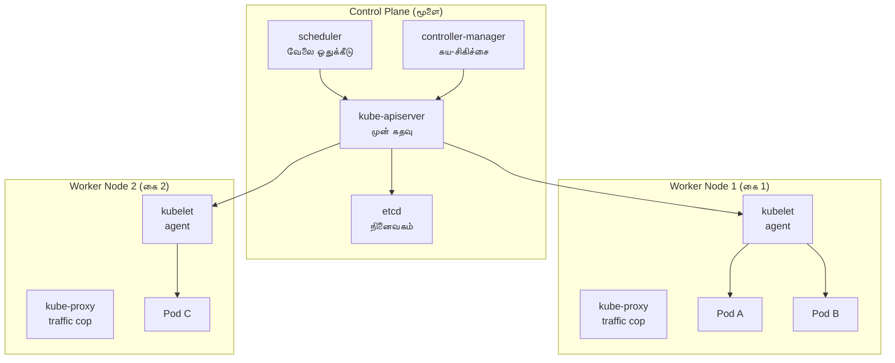

# Module 01: Kubernetes Architecture & Internals
# மாடுல் 01: குபெர்நெடிஸ் கட்டமைப்பு & உட்கூறுகள்

---

## 🎯 What is Kubernetes? | குபெர்நெடிஸ் என்றால் என்ன?

**English:** Kubernetes (K8s) is a system that manages your containers automatically — starting them, stopping them, scaling them, and healing them when they fail.

**தமிழ்:** Kubernetes என்பது உங்கள் containers-ஐ தானாகவே நிர்வகிக்கும் ஒரு system — அவற்றை start செய்வது, stop செய்வது, scale செய்வது, fail ஆனால் மீண்டும் run செய்வது.

### Real-World Analogy | நிஜ உலக உதாரணம்

Think of Kubernetes as a **restaurant manager (மேலாளர்)**:

| Restaurant | Kubernetes |
|-----------|-----------|
| Manager decides which chef cooks what | **Scheduler** assigns pods to nodes |
| Manager checks if chefs are working | **Kubelet** monitors containers |
| Menu (what customers want) | **Desired state** (YAML manifests) |
| Kitchen (where food is made) | **Worker nodes** (run containers) |
| Recipe book (how to cook) | **etcd** (stores cluster state) |
| Front desk takes orders | **API Server** (receives requests) |

> 💡 **தமிழ்:** ஒரு உணவகத்தில் manager எப்படி எல்லா chef-களையும் manage செய்கிறாரோ, அப்படித்தான் Kubernetes எல்லா containers-ஐயும் manage செய்கிறது.

---

## 🏗️ Architecture Overview | கட்டமைப்பு பொது பார்வை

### The Two Parts | இரண்டு பகுதிகள்

```
Kubernetes Cluster = Control Plane (Brain) + Worker Nodes (Hands)
                     கட்டுப்பாட்டு தளம் (மூளை) + தொழிலாளர் நோட்கள் (கைகள்)
```

---

## 🧠 Control Plane (Brain) | கட்டுப்பாட்டு தளம் (மூளை)

The control plane makes all the decisions. It does NOT run your applications.
கட்டுப்பாட்டு தளம் எல்லா முடிவுகளையும் எடுக்கிறது. இது உங்கள் applications-ஐ run செய்வதில்லை.

| Component | What it does (English) | என்ன செய்கிறது (தமிழ்) |
|-----------|----------------------|---------------------|
| **kube-apiserver** | Front door — receives all requests (kubectl, UI, CI/CD) | முன் கதவு — எல்லா requests-ஐயும் பெறுகிறது |
| **etcd** | Memory/Brain — stores entire cluster state as key-value pairs | நினைவகம் — cluster-ன் முழு நிலையையும் சேமிக்கிறது |
| **kube-scheduler** | Assigns work — decides which node runs which pod | வேலை ஒதுக்கீடு — எந்த node-ல் எந்த pod run ஆகும் என்று முடிவு செய்கிறது |
| **controller-manager** | Self-healing — watches and fixes drift from desired state | சுய-சிகிச்சை — desired state-லிருந்து மாறினால் சரி செய்கிறது |
| **cloud-controller** | Cloud glue — talks to GCP/Azure/AWS for LBs, disks, routes | Cloud இணைப்பு — GCP/Azure-உடன் பேசுகிறது |

### Simple Memory Trick | எளிய நினைவு உத்தி

```
A - E - S - C - C
API → Etcd → Scheduler → Controller → Cloud-Controller

"ஒரு (A)PI request வருகிறது → (E)tcd-ல் store ஆகிறது → 
(S)cheduler node select செய்கிறது → (C)ontroller monitor செய்கிறது → 
(C)loud resources create செய்கிறது"
```

---

## 💪 Worker Nodes (Hands) | தொழிலாளர் நோட்கள் (கைகள்)

Worker nodes actually run your containers. Each node has:
Worker nodes-ல்தான் உங்கள் containers உண்மையில் run ஆகின்றன.

| Component | What it does (English) | என்ன செய்கிறது (தமிழ்) |
|-----------|----------------------|---------------------|
| **kubelet** | Agent on each node — takes orders from API server, runs pods | ஒவ்வொரு node-லும் உள்ள agent — API server-இடமிருந்து orders பெறுகிறது |
| **kube-proxy** | Network traffic cop — routes traffic to correct pods | Network போக்குவரத்து காவலர் — சரியான pod-க்கு traffic அனுப்புகிறது |
| **container runtime** | Actually runs containers (containerd/CRI-O) | Containers-ஐ உண்மையில் run செய்கிறது |

---

## 📊 Visual: How it all connects | எல்லாம் எப்படி இணைகிறது



---

## 🔑 Key Concepts | முக்கிய கருத்துகள்

### 1. Declarative Model (சொல்லுங்க, செய்யுறேன்)

**English:** You tell Kubernetes WHAT you want (3 replicas of nginx). You don't tell it HOW. It figures out how to get there.

**தமிழ்:** நீங்கள் Kubernetes-க்கு என்ன வேண்டும் என்று சொல்கிறீர்கள் (3 nginx replicas வேண்டும்). எப்படி செய்வது என்று நீங்கள் சொல்ல வேண்டாம் — அது தானே செய்யும்.

> Analogy: You tell a taxi driver "Take me to airport" (not "turn left, then right, then...")  
> உதாரணம்: Taxi driver-கிட்ட "Airport-க்கு போங்க" என்று சொல்கிறீர்கள் (எந்த road-ல் போகணும் என்று நீங்க சொல்ல வேண்டாம்)

### 2. Reconciliation Loop (சரி பார்த்துக்கொண்டே இருக்கும்)

```
Desired State (what you want) ←→ Actual State (what's running)
விரும்பும் நிலை              ←→  உண்மையான நிலை

If they don't match → Kubernetes FIXES it automatically
பொருந்தவில்லை என்றால் → Kubernetes தானே சரி செய்யும்
```

### 3. Admission Chain (யாரை உள்ளே விடுவது?)

```
Request → Authentication (யார்?) → Authorization (அனுமதி உள்ளதா?) → 
Admission Webhooks (rules OK?) → etcd (stored ✓)
```

> **தமிழ்:** ஒரு office building-ல் security check போல — ID card check → permission check → bag scan → உள்ளே entry

---

## 🛠️ Hands-On Commands | நடைமுறை Commands

```bash
# Cluster-ன் basic info பாருங்கள்
kubectl cluster-info

# எத்தனை nodes இருக்கின்றன?
kubectl get nodes -o wide

# Control plane pods என்ன run ஆகிறது?
kubectl get pods -n kube-system

# ஒரு node பற்றிய முழு details
kubectl describe node <node-name>

# Kubernetes-ல் என்னென்ன resource types இருக்கு?
kubectl api-resources | head -20

# ஒரு resource-ன் structure என்ன?
kubectl explain pod.spec.containers
kubectl explain deployment.spec.strategy

# API server-ஐ நேரடியாக கேளுங்கள்
kubectl get --raw /healthz
kubectl get --raw /apis/apps/v1

# Watch mode — real-time changes பாருங்கள்
kubectl get pods -w
```

---

## 📋 Cheat Sheet / Quick Reference | விரைவு குறிப்பு

```
┌──────────────────────────────────────────────────────┐
│           KUBERNETES ARCHITECTURE CHEAT SHEET         │
├──────────────────────────────────────────────────────┤
│                                                      │
│  CONTROL PLANE (மூளை):                               │
│    • API Server  = Front door (முன் கதவு)            │
│    • etcd        = Database (நினைவகம்)               │
│    • Scheduler   = Work assigner (வேலை ஒதுக்கீடு)    │
│    • Controller  = Self-healer (சுய-சிகிச்சை)        │
│                                                      │
│  WORKER NODE (கை):                                   │
│    • Kubelet     = Node agent (agent)                │
│    • Kube-proxy  = Traffic cop (போக்குவரத்து)        │
│    • Runtime     = Runs containers (containerd)      │
│                                                      │
│  KEY PRINCIPLE:                                      │
│    Declarative = Tell WHAT, not HOW                  │
│    என்ன வேண்டும் சொல்லுங்க, எப்படி நான் பார்த்துக்கிறேன் │
│                                                      │
│  FLOW:                                               │
│    kubectl apply → API → etcd → scheduler →          │
│    kubelet → container starts                        │
│                                                      │
└──────────────────────────────────────────────────────┘
```

---

## 🧪 Practical Lab | நடைமுறை பயிற்சி

### Setup (kind cluster உருவாக்குங்கள்)
```bash
# 3-node cluster create செய்யுங்கள்
cat <<EOF | kind create cluster --config=-
kind: Cluster
apiVersion: kind.x-k8s.io/v1alpha4
nodes:
- role: control-plane
- role: worker
- role: worker
EOF

# Verify
kubectl get nodes
# NAME                 STATUS   ROLES           AGE   VERSION
# kind-control-plane   Ready    control-plane   1m    v1.30.0
# kind-worker          Ready    <none>          1m    v1.30.0
# kind-worker2         Ready    <none>          1m    v1.30.0
```

### Exercise 1: Trace a deployment request
```bash
# Step 1: Create a deployment
kubectl create deployment nginx --image=nginx:1.25 --replicas=2

# Step 2: Watch what happened (events)
kubectl get events --sort-by=.metadata.creationTimestamp

# Step 3: Answer these questions:
# - API server-க்கு request போனது ✓
# - etcd-ல் store ஆனது ✓
# - Scheduler எந்த node-ல் வைத்தது?
kubectl get pods -o wide
# - Kubelet container-ஐ start செய்ததா?
kubectl describe pod <pod-name> | grep -A 5 Events
```

### Exercise 2: Kill a node, watch self-healing
```bash
# Worker node-ஐ stop செய்யுங்கள்
docker stop kind-worker

# 5 நிமிடம் wait செய்யுங்கள், then:
kubectl get nodes    # NotReady ஆகிவிடும்
kubectl get pods -o wide  # Pods will be rescheduled to kind-worker2
# இது controller-manager-ன் self-healing!
```

---

## 🎤 Interview Q&A | நேர்முகத் தேர்வு கேள்வி-பதில்

### Q1: Walk me through what happens when you run `kubectl apply -f deployment.yaml`

**Answer (English):**
1. kubectl sends the YAML to the **API server** (HTTPS)
2. API server **authenticates** (who are you?) and **authorizes** (can you do this?)
3. Admission webhooks validate/mutate the request (OPA Gatekeeper checks)
4. Object is stored in **etcd**
5. **Controller manager** sees a new Deployment, creates a ReplicaSet
6. ReplicaSet controller creates Pod objects
7. **Scheduler** assigns pods to nodes
8. **Kubelet** on that node pulls the image and starts the container

**பதில் (தமிழ்):**
1. kubectl YAML-ஐ API server-க்கு அனுப்புகிறது
2. API server authenticate/authorize செய்கிறது (யார்? அனுமதி உள்ளதா?)
3. Admission webhooks check செய்கிறது (OPA policies pass ஆகிறதா?)
4. etcd-ல் save ஆகிறது
5. Controller manager புதிய Deployment-ஐ பார்த்து ReplicaSet உருவாக்குகிறது
6. ReplicaSet controller Pod objects உருவாக்குகிறது
7. Scheduler எந்த node-ல் run ஆகணும் என்று decide செய்கிறது
8. அந்த node-ல் உள்ள Kubelet image pull செய்து container start செய்கிறது

---

### Q2: If the API server goes down, what still works?

**Answer:** Running containers continue to work (kubelet keeps them alive). But no NEW operations — no scaling, no deployments, no kubectl commands.

**பதில்:** Already run ஆகிக்கொண்டிருக்கும் containers வேலை செய்யும் (kubelet அவற்றை alive-ஆக வைக்கும்). ஆனால் புதிய operations எதுவும் நடக்காது.

---

### Q3: What's the difference between a controller and an operator?

**Answer:** A controller is a generic reconciliation loop (watch desired → fix actual). An operator is a CUSTOM controller that understands a specific application (e.g., PostgreSQL operator knows how to backup, failover, upgrade PostgreSQL).

**பதில்:** Controller = பொதுவான self-healing loop. Operator = ஒரு specific application-ஐ புரிந்துகொண்ட custom controller (உதா: PostgreSQL operator-க்கு backup எப்படி எடுப்பது என்று தெரியும்).

---

### Q4: How would you design a highly available control plane?

**Answer:**
- 3+ control plane nodes (odd number for etcd quorum)
- Load balancer in front of API servers
- etcd: stacked or external, with regular backups
- Anti-affinity: spread across availability zones
- Talos: immutable OS, API-driven, no SSH attack surface

**பதில்:**
- 3+ control plane nodes (etcd quorum-க்கு odd number வேண்டும்)
- API servers முன்னால் Load balancer
- etcd: regular backups எடுக்க வேண்டும்
- Availability zones-ல் spread செய்ய வேண்டும்
- Talos: immutable OS, SSH இல்லை = குறைவான attack surface

---

## ✅ Self-Check | சுய மதிப்பீடு

After this module, you should be able to:
இந்த module-க்கு பிறகு, நீங்கள் இவற்றை செய்ய முடிய வேண்டும்:

- [ ] Draw the K8s architecture from memory | நினைவிலிருந்து architecture வரைய முடியும்
- [ ] Explain each component in one sentence | ஒவ்வொரு component-ஐயும் ஒரு வரியில் explain செய்ய முடியும்
- [ ] Trace a deployment request end-to-end | ஒரு deployment request-ன் முழு பயணத்தை explain செய்ய முடியும்
- [ ] Explain what happens when a node dies | ஒரு node fail ஆனால் என்ன நடக்கும் என்று explain செய்ய முடியும்
- [ ] Describe the admission chain | Admission chain-ஐ describe செய்ய முடியும்
