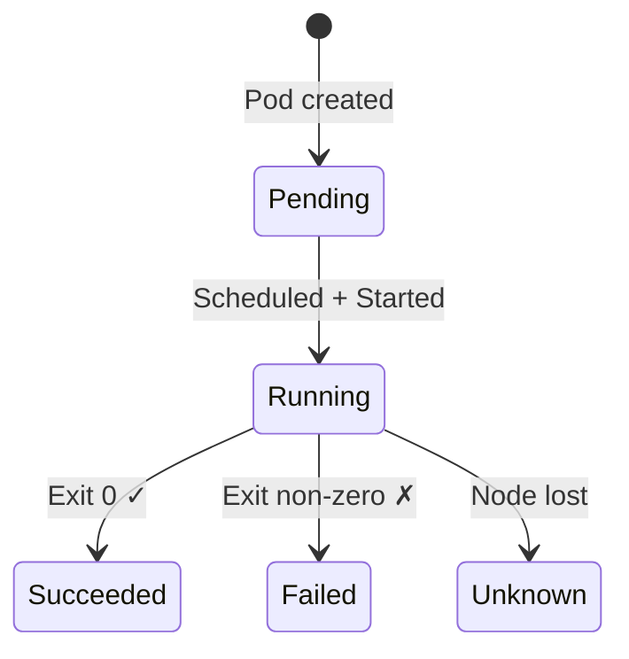

# Module 02: Pod Lifecycle & Workload Resources
# மாடுல் 02: Pod வாழ்க்கைச் சுழற்சி & Workload Resources

---

## 🎯 What is a Pod? | Pod என்றால் என்ன?

**English:** A Pod is the smallest deployable unit in Kubernetes — a wrapper around one or more containers that share network and storage.

**தமிழ்:** Pod என்பது Kubernetes-ல் மிகச்சிறிய deploy செய்யக்கூடிய அலகு — ஒன்று அல்லது அதற்கு மேற்பட்ட containers-ஐ wrap செய்வது.

### Analogy | உதாரணம்
> Pod = ஒரு அறை (room). Containers = அறையில் உள்ள நபர்கள். எல்லா நபர்களும் ஒரே bathroom (network) & kitchen (storage) share செய்கின்றனர்.

---

## 📊 Pod Phases | Pod நிலைகள்



| Phase | English | தமிழ் | Analogy |
|-------|---------|-------|---------|
| Pending | Waiting for node assignment | Node assign ஆக காத்திருக்கிறது | Job interview-க்கு wait செய்வது |
| Running | Container(s) alive | Container(s) உயிருடன் | Office-ல் work செய்கிறார் |
| Succeeded | Finished successfully | வெற்றிகரமாக முடிந்தது | Task complete, left office |
| Failed | Container crashed | Crash ஆனது | Employee collapsed |
| Unknown | Node unreachable | Node-ஐ reach செய்ய முடியவில்லை | Phone unreachable |

---

## 🏥 Probes (Health Checks) | ஆரோக்கிய சோதனை

**Doctor analogy:** Probes = Doctor checking patients
**தமிழ்:** Probes = Doctor patients-ஐ check செய்வது

| Probe | Question | Fail = | தமிழ் |
|-------|----------|--------|-------|
| **startupProbe** | "Did you wake up?" | Kill & restart | "எழுந்தீர்களா?" → இல்ல = restart |
| **livenessProbe** | "Are you alive?" | Kill & restart | "உயிருடன் இருக்கீர்களா?" → இல்ல = restart |
| **readinessProbe** | "Can you work?" | No traffic sent | "வேலை செய்ய முடியுமா?" → இல்ல = traffic நிறுத்து |

---

## 🏭 Controllers | கட்டுப்படுத்திகள்

| Controller | When to use | தமிழ் உதாரணம் |
|-----------|-------------|---------------|
| **Deployment** | Always-running stateless apps | Restaurant-ல் 5 waiters வேண்டும் |
| **StatefulSet** | Databases, ordered identity | Hospital beds (Bed 1, 2, 3) |
| **DaemonSet** | One pod per node | ஒவ்வொரு floor-லும் 1 security guard |
| **Job** | Run once, finish | Parcel delivery — deliver செய்தால் முடிந்தது |
| **CronJob** | Scheduled runs | தினமும் காலை 6 alarm |

---

## 🛠️ Commands | Commands

```bash
# --- Pod ---
kubectl run nginx --image=nginx:1.25 --restart=Never   # Pod உருவாக்கு
kubectl get pods -o wide                                # Pods list பாரு
kubectl describe pod nginx                              # Full details
kubectl logs nginx                                      # Logs பாரு
kubectl logs nginx --previous                           # Crashed container logs
kubectl exec -it nginx -- /bin/sh                       # Pod-க்குள் நுழை
kubectl delete pod nginx                                # Pod delete

# --- Deployment ---
kubectl create deployment web --image=nginx:1.24 --replicas=3   # 3 copies
kubectl set image deployment/web nginx=nginx:1.25               # Update image
kubectl rollout status deployment/web                           # Update status
kubectl rollout history deployment/web                          # History
kubectl rollout undo deployment/web                             # Rollback!

# --- Job ---
kubectl create job build --image=alpine -- sh -c 'echo done'   # One-time job
kubectl get jobs                                                # Status
kubectl logs job/build                                          # Job logs

# --- Probes (YAML) ---
# livenessProbe:
#   httpGet: {path: /, port: 80}
#   initialDelaySeconds: 5
#   periodSeconds: 10

# --- Debugging ---
kubectl describe pod <name> | tail -20                 # Events section
kubectl get events --field-selector involvedObject.name=<pod>
```

---

## 📋 Cheat Sheet | விரைவு குறிப்பு

```
┌─────────────────────────────────────────────────┐
│         POD & WORKLOAD CHEAT SHEET              │
├─────────────────────────────────────────────────┤
│ PHASES: Pending → Running → Succeeded/Failed    │
│                                                 │
│ PROBES:                                         │
│   startup  → "Started?"  fail=kill              │
│   liveness → "Alive?"    fail=restart           │
│   readiness→ "Ready?"    fail=no traffic        │
│                                                 │
│ CONTROLLERS:                                    │
│   Deployment  = நிரந்தர app (web server)        │
│   Job         = ஒரு முறை run (CI build)         │
│   CronJob     = schedule (nightly test)         │
│   DaemonSet   = every node (monitoring)         │
│   StatefulSet = database (ordered)              │
│                                                 │
│ ROLLING UPDATE:                                 │
│   maxSurge=25%        (extra pods allowed)      │
│   maxUnavailable=25%  (pods that can be down)   │
│   kubectl rollout undo = ROLLBACK               │
└─────────────────────────────────────────────────┘
```

---

## 🎤 Interview Q&A | நேர்முகத் தேர்வு

**Q: Pod CrashLoopBackOff — how to debug?**
1. `kubectl describe pod` → Events பாரு
2. `kubectl logs --previous` → Crash logs பாரு
3. Exit code: OOMKilled? Missing config? App bug?

**Q: Job vs Deployment எப்போது use செய்வது?**
- Job = ஒரு முறை செய் (build, migration, backup)
- Deployment = எப்போதும் run ஆகணும் (web server, API)

**Q: Rolling update எப்படி works?**
- புதிய pods படிப்படியாக வருகின்றன, பழையவை போகின்றன
- `maxSurge` & `maxUnavailable` speed control செய்கின்றன

---

## ✅ Self-Check | சுய மதிப்பீடு

- [ ] Pod phases explain செய்ய முடியும்
- [ ] 3 probes differentiate செய்ய முடியும்
- [ ] Right controller select செய்ய முடியும்
- [ ] CrashLoopBackOff debug செய்ய முடியும்
- [ ] Rolling update + rollback செய்ய முடியும்
