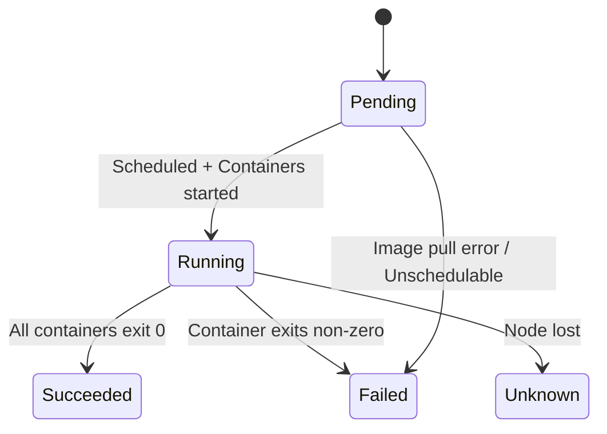

# Module 02: Pod Lifecycle & Workload Resources

## Why this matters for your profile
You manage CI/CT workloads (build pods, test runners, emulator pods) on Kubernetes. Understanding pod lifecycle, init containers, and workload controllers is essential for designing reliable pipeline execution environments.

## Concept Clarity

### Pod Phases
| Phase | Description |
|-------|-------------|
| Pending | Accepted but not yet scheduled or images pulling |
| Running | At least one container is running |
| Succeeded | All containers terminated with exit code 0 |
| Failed | At least one container terminated with non-zero |
| Unknown | Node communication lost |

### Container States
- **Waiting:** Pulling image, creating container
- **Running:** Executing without issues
- **Terminated:** Finished (success or failure)

### Pod Lifecycle Hooks
| Hook | When | Use Case |
|------|------|----------|
| postStart | After container start | Initialization tasks |
| preStop | Before SIGTERM | Graceful shutdown, drain connections |

### Probes
| Probe | Purpose | Failure Action |
|-------|---------|----------------|
| startupProbe | App has started | Kills container |
| livenessProbe | App is alive | Restarts container |
| readinessProbe | App can serve traffic | Removes from Service |

### Workload Resources
| Resource | Use Case |
|----------|----------|
| Deployment | Stateless apps, rolling updates |
| StatefulSet | Ordered deployment, stable network identity |
| DaemonSet | One pod per node (monitoring, log agents) |
| Job | Run-to-completion (CI builds, batch) |
| CronJob | Scheduled jobs |
| ReplicaSet | Maintained by Deployment (rarely used directly) |

## Diagram: Pod Lifecycle



## Command Mastery

### Pod operations
```bash
# Create a pod
kubectl run nginx --image=nginx:1.25 --restart=Never
kubectl run busybox --image=busybox --restart=Never -- sleep 3600

# Multi-container pod (sidecar pattern)
cat <<EOF | kubectl apply -f -
apiVersion: v1
kind: Pod
metadata:
  name: sidecar-demo
spec:
  containers:
  - name: app
    image: nginx:1.25
    ports:
    - containerPort: 80
  - name: log-collector
    image: busybox
    command: ['sh', '-c', 'while true; do echo "$(date) - collecting logs"; sleep 5; done']
EOF

# Init containers
cat <<EOF | kubectl apply -f -
apiVersion: v1
kind: Pod
metadata:
  name: init-demo
spec:
  initContainers:
  - name: wait-for-service
    image: busybox
    command: ['sh', '-c', 'until nslookup myservice; do echo waiting; sleep 2; done']
  containers:
  - name: app
    image: nginx:1.25
EOF

# Inspect pod lifecycle
kubectl get pod nginx -o yaml | grep -A 5 status
kubectl describe pod nginx | grep -A 10 Events
kubectl logs nginx
kubectl logs sidecar-demo -c log-collector
kubectl exec -it nginx -- /bin/sh
```

### Probes
```bash
cat <<EOF | kubectl apply -f -
apiVersion: v1
kind: Pod
metadata:
  name: probe-demo
spec:
  containers:
  - name: app
    image: nginx:1.25
    livenessProbe:
      httpGet:
        path: /
        port: 80
      initialDelaySeconds: 5
      periodSeconds: 10
    readinessProbe:
      httpGet:
        path: /
        port: 80
      initialDelaySeconds: 3
      periodSeconds: 5
    startupProbe:
      httpGet:
        path: /
        port: 80
      failureThreshold: 30
      periodSeconds: 2
EOF
```

### Workload controllers
```bash
# Deployment with rolling update
kubectl create deployment web --image=nginx:1.24 --replicas=3
kubectl set image deployment/web nginx=nginx:1.25
kubectl rollout status deployment/web
kubectl rollout history deployment/web
kubectl rollout undo deployment/web

# Job (CI build simulation)
cat <<EOF | kubectl apply -f -
apiVersion: batch/v1
kind: Job
metadata:
  name: build-job
spec:
  backoffLimit: 3
  activeDeadlineSeconds: 300
  template:
    spec:
      containers:
      - name: build
        image: alpine
        command: ['sh', '-c', 'echo "Building..." && sleep 10 && echo "Done"']
      restartPolicy: Never
EOF

kubectl get jobs
kubectl logs job/build-job

# CronJob (nightly regression trigger)
cat <<EOF | kubectl apply -f -
apiVersion: batch/v1
kind: CronJob
metadata:
  name: nightly-regression
spec:
  schedule: "0 2 * * *"
  jobTemplate:
    spec:
      template:
        spec:
          containers:
          - name: trigger
            image: curlimages/curl
            command: ['sh', '-c', 'curl -X POST http://jenkins:8080/job/nightly/build']
          restartPolicy: OnFailure
EOF

# DaemonSet
kubectl get daemonsets -n kube-system

# StatefulSet
kubectl get statefulsets --all-namespaces
```

### Debugging pod issues
```bash
# Why is pod not starting?
kubectl get pod <name> -o yaml | grep -A 20 conditions
kubectl describe pod <name> | tail -30
kubectl get events --field-selector involvedObject.name=<name>

# Image pull issues
kubectl describe pod <name> | grep -i "failed\|error\|back-off"

# OOMKilled
kubectl get pod <name> -o jsonpath='{.status.containerStatuses[0].lastState}'
```

## Practical Lab

### Exercises
1. Create a pod with an init container that waits for a service, then deploy the service and watch the pod start
2. Configure all three probes on a pod — kill the liveness endpoint and observe restart behavior
3. Create a Deployment, perform a rolling update, observe the ReplicaSet transition, then rollback
4. Create a Job with `backoffLimit: 3` that intentionally fails — observe retry behavior
5. Create a parallel Job (completions: 5, parallelism: 2) simulating parallel CI test execution
6. Design a pod spec for your Android emulator workload (resource requests, init containers for image pull, liveness for emulator health)

### Pass Criteria
- You can explain what happens at each pod phase transition
- You can choose the right workload controller for any given scenario
- You can troubleshoot a pod stuck in Pending, CrashLoopBackOff, or ImagePullBackOff
- You understand graceful shutdown (preStop + terminationGracePeriodSeconds)

## Mock Interview Questions

1. **A pod is in CrashLoopBackOff. Walk me through your debugging steps.**
2. **When would you use a Job vs a Deployment for CI workloads?**
3. **Explain the difference between liveness and readiness probes. What happens if you misconfigure them?**
4. **How does a rolling update work internally? What controls the rollout speed?**
5. **Design a pod spec for a CI build agent that needs privileged access, 4 CPU cores, and 8GB RAM with proper resource governance.**
6. **What is the purpose of `terminationGracePeriodSeconds` and how have you used preStop hooks?**
7. **How do init containers help in your CI/CD pipeline architecture?**
