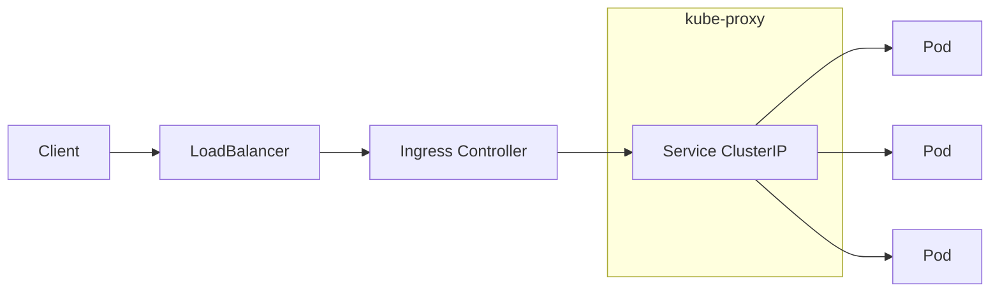

# Module 03: Networking (Services, Ingress, DNS, CNI)

## Why this matters for your profile
You architect Kubernetes platforms where CI/CD services communicate — Jenkins agents talk to controllers, test pods reach device farms, and OTA services expose APIs. Networking is the foundation of every distributed system you build.

## Concept Clarity

### Kubernetes Networking Model
Four requirements (every pod gets a unique IP):
1. Pod-to-Pod communication without NAT
2. Node-to-Pod communication without NAT
3. Pod sees its own IP same as others see it
4. Services abstract stable endpoints over dynamic pods

### Service Types
| Type | Description | Use Case |
|------|-------------|----------|
| ClusterIP | Internal-only virtual IP | Inter-service communication |
| NodePort | Exposes on each node's IP:port (30000–32767) | Dev/test access |
| LoadBalancer | Cloud LB provisioned | Production ingress |
| ExternalName | CNAME to external DNS | External service abstraction |
| Headless (clusterIP: None) | No virtual IP, returns pod IPs | StatefulSets, service discovery |

### DNS in Kubernetes
- Service: `<service>.<namespace>.svc.cluster.local`
- Pod: `<pod-ip-dashed>.<namespace>.pod.cluster.local`
- Headless: `<pod-name>.<service>.<namespace>.svc.cluster.local`

### CNI (Container Network Interface)
| Plugin | Key Feature |
|--------|-------------|
| Calico | NetworkPolicy, BGP routing |
| Cilium | eBPF-based, L7 policy, observability |
| Flannel | Simple overlay (VXLAN) |
| Azure CNI | Native VNet integration (AKS) |
| GKE native | Alias IPs (GKE) |

### Ingress vs Gateway API
| Feature | Ingress | Gateway API |
|---------|---------|-------------|
| Maturity | Stable, widely used | GA (v1.0+), future direction |
| Multi-tenancy | Limited | Built-in (GatewayClass, Routes) |
| Protocol support | HTTP/HTTPS | HTTP, TCP, UDP, gRPC |
| Traffic splitting | Controller-specific | Native |

### Network Policies
- Default: all traffic allowed
- NetworkPolicy: namespace-scoped ingress/egress rules
- Requires CNI support (Calico, Cilium, etc.)

## Diagram: Service Traffic Flow



## Command Mastery

### Services
```bash
# Create deployment and expose
kubectl create deployment web --image=nginx:1.25 --replicas=3
kubectl expose deployment web --port=80 --target-port=80 --type=ClusterIP

# Different service types
kubectl expose deployment web --port=80 --type=NodePort --name=web-np
kubectl expose deployment web --port=80 --type=LoadBalancer --name=web-lb

# Headless service
cat <<EOF | kubectl apply -f -
apiVersion: v1
kind: Service
metadata:
  name: web-headless
spec:
  clusterIP: None
  selector:
    app: web
  ports:
  - port: 80
EOF

# Inspect services
kubectl get svc -o wide
kubectl describe svc web
kubectl get endpoints web
```

### DNS verification
```bash
# Deploy a DNS debugging pod
kubectl run dnsutils --image=gcr.io/kubernetes-e2e-test-images/dnsutils:1.3 --restart=Never -- sleep 3600

# Test DNS resolution
kubectl exec dnsutils -- nslookup web
kubectl exec dnsutils -- nslookup web.default.svc.cluster.local
kubectl exec dnsutils -- nslookup kubernetes.default

# Check CoreDNS
kubectl get pods -n kube-system -l k8s-app=kube-dns
kubectl logs -n kube-system -l k8s-app=kube-dns
```

### Ingress
```bash
# Install NGINX Ingress Controller (kind/minikube)
kubectl apply -f https://raw.githubusercontent.com/kubernetes/ingress-nginx/main/deploy/static/provider/kind/deploy.yaml

# Create Ingress resource
cat <<EOF | kubectl apply -f -
apiVersion: networking.k8s.io/v1
kind: Ingress
metadata:
  name: web-ingress
  annotations:
    nginx.ingress.kubernetes.io/rewrite-target: /
spec:
  ingressClassName: nginx
  rules:
  - host: web.local
    http:
      paths:
      - path: /
        pathType: Prefix
        backend:
          service:
            name: web
            port:
              number: 80
EOF

kubectl get ingress
kubectl describe ingress web-ingress
```

### Network Policies
```bash
# Default deny all ingress in namespace
cat <<EOF | kubectl apply -f -
apiVersion: networking.k8s.io/v1
kind: NetworkPolicy
metadata:
  name: deny-all-ingress
  namespace: default
spec:
  podSelector: {}
  policyTypes:
  - Ingress
EOF

# Allow only from specific namespace
cat <<EOF | kubectl apply -f -
apiVersion: networking.k8s.io/v1
kind: NetworkPolicy
metadata:
  name: allow-from-ci
spec:
  podSelector:
    matchLabels:
      app: web
  ingress:
  - from:
    - namespaceSelector:
        matchLabels:
          purpose: ci-pipeline
    ports:
    - port: 80
EOF

# Verify
kubectl get networkpolicy
kubectl describe networkpolicy deny-all-ingress
```

### Debugging networking
```bash
# Test connectivity
kubectl exec dnsutils -- wget -qO- http://web:80 --timeout=5

# Check endpoints
kubectl get endpoints web

# Check kube-proxy mode
kubectl get configmap kube-proxy -n kube-system -o yaml | grep mode

# Trace with curl and verbose
kubectl exec dnsutils -- curl -v http://web.default.svc.cluster.local
```

## Practical Lab

### Exercises
1. Create two namespaces (`ci` and `production`). Deploy services in each and verify cross-namespace DNS resolution
2. Implement a NetworkPolicy that allows CI pods to reach a test service but blocks all other traffic
3. Set up an Ingress with path-based routing (e.g., `/api` → backend, `/ui` → frontend)
4. Create a headless service and verify individual pod DNS records
5. Simulate a Service with no ready endpoints and observe behavior
6. Test what happens when you scale a deployment — how quickly do endpoints update?

### Pass Criteria
- You can explain the full packet path from client → pod
- You can write NetworkPolicies from memory
- You understand DNS resolution mechanics in-cluster
- You can troubleshoot "connection refused" vs "no route to host" vs "timeout"

## Mock Interview Questions

1. **Explain how kube-proxy implements Services. What's the difference between iptables and IPVS mode?**
2. **A pod can't reach a service in another namespace. Walk me through debugging.**
3. **How do NetworkPolicies work? What's the default behavior? How would you implement zero-trust networking?**
4. **Compare Ingress and Gateway API. When would you choose each?**
5. **How would you design network segmentation for a multi-tenant CI/CD platform on Kubernetes?**
6. **What's a headless service and when would you use it?**
7. **Explain how CoreDNS resolves service names. What happens during a DNS lookup?**
