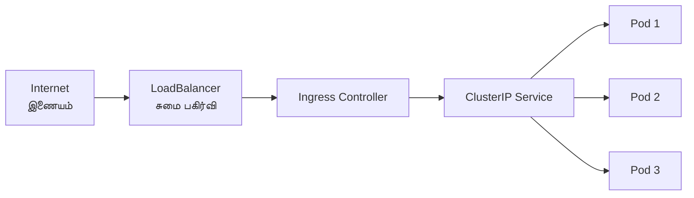

# Module 03: Networking
# மாடுல் 03: Networking (வலையமைப்பு)

---

## 🎯 What? | என்ன?

**English:** Kubernetes networking allows pods to talk to each other, services to load-balance traffic, and external users to reach your applications.

**தமிழ்:** Kubernetes networking = pods ஒன்றோடு ஒன்று பேசுவது, services traffic-ஐ balance செய்வது, வெளி users உங்கள் app-ஐ access செய்வது.

### Analogy | உதாரணம்
> Office building: Every employee (pod) has a phone extension (IP). Reception desk (Service) routes calls to available employees. Building entrance (Ingress) lets outside visitors in.

> Office building: ஒவ்வொரு employee-க்கும் (pod) ஒரு phone extension (IP). Reception (Service) calls-ஐ route செய்கிறது. Building entrance (Ingress) வெளி visitors-ஐ உள்ளே விடுகிறது.

---

## 🔑 Key Rules | முக்கிய விதிகள்

1. Every pod gets its own IP — ஒவ்வொரு pod-க்கும் unique IP
2. Pods can talk to any pod directly (no NAT) — Pods நேரடியாக பேசலாம்
3. Services give stable endpoints — Services நிலையான address கொடுக்கின்றன
4. DNS auto-resolves service names — DNS தானாக resolve செய்கிறது

---

## 📊 Service Types | Service வகைகள்



| Type | Who can access? | யார் access செய்யலாம்? | Use case |
|------|----------------|----------------------|----------|
| **ClusterIP** | Only inside cluster | Cluster உள்ளே மட்டும் | Service-to-service |
| **NodePort** | Node IP:Port from outside | வெளியில் இருந்து Node IP:Port | Dev/test |
| **LoadBalancer** | Cloud load balancer | Cloud LB வழியாக எல்லோரும் | Production |
| **Headless** | Returns pod IPs directly | Pod IPs நேரடியாக return | StatefulSets |

### DNS in Kubernetes | DNS

```
Service: <service-name>.<namespace>.svc.cluster.local
         web.production.svc.cluster.local

Short form: just use "web" (same namespace)
Short form: "web.production" (cross namespace)
```

> 💡 **தமிழ்:** ஒரே department (namespace) உள்ள person-ஐ first name-ல் call செய்யலாம். வேறு department-னா department name-உம் சேர்க்கணும்.

---

## 🛡️ Network Policy | Network கொள்கை

Default: எல்லா pods எல்லா pods-உடனும் பேசலாம் (open)
NetworkPolicy: rules define — யார் யாருடன் பேசலாம்

> Analogy: Office-ல் default-ஆ எல்லோரும் எல்லோரிடமும் பேசலாம். NetworkPolicy = "Finance team members only talk to HR and Management"

---

## 🛠️ Commands | Commands

```bash
# --- Service create ---
kubectl create deployment web --image=nginx --replicas=3
kubectl expose deployment web --port=80 --type=ClusterIP      # Internal
kubectl expose deployment web --port=80 --type=NodePort       # External via node
kubectl expose deployment web --port=80 --type=LoadBalancer   # Cloud LB

# --- Service inspect ---
kubectl get svc -o wide
kubectl describe svc web
kubectl get endpoints web                    # எந்த pods-க்கு traffic போகிறது

# --- DNS test ---
kubectl run test --rm -it --image=busybox -- nslookup web
kubectl run test --rm -it --image=busybox -- nslookup web.default.svc.cluster.local

# --- Network Policy ---
cat <<EOF | kubectl apply -f -
apiVersion: networking.k8s.io/v1
kind: NetworkPolicy
metadata:
  name: deny-all
spec:
  podSelector: {}       # எல்லா pods-க்கும் apply
  policyTypes:
  - Ingress             # Incoming traffic block
EOF

# Allow only from CI namespace
cat <<EOF | kubectl apply -f -
apiVersion: networking.k8s.io/v1
kind: NetworkPolicy
metadata:
  name: allow-ci
spec:
  podSelector:
    matchLabels: {app: web}
  ingress:
  - from:
    - namespaceSelector:
        matchLabels: {purpose: ci}
EOF

# --- Ingress ---
cat <<EOF | kubectl apply -f -
apiVersion: networking.k8s.io/v1
kind: Ingress
metadata:
  name: web-ingress
spec:
  ingressClassName: nginx
  rules:
  - host: myapp.company.com
    http:
      paths:
      - path: /
        pathType: Prefix
        backend:
          service: {name: web, port: {number: 80}}
EOF

# --- Debug networking ---
kubectl run netshoot --rm -it --image=nicolaka/netshoot -- bash
# Inside: curl, dig, nslookup, tcpdump
```

---

## 📋 Cheat Sheet | விரைவு குறிப்பு

```
┌───────────────────────────────────────────────────┐
│           NETWORKING CHEAT SHEET                  │
├───────────────────────────────────────────────────┤
│ SERVICE TYPES:                                    │
│   ClusterIP    = Internal only (default)          │
│   NodePort     = Node:30000-32767                 │
│   LoadBalancer = Cloud LB (production)            │
│   Headless     = Pod IPs directly                 │
│                                                   │
│ DNS FORMAT:                                       │
│   <svc>.<ns>.svc.cluster.local                    │
│   Same ns: just "web"                             │
│   Cross ns: "web.other-namespace"                 │
│                                                   │
│ NETWORK POLICY:                                   │
│   Default = allow all                             │
│   deny-all + allow specific = zero trust          │
│                                                   │
│ CNI PLUGINS:                                      │
│   Calico = NetworkPolicy + BGP                    │
│   Cilium = eBPF, L7 policy                       │
│   Azure CNI = AKS native                         │
│   GKE = Alias IPs                                │
└───────────────────────────────────────────────────┘
```

---

## 🎤 Interview Q&A | நேர்முகத் தேர்வு

**Q: Pod A can't reach Service B. Debug steps?**
1. `kubectl get endpoints B` — endpoints இருக்கா?
2. `kubectl get svc B` — ClusterIP correct-ஆ?
3. DNS resolve ஆகிறதா? `nslookup B`
4. NetworkPolicy block செய்கிறதா?
5. Pod labels match service selector-ஆ?

**Q: NetworkPolicy default behavior?**
- Default = ALL traffic allowed. NetworkPolicy create செய்தவுடன் = whitelist mode (specified traffic only).

**Q: Ingress vs LoadBalancer?**
- LoadBalancer = ஒவ்வொரு service-க்கும் ஒரு LB (costly)
- Ingress = ஒரே LB, path/host based routing (cost effective)

---

## ✅ Self-Check | சுய மதிப்பீடு

- [ ] 4 Service types explain செய்ய முடியும்
- [ ] DNS format எழுத முடியும்
- [ ] NetworkPolicy எழுத முடியும்
- [ ] Network issues debug செய்ய முடியும்
