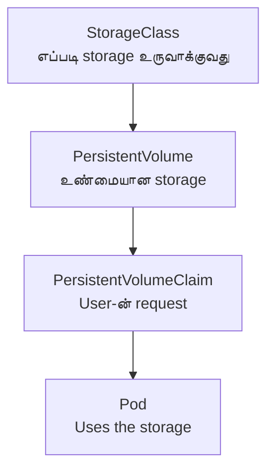

# Module 04: Storage
# மாடுல் 04: Storage (சேமிப்பு)

---

## 🎯 What? | என்ன?

**English:** Kubernetes storage lets pods keep data that survives restarts. Without it, everything in a container disappears when the pod dies.

**தமிழ்:** Kubernetes storage = pods data-ஐ நிலையாக வைக்க உதவுகிறது. இது இல்லாமல், pod die ஆனால் எல்லா data-வும் போய்விடும்.

### Analogy | உதாரணம்
> Container without storage = Writing on a whiteboard (erase when done)
> Container with PVC = Writing in a notebook (keeps forever)

> Storage இல்லாம = Whiteboard-ல் எழுதுவது (அழிந்துவிடும்)
> PVC உடன் = Notebook-ல் எழுதுவது (நிலையாக இருக்கும்)

---

## 📊 Storage Hierarchy | Storage படிநிலை



Simple version: **StorageClass** (template) → **PV** (actual disk) → **PVC** (user's request) → **Pod** (uses it)

**தமிழ்:** StorageClass (எப்படி disk create செய்வது) → PV (உண்மையான disk) → PVC (user-ன் request) → Pod (use செய்கிறது)

---

## 🔑 Volume Types | Volume வகைகள்

| Type | Lifespan | Use case | தமிழ் |
|------|----------|----------|-------|
| **emptyDir** | Dies with pod | Temp scratch space | Pod-உடன் அழியும் temp space |
| **hostPath** | Node-local | Dev only (avoid in prod!) | Node-ல் உள்ள path (production-ல் avoid) |
| **PVC** | Survives pod restarts | Databases, artifacts | Pod restart ஆனாலும் data remain |
| **configMap** | Config as files | App configuration | Config-ஐ file-ஆக mount |
| **secret** | Secrets as files | Passwords, keys | Secrets-ஐ file-ஆக mount |

## Access Modes | Access Modes

| Mode | Short | Meaning | தமிழ் |
|------|-------|---------|-------|
| ReadWriteOnce | RWO | One node reads/writes | ஒரு node மட்டும் read/write |
| ReadOnlyMany | ROX | Many nodes read | பல nodes read மட்டும் |
| ReadWriteMany | RWX | Many nodes read/write | பல nodes read/write |

> 💡 **தமிழ்:** RWO = ஒரு நபர் மட்டும் notebook-ல் எழுதலாம். RWX = எல்லோரும் எழுதலாம். ROX = எல்லோரும் படிக்கலாம், யாரும் எழுத முடியாது.

---

## 🛠️ Commands | Commands

```bash
# --- Storage classes available ---
kubectl get storageclass

# --- PVC create (dynamic provisioning) ---
cat <<EOF | kubectl apply -f -
apiVersion: v1
kind: PersistentVolumeClaim
metadata:
  name: my-data
spec:
  accessModes: [ReadWriteOnce]
  resources:
    requests:
      storage: 10Gi
  storageClassName: standard
EOF

# --- Pod using PVC ---
cat <<EOF | kubectl apply -f -
apiVersion: v1
kind: Pod
metadata:
  name: app
spec:
  containers:
  - name: app
    image: nginx
    volumeMounts:
    - name: data
      mountPath: /data       # Pod-க்குள் /data-ல் mount ஆகும்
  volumes:
  - name: data
    persistentVolumeClaim:
      claimName: my-data     # மேலே create செய்த PVC
EOF

# --- Check status ---
kubectl get pvc              # Bound ஆனதா?
kubectl get pv               # PV auto-created ஆனதா?

# --- emptyDir (temp shared storage) ---
cat <<EOF | kubectl apply -f -
apiVersion: v1
kind: Pod
metadata:
  name: shared
spec:
  containers:
  - name: writer
    image: busybox
    command: ['sh', '-c', 'echo hello > /shared/data && sleep 3600']
    volumeMounts: [{name: tmp, mountPath: /shared}]
  - name: reader
    image: busybox
    command: ['sh', '-c', 'cat /shared/data && sleep 3600']
    volumeMounts: [{name: tmp, mountPath: /shared}]
  volumes:
  - name: tmp
    emptyDir: {}          # Pod-உடன் அழியும்
EOF

# --- Expand PVC ---
kubectl patch pvc my-data -p '{"spec":{"resources":{"requests":{"storage":"20Gi"}}}}'
```

---

## 📋 Cheat Sheet | விரைவு குறிப்பு

```
┌──────────────────────────────────────────────┐
│           STORAGE CHEAT SHEET                │
├──────────────────────────────────────────────┤
│ StorageClass → PV → PVC → Pod               │
│ (template)  (disk) (request) (uses it)       │
│                                              │
│ ACCESS MODES:                                │
│   RWO = 1 node write    (most common)        │
│   RWX = many nodes write (NFS, shared)       │
│   ROX = many nodes read  (configs)           │
│                                              │
│ RECLAIM POLICY (PVC delete ஆனால்):            │
│   Delete = PV-யும் disk-யும் delete           │
│   Retain = PV remain, manual cleanup         │
│                                              │
│ emptyDir = temp (pod-உடன் அழியும்)            │
│ hostPath = avoid in production!              │
│ PVC      = permanent (production use)        │
└──────────────────────────────────────────────┘
```

---

## 🎤 Interview Q&A | நேர்முகத் தேர்வு

**Q: Pod Pending due to storage — how to debug?**
- `kubectl describe pvc` → event "waiting for volume" இருக்கா?
- StorageClass exist ஆகிறதா? `kubectl get sc`
- Cloud quota exceeded ஆ?

**Q: RWO vs RWX — when does it matter?**
- RWO: single pod database (PostgreSQL). RWX: shared build cache across multiple CI pods.

**Q: hostPath ஏன் production-ல் avoid?**
- Pod reschedule ஆனால் data lost. Security risk (node filesystem access). No portability.

---

## ✅ Self-Check | சுய மதிப்பீடு

- [ ] StorageClass → PV → PVC → Pod flow explain செய்ய முடியும்
- [ ] Access modes differentiate செய்ய முடியும்
- [ ] PVC create/mount செய்ய முடியும்
- [ ] Storage issues debug செய்ய முடியும்
