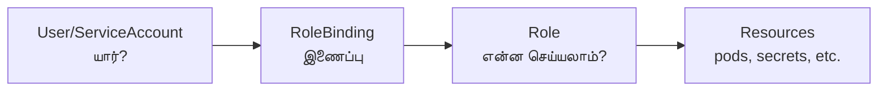

# Module 06: RBAC & Security
# மாடுல் 06: RBAC & Security (அணுகல் கட்டுப்பாடு & பாதுகாப்பு)

---

## 🎯 What? | என்ன?

**English:** RBAC (Role-Based Access Control) controls WHO can do WHAT in your cluster. Security Context controls HOW pods run (non-root, read-only filesystem, etc.)

**தமிழ்:** RBAC = யார் என்ன செய்யலாம் என்று கட்டுப்படுத்துவது. Security Context = Pods எப்படி run ஆகணும் என்று கட்டுப்படுத்துவது.

### Analogy | உதாரணம்
> Office building: RBAC = key cards (Finance team can enter finance room only). Security Context = dress code rules (no shorts, must wear ID badge).

> Office: RBAC = key card (Finance team finance room-க்கு மட்டும் போகலாம்). Security Context = dress code (shorts போட முடியாது, ID badge அணிய வேண்டும்).

---

## 📊 RBAC Model | RBAC மாதிரி



### 4 RBAC Objects | 4 RBAC Objects

| Object | Scope | Purpose | தமிழ் |
|--------|-------|---------|-------|
| **Role** | Namespace | Permissions in ONE namespace | ஒரு namespace-ல் permissions |
| **ClusterRole** | Cluster | Permissions EVERYWHERE | எல்லா இடத்திலும் permissions |
| **RoleBinding** | Namespace | Links user → Role | User-ஐ Role-உடன் இணை |
| **ClusterRoleBinding** | Cluster | Links user → ClusterRole | User-ஐ ClusterRole-உடன் இணை |

### Simple Formula | எளிய Formula

```
WHO (User/ServiceAccount) + WHAT (Role/ClusterRole) = RoleBinding

யார் + என்ன செய்யலாம் = இணைப்பு
```

---

## 🛡️ Security Context | பாதுகாப்பு Context

| Setting | What it does | ஏன் முக்கியம் |
|---------|-------------|--------------|
| `runAsNonRoot: true` | Container root-ஆக run ஆகாது | Root = full power = dangerous |
| `readOnlyRootFilesystem: true` | Files எழுத முடியாது | Malware write செய்ய முடியாது |
| `allowPrivilegeEscalation: false` | Privilege increase block | Hacker escalation prevent |
| `capabilities.drop: ["ALL"]` | Linux capabilities remove | Minimal permissions only |

### Pod Security Standards (PSS)

| Level | Meaning | தமிழ் |
|-------|---------|-------|
| **Privileged** | No restrictions | கட்டுப்பாடு இல்லை (system pods) |
| **Baseline** | Block known attacks | தெரிந்த attacks block |
| **Restricted** | Maximum security | அதிகபட்ச பாதுகாப்பு ✓ |

### OKD/OpenShift = SCCs (Security Context Constraints)
- Similar to PSS but more granular
- `restricted` → `anyuid` → `privileged`

---

## 🛠️ Commands | Commands

```bash
# --- ServiceAccount create ---
kubectl create serviceaccount ci-agent -n ci

# --- Role (namespace-level) ---
cat <<EOF | kubectl apply -f -
apiVersion: rbac.authorization.k8s.io/v1
kind: Role
metadata:
  name: pod-manager
  namespace: ci
rules:
- apiGroups: [""]
  resources: ["pods", "pods/log"]
  verbs: ["get", "list", "create", "delete"]   # Read + create + delete
- apiGroups: ["batch"]
  resources: ["jobs"]
  verbs: ["get", "list", "create", "delete"]
EOF

# --- Bind Role to ServiceAccount ---
kubectl create rolebinding ci-agent-binding \
  --role=pod-manager \
  --serviceaccount=ci:ci-agent -n ci

# --- Test permissions ---
kubectl auth can-i create pods --as=system:serviceaccount:ci:ci-agent -n ci
# yes ✓
kubectl auth can-i delete nodes --as=system:serviceaccount:ci:ci-agent
# no ✗

# --- Secure Pod ---
cat <<EOF | kubectl apply -f -
apiVersion: v1
kind: Pod
metadata:
  name: secure-app
spec:
  securityContext:
    runAsNonRoot: true        # Root-ஆக run ஆகாது
    runAsUser: 1000           # UID 1000 ஆக run
    fsGroup: 2000
  containers:
  - name: app
    image: nginx
    securityContext:
      allowPrivilegeEscalation: false   # Escalation block
      readOnlyRootFilesystem: true      # Write block
      capabilities:
        drop: ["ALL"]                   # All capabilities remove
    volumeMounts:
    - name: tmp
      mountPath: /tmp
  volumes:
  - name: tmp
    emptyDir: {}    # /tmp-க்கு mutable space கொடு
EOF

# --- Pod Security Standards enforce ---
kubectl label namespace ci pod-security.kubernetes.io/enforce=restricted
# இனி restricted-க்கு comply ஆகாத pods reject ஆகும்

# --- Audit RBAC ---
kubectl get clusterrolebindings -o wide | grep -v system:
kubectl auth can-i --list --as=system:serviceaccount:ci:ci-agent -n ci
```

---

## 📋 Cheat Sheet | விரைவு குறிப்பு

```
┌────────────────────────────────────────────────────┐
│           RBAC & SECURITY CHEAT SHEET              │
├────────────────────────────────────────────────────┤
│ RBAC FORMULA:                                      │
│   WHO + WHAT = Binding                             │
│   (User/SA) + (Role) = RoleBinding                 │
│                                                    │
│ SCOPE:                                             │
│   Role + RoleBinding         = 1 namespace         │
│   ClusterRole + CRBinding    = all namespaces      │
│                                                    │
│ SECURITY CONTEXT (always set!):                    │
│   runAsNonRoot: true                               │
│   readOnlyRootFilesystem: true                     │
│   allowPrivilegeEscalation: false                  │
│   capabilities.drop: ["ALL"]                       │
│                                                    │
│ PSS LEVELS:                                        │
│   Privileged < Baseline < Restricted               │
│   (open)      (safe)     (most secure) ✓           │
│                                                    │
│ VERIFY:                                            │
│   kubectl auth can-i <verb> <resource> --as=<who>  │
└────────────────────────────────────────────────────┘
```

---

## 🎤 Interview Q&A | நேர்முகத் தேர்வு

**Q: Design RBAC for multi-team CI platform?**
- ஒவ்வொரு team-க்கும் ஒரு namespace
- Team-specific Role (own namespace manage)
- ClusterRole for shared read-only access
- ServiceAccount per CI agent with minimal permissions
- No cluster-admin for anyone except platform team

**Q: Pod won't start after enforcing restricted PSS?**
- `kubectl describe pod` → security violation message பாரு
- Common fix: add `runAsNonRoot`, drop capabilities, remove hostPath

**Q: Workload Identity vs static ServiceAccount keys?**
- Workload Identity = pod automatically gets cloud credentials via OIDC (no static keys to rotate!)
- Static keys = must rotate manually, can leak

---

## ✅ Self-Check | சுய மதிப்பீடு

- [ ] RBAC 4 objects explain செய்ய முடியும்
- [ ] Least-privilege Role design செய்ய முடியும்
- [ ] Security Context எழுத முடியும்
- [ ] PSS vs OKD SCC difference சொல்ல முடியும்
- [ ] `kubectl auth can-i` use செய்ய முடியும்
