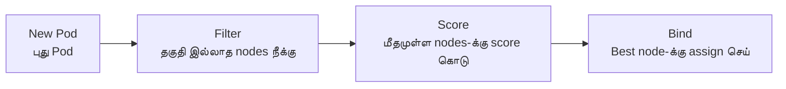

# Module 07: Scheduling & Resource Management
# மாடுல் 07: Scheduling & Resource Management (திட்டமிடல் & வள மேலாண்மை)

---

## 🎯 What? | என்ன?

**English:** Scheduling = how K8s decides WHICH NODE to place a pod on. Resource management = how much CPU/memory each pod gets.

**தமிழ்:** Scheduling = எந்த node-ல் pod வைக்கணும் என்று K8s decide செய்வது. Resource management = ஒவ்வொரு pod-க்கும் எவ்வளவு CPU/memory கொடுப்பது.

### Analogy | உதாரணம்
> School classroom: Scheduler = teacher assigning seats. Resources = desk size (some students need bigger desks). Taints = "reserved" signs on seats.

> School: Scheduler = teacher seats assign செய்வது. Resources = desk size. Taints = "reserved" sign.

---

## 📊 Scheduling Flow | Scheduling செயல்முறை



1. **Filter** = Remove nodes that CAN'T run this pod (not enough CPU, wrong taint, etc.)
2. **Score** = Rank remaining nodes (prefer less loaded, correct zone, etc.)
3. **Bind** = Assign pod to highest-scoring node

---

## 💰 Resources: Requests vs Limits

| | Requests | Limits |
|--|----------|--------|
| **Meaning** | "I need at least this much" | "Don't give me more than this" |
| **தமிழ்** | "குறைந்தது இவ்வளவு வேண்டும்" | "இதைவிட அதிகம் வேண்டாம்" |
| **Scheduler uses?** | ✅ Yes (for placement) | ❌ No |
| **Enforced at runtime?** | No (minimum guarantee) | ✅ Yes (killed/throttled) |
| **CPU exceed** | OK (throttled) | Throttled |
| **Memory exceed** | OK (if available) | **OOMKilled!** ☠️ |

### QoS Classes | தரம்

| Class | Condition | Eviction Priority | தமிழ் |
|-------|-----------|-------------------|-------|
| **Guaranteed** | requests = limits | Last evicted | கடைசியாக evict ஆகும் (best) |
| **Burstable** | requests < limits | Middle | நடுவில் |
| **BestEffort** | No requests/limits | First evicted! | முதலில் evict ஆகும் (worst) |

> 💡 **தமிழ்:** Bus-ல் reserved seat (Guaranteed), general seat (Burstable), standing (BestEffort). Bus நிறைந்தால் standing-ல் இருப்பவர்கள் முதலில் இறக்கப்படுவார்கள்!

---

## 🎯 Scheduling Controls | Scheduling கட்டுப்பாடுகள்

| Mechanism | Purpose | தமிழ் | Analogy |
|-----------|---------|-------|---------|
| **nodeSelector** | Simple label match | Label match செய் | "Only seat in row A" |
| **nodeAffinity** | Complex rules | விரிவான rules | "Prefer row A, but B is OK" |
| **podAntiAffinity** | Spread pods apart | Pods-ஐ பரப்பு | "Don't sit next to each other" |
| **Taints/Tolerations** | Node repels pods | Node pods-ஐ தள்ளுகிறது | "Reserved seat" sign |
| **ResourceQuota** | Namespace total cap | Namespace-க்கு total limit | Department budget |
| **LimitRange** | Per-pod defaults | Pod-க்கு default limits | Individual expense limit |

---

## 🛠️ Commands | Commands

```bash
# --- Resource requests/limits ---
cat <<EOF | kubectl apply -f -
apiVersion: v1
kind: Pod
metadata:
  name: build-agent
spec:
  containers:
  - name: builder
    image: alpine
    command: ['sleep', '3600']
    resources:
      requests:
        cpu: "2"           # 2 CPU cores guarantee
        memory: "4Gi"      # 4GB memory guarantee
      limits:
        cpu: "4"           # Max 4 cores
        memory: "8Gi"      # Max 8GB (exceed = OOMKill!)
EOF

# QoS class check
kubectl get pod build-agent -o jsonpath='{.status.qosClass}'

# --- ResourceQuota (namespace budget) ---
cat <<EOF | kubectl apply -f -
apiVersion: v1
kind: ResourceQuota
metadata:
  name: team-quota
  namespace: ci
spec:
  hard:
    requests.cpu: "32"       # Team-க்கு total 32 CPU
    requests.memory: "64Gi"  # Total 64GB
    pods: "50"               # Max 50 pods
EOF

# --- LimitRange (per-pod defaults) ---
cat <<EOF | kubectl apply -f -
apiVersion: v1
kind: LimitRange
metadata:
  name: defaults
  namespace: ci
spec:
  limits:
  - type: Container
    default:          # Limit not specified-னா இது apply ஆகும்
      cpu: "1"
      memory: "1Gi"
    defaultRequest:   # Request not specified-னா இது apply ஆகும்
      cpu: "500m"
      memory: "512Mi"
EOF

# --- Taints & Tolerations ---
# Node-ஐ "build-only" ஆக mark செய்
kubectl taint nodes worker-1 dedicated=build:NoSchedule

# Pod-ல் toleration கொடு (இந்த pod மட்டும் schedule ஆகும்)
cat <<EOF | kubectl apply -f -
apiVersion: v1
kind: Pod
metadata:
  name: build-pod
spec:
  tolerations:
  - key: "dedicated"
    value: "build"
    effect: "NoSchedule"
  nodeSelector:
    node-type: build
  containers:
  - name: build
    image: alpine
EOF

# --- Pod Anti-Affinity (spread replicas) ---
cat <<EOF | kubectl apply -f -
apiVersion: apps/v1
kind: Deployment
metadata:
  name: web
spec:
  replicas: 3
  selector:
    matchLabels: {app: web}
  template:
    metadata:
      labels: {app: web}
    spec:
      affinity:
        podAntiAffinity:
          requiredDuringSchedulingIgnoredDuringExecution:
          - labelSelector:
              matchLabels: {app: web}
            topologyKey: kubernetes.io/hostname   # ஒவ்வொரு node-லும் 1 pod
      containers:
      - name: web
        image: nginx
EOF

# --- Debug scheduling ---
kubectl describe pod <pending-pod> | grep -A 10 Events
kubectl top nodes       # Node resource usage
kubectl top pods -n ci  # Pod resource usage
```

---

## 📋 Cheat Sheet | விரைவு குறிப்பு

```
┌────────────────────────────────────────────────────┐
│       SCHEDULING & RESOURCES CHEAT SHEET           │
├────────────────────────────────────────────────────┤
│ REQUESTS vs LIMITS:                                │
│   Request = minimum guarantee (scheduling)         │
│   Limit   = maximum allowed (runtime enforce)      │
│   CPU exceed limit    → throttled (slow)           │
│   Memory exceed limit → OOMKilled! ☠️              │
│                                                    │
│ QoS: Guaranteed > Burstable > BestEffort           │
│       (last evict)  (middle)  (first evict)        │
│                                                    │
│ SCHEDULING:                                        │
│   Taint on node   = "keep out" sign               │
│   Toleration on pod = "I can enter anyway"         │
│   nodeSelector    = simple label match             │
│   Affinity        = complex preference rules       │
│   Anti-affinity   = spread pods across nodes       │
│                                                    │
│ GOVERNANCE:                                        │
│   ResourceQuota = total namespace budget           │
│   LimitRange    = per-pod defaults/limits          │
│                                                    │
│ DEBUG PENDING:                                     │
│   kubectl describe pod → Events                    │
│   Common: Insufficient cpu/memory, taint           │
└────────────────────────────────────────────────────┘
```

---

## 🎤 Interview Q&A | நேர்முகத் தேர்வு

**Q: Pod is Pending. Debug?**
1. `kubectl describe pod` → Events → "Insufficient cpu" or "didn't match taint"
2. `kubectl top nodes` → nodes-ல் resource இருக்கா?
3. Taint/toleration mismatch-ஆ?
4. ResourceQuota exceeded-ஆ?

**Q: Requests vs Limits difference? OOM scenario?**
- Request = scheduling guarantee. Limit = runtime maximum.
- Memory exceed limit → OOMKilled (container killed, restarts).
- CPU exceed limit → throttled (slow, not killed).

**Q: Design resource governance for 5 teams?**
- Namespace per team + ResourceQuota + LimitRange
- Priority classes (critical-ci > batch-low)
- Cluster autoscaler for elastic capacity

---

## ✅ Self-Check | சுய மதிப்பீடு

- [ ] Requests vs Limits explain முடியும் + OOM scenario
- [ ] QoS classes & eviction order சொல்ல முடியும்
- [ ] Taints/Tolerations write செய்ய முடியும்
- [ ] ResourceQuota + LimitRange design முடியும்
- [ ] Pending pod debug முடியும்
