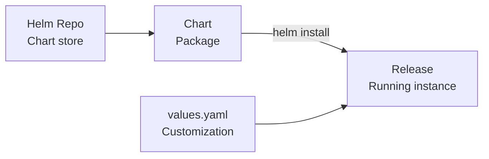

# Module 08: Helm
# மாடுல் 08: Helm (Package Manager)

---

## 🎯 What? | என்ன?

**English:** Helm is the package manager for Kubernetes — like apt/yum for Linux. It packages multiple K8s manifests into a "chart" that you can install, upgrade, and rollback as one unit.

**தமிழ்:** Helm = Kubernetes-க்கான package manager. Linux-ல் apt/yum போல. பல K8s YAML files-ஐ ஒரு "chart"-ஆக pack செய்து, ஒரே command-ல் install/upgrade/rollback செய்யலாம்.

### Analogy | உதாரணம்
> Without Helm = Assembling IKEA furniture without manual (10 YAML files manually)
> With Helm = "helm install" = one-click setup (chart = instruction manual + all parts)

> Helm இல்லாம = IKEA furniture manual இல்லாம assemble செய்வது
> Helm-உடன் = ஒரே click-ல் full setup

---

## 📊 Helm Concepts | Helm கருத்துகள்

| Concept | What | தமிழ் | Analogy |
|---------|------|-------|---------|
| **Chart** | Package of K8s templates | K8s templates package | Recipe (சமையல் குறிப்பு) |
| **Release** | Installed instance of chart | Chart install செய்த instance | Cooked dish (சமைத்த உணவு) |
| **Values** | Config to customize chart | Chart-ஐ customize செய்ய config | Spice level (காரம் அளவு) |
| **Repository** | Where charts are stored | Charts store ஆகும் இடம் | Cookbook library |



---

## 🛠️ Commands | Commands

```bash
# --- Repository (charts எங்கிருந்து download?) ---
helm repo add bitnami https://charts.bitnami.com/bitnami
helm repo add prometheus https://prometheus-community.github.io/helm-charts
helm repo update
helm search repo nginx            # Chart search

# --- Install (chart-ஐ cluster-ல் deploy) ---
helm install my-nginx bitnami/nginx -n web --create-namespace
helm install jenkins jenkins/jenkins -f my-values.yaml -n ci

# --- Before install, what will happen? ---
helm show values bitnami/nginx | head -30    # Default values பாரு
helm template my-release bitnami/nginx       # Rendered YAML பாரு (dry run)
helm install test bitnami/nginx --dry-run    # Install simulate

# --- Upgrade (version/config change) ---
helm upgrade my-nginx bitnami/nginx --set replicaCount=3
helm upgrade my-nginx bitnami/nginx -f prod-values.yaml

# --- Rollback (problem-னா பழையதுக்கு போ) ---
helm history my-nginx -n web     # History பாரு
helm rollback my-nginx 1 -n web  # Revision 1-க்கு rollback

# --- Uninstall ---
helm uninstall my-nginx -n web

# --- Create your own chart ---
helm create mychart              # Skeleton chart create
helm lint mychart                # Validate
helm package mychart             # .tgz file create
helm push mychart-0.1.0.tgz oci://registry.io/charts  # Push to registry

# --- Dependency management ---
helm dependency update ./mychart
```

---

## 📋 Cheat Sheet | விரைவு குறிப்பு

```
┌────────────────────────────────────────────────────┐
│              HELM CHEAT SHEET                      │
├────────────────────────────────────────────────────┤
│ LIFECYCLE:                                         │
│   install → upgrade → rollback → uninstall         │
│                                                    │
│ KEY COMMANDS:                                      │
│   helm repo add <name> <url>     # Add repo        │
│   helm install <release> <chart> # Deploy          │
│   helm upgrade <release> <chart> # Update          │
│   helm rollback <release> <rev>  # Rollback!       │
│   helm uninstall <release>       # Remove          │
│   helm template <rel> <chart>    # Render only     │
│                                                    │
│ CUSTOMIZATION:                                     │
│   --set key=value               (inline)           │
│   -f values.yaml                (file)             │
│   Multiple -f files merge (last wins)              │
│                                                    │
│ CHART STRUCTURE:                                   │
│   Chart.yaml   = metadata                          │
│   values.yaml  = defaults                          │
│   templates/   = K8s manifests (Go templates)      │
│   charts/      = sub-chart dependencies            │
│                                                    │
│ HELM vs KUSTOMIZE:                                 │
│   Helm = templating (Go templates, complex)        │
│   Kustomize = patching (overlay, simpler)          │
└────────────────────────────────────────────────────┘
```

---

## 🎤 Interview Q&A | நேர்முகத் தேர்வு

**Q: Helm vs Kustomize — when to use which?**
- **Helm**: Complex apps with many config variations, reusable packages, dependency management
- **Kustomize**: Simple overlays (dev/staging/prod), no templating needed, built into kubectl

**Q: Helm upgrade failed midway. What's the state?**
- Release marked as "FAILED". Previous version still running (atomic by default in Helm 3). Fix and `helm upgrade` again or `helm rollback`.

**Q: How to handle secrets in Helm?**
- Never put secrets in values.yaml in Git!
- Options: helm-secrets plugin + SOPS, External Secrets Operator, Vault injection at runtime

---

## ✅ Self-Check | சுய மதிப்பீடு

- [ ] Chart/Release/Values explain முடியும்
- [ ] install/upgrade/rollback செய்ய முடியும்
- [ ] Own chart create செய்ய முடியும்
- [ ] Helm vs Kustomize compare செய்ய முடியும்
