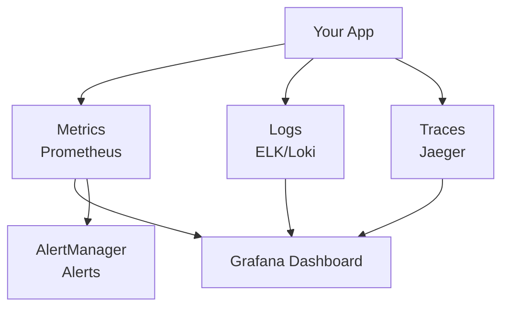

# Module 09: Observability
# மாடுல் 09: Observability (கண்காணிப்பு)

---

## 🎯 What? | என்ன?

**English:** Observability = understanding what's happening inside your system using metrics, logs, and traces. It's how you know if things are healthy or broken.

**தமிழ்:** Observability = உங்கள் system உள்ளே என்ன நடக்கிறது என்று புரிந்துகொள்வது — metrics, logs, traces மூலம். Healthy-ஆ, broken-ஆ என்று தெரிந்துகொள்வது.

### Analogy | உதாரணம்
> Car dashboard: Speedometer (metrics), Engine warning light (alerts), Trip log (logs), GPS route (traces)
> Car dashboard: Speedometer (metrics), Warning light (alerts), Trip log (logs), GPS route (traces)

---

## 📊 Three Pillars | மூன்று தூண்கள்

| Pillar | What | Tools | தமிழ் |
|--------|------|-------|-------|
| **Metrics** | Numbers over time | Prometheus, Grafana | எண்கள் (CPU 80%, memory 4GB) |
| **Logs** | Event messages | ELK, Loki, Fluent Bit | நிகழ்வு செய்திகள் ("error at line 42") |
| **Traces** | Request journey | Jaeger, Tempo | Request-ன் பயணம் (A→B→C→D) |



---

## 🔑 Key Concepts | முக்கிய கருத்துகள்

### Prometheus Flow
```
App exposes /metrics → Prometheus scrapes every 30s → Stores in TSDB → 
PromQL queries → Grafana dashboards → AlertManager → Slack/PagerDuty
```

### SLI / SLO / SLA

| Term | Meaning | Example | தமிழ் |
|------|---------|---------|-------|
| **SLI** | What you measure | p99 latency, error rate | என்ன measure செய்கிறோம் |
| **SLO** | Your target | p99 < 500ms, 99.9% uptime | நம் target |
| **SLA** | Contract with customer | 99.9% or refund | Customer-உடன் ஒப்பந்தம் |

> 💡 **தமிழ்:** SLI = thermometer reading. SLO = "fever 100°F-க்கு கீழ் இருக்கணும்". SLA = "fever exceed ஆனால் hospital admit".

---

## 🛠️ Commands | Commands

```bash
# --- Install Prometheus + Grafana stack ---
helm repo add prometheus https://prometheus-community.github.io/helm-charts
helm install monitoring prometheus/kube-prometheus-stack -n monitoring --create-namespace

# --- Verify ---
kubectl get pods -n monitoring
kubectl get servicemonitor -n monitoring

# --- Access Grafana ---
kubectl port-forward svc/monitoring-grafana 3000:80 -n monitoring
# Browser: http://localhost:3000 (admin/prom-operator)

# --- Access Prometheus ---
kubectl port-forward svc/monitoring-kube-prometheus-prometheus 9090:9090 -n monitoring

# --- Custom ServiceMonitor (உங்கள் app monitor செய்ய) ---
cat <<EOF | kubectl apply -f -
apiVersion: monitoring.coreos.com/v1
kind: ServiceMonitor
metadata:
  name: my-app
  namespace: monitoring
spec:
  selector:
    matchLabels: {app: my-app}
  endpoints:
  - port: metrics
    interval: 30s
    path: /metrics
  namespaceSelector:
    matchNames: [ci]
EOF

# --- Alert Rule ---
cat <<EOF | kubectl apply -f -
apiVersion: monitoring.coreos.com/v1
kind: PrometheusRule
metadata:
  name: ci-alerts
  namespace: monitoring
spec:
  groups:
  - name: pipeline
    rules:
    - alert: HighFailureRate
      expr: rate(ci_failures_total[5m]) > 0.1
      for: 10m
      labels: {severity: warning}
      annotations:
        summary: "Pipeline failure rate > 10%"
EOF

# --- Useful PromQL queries ---
# CPU usage by namespace
# sum(rate(container_cpu_usage_seconds_total{namespace="ci"}[5m])) by (pod)

# Memory usage
# container_memory_working_set_bytes{namespace="ci"} / 1024 / 1024

# Pod restarts
# rate(kube_pod_container_status_restarts_total[1h]) > 0

# --- Logs ---
kubectl logs <pod> -n ci              # Single pod logs
kubectl logs -l app=web -n ci         # All pods with label
kubectl logs <pod> --previous         # Crashed container logs
```

---

## 📋 Cheat Sheet | விரைவு குறிப்பு

```
┌──────────────────────────────────────────────────┐
│          OBSERVABILITY CHEAT SHEET               │
├──────────────────────────────────────────────────┤
│ THREE PILLARS:                                   │
│   Metrics = numbers (Prometheus)                 │
│   Logs    = events (ELK/Loki)                    │
│   Traces  = request journey (Jaeger)             │
│                                                  │
│ PROMETHEUS STACK:                                │
│   ServiceMonitor → Prometheus → Grafana          │
│   PrometheusRule → AlertManager → Slack          │
│                                                  │
│ SLI/SLO/SLA:                                    │
│   SLI = what you measure                         │
│   SLO = your target (internal)                   │
│   SLA = contract (external, with penalty)        │
│                                                  │
│ CI/CD METRICS TO TRACK:                          │
│   - Build success rate                           │
│   - Queue time (wait before execution)           │
│   - Build duration (p50, p95)                    │
│   - Pipeline failure rate                        │
│   - MTTR (mean time to recover)                  │
└──────────────────────────────────────────────────┘
```

---

## 🎤 Interview Q&A | நேர்முகத் தேர்வு

**Q: Design observability for CI/CD platform?**
- Metrics: Prometheus (build rate, queue time, success rate) + Grafana dashboards
- Logs: Fluent Bit DaemonSet → Loki/ELK
- Alerts: PrometheusRule → AlertManager → Slack (P1) / Email (P3)
- SLOs: build success > 95%, queue time p95 < 5min

**Q: Prometheus running out of memory?**
- Reduce retention, increase resources, add remote write to Thanos/Mimir for long-term
- Check cardinality (too many labels = memory explosion)

**Q: ELK vs Loki?**
- ELK: full-text search, powerful but heavy (resource-hungry)
- Loki: label-based, lightweight, integrates with Grafana natively

---

## ✅ Self-Check | சுய மதிப்பீடு

- [ ] Three pillars explain முடியும்
- [ ] Prometheus stack deploy முடியும்
- [ ] ServiceMonitor/PrometheusRule write முடியும்
- [ ] SLI/SLO define முடியும் for CI/CD
- [ ] PromQL basic queries write முடியும்
