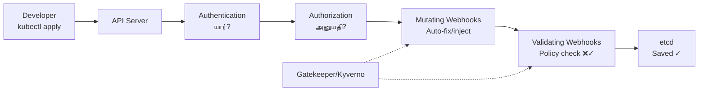

# Module 10: Policy-as-Code (OPA Gatekeeper & Kyverno)
# மாடுல் 10: Policy-as-Code (கொள்கை குறியீடு)

---

## 🎯 What? | என்ன?

**English:** Policy-as-Code = writing security/compliance rules as code that automatically blocks bad deployments. Instead of manual review, the system enforces rules.

**தமிழ்:** Policy-as-Code = security/compliance rules-ஐ code-ஆக எழுதி, bad deployments-ஐ automatically block செய்வது. Manual review இல்லாமல் system enforce செய்கிறது.

### Analogy | உதாரணம்
> Airport security scanner: You don't manually check every bag — the scanner (admission controller) automatically rejects prohibited items (policy violations).

> Airport security: Scanner automatically prohibited items reject செய்கிறது. நீங்கள் manually check செய்ய வேண்டாம். Policy = what's prohibited list.

---

## 📊 How it works | எப்படி works



---

## ⚔️ Gatekeeper vs Kyverno | ஒப்பீடு

| Feature | OPA Gatekeeper | Kyverno |
|---------|---------------|---------|
| Language | Rego (custom language) | YAML (familiar!) |
| Learning curve | Steep (Rego கற்க வேண்டும்) | Easy (YAML already know) |
| Validate | ✅ | ✅ |
| Mutate | Limited | ✅ Full support |
| Generate resources | ❌ | ✅ Auto-create NetworkPolicy, etc. |
| Image verification | External | ✅ Built-in (Cosign) |

> 💡 **தமிழ்:** Gatekeeper = powerful but complex (Rego language learn செய்யணும்). Kyverno = simple YAML-based (already YAML தெரியும், easy!).

---

## 🛠️ Commands | Commands

### OPA Gatekeeper

```bash
# Install
helm install gatekeeper gatekeeper/gatekeeper -n gatekeeper-system --create-namespace

# --- Policy: Block "latest" tag (Rego) ---
# Step 1: Template (logic)
cat <<EOF | kubectl apply -f -
apiVersion: templates.gatekeeper.sh/v1
kind: ConstraintTemplate
metadata:
  name: k8sblocklatest
spec:
  crd:
    spec:
      names:
        kind: K8sBlockLatest
  targets:
  - target: admission.k8s.gatekeeper.sh
    rego: |
      package k8sblocklatest
      violation[{"msg": msg}] {
        container := input.review.object.spec.containers[_]
        endswith(container.image, ":latest")
        msg := sprintf("Image '%v' uses :latest tag. Use specific version!", [container.image])
      }
EOF

# Step 2: Constraint (apply policy)
cat <<EOF | kubectl apply -f -
apiVersion: constraints.gatekeeper.sh/v1beta1
kind: K8sBlockLatest
metadata:
  name: no-latest-tag
spec:
  match:
    kinds:
    - apiGroups: [""]
      kinds: ["Pod"]
    - apiGroups: ["apps"]
      kinds: ["Deployment"]
EOF

# Test — இது reject ஆகும்!
kubectl run test --image=nginx:latest
# Error: Image 'nginx:latest' uses :latest tag. Use specific version!

# Audit existing violations
kubectl get k8sblocklatest no-latest-tag -o yaml | grep -A 20 violations
```

### Kyverno

```bash
# Install
helm install kyverno kyverno/kyverno -n kyverno --create-namespace

# --- Policy: Require resource limits (YAML — easy!) ---
cat <<EOF | kubectl apply -f -
apiVersion: kyverno.io/v1
kind: ClusterPolicy
metadata:
  name: require-limits
spec:
  validationFailureAction: Enforce    # Block! (Audit = warn only)
  rules:
  - name: check-limits
    match:
      any:
      - resources:
          kinds: [Pod]
    validate:
      message: "CPU and memory limits required! Limits இல்லாம deploy முடியாது."
      pattern:
        spec:
          containers:
          - resources:
              limits:
                cpu: "?*"
                memory: "?*"
EOF

# --- Policy: Auto-inject labels (Mutate) ---
cat <<EOF | kubectl apply -f -
apiVersion: kyverno.io/v1
kind: ClusterPolicy
metadata:
  name: add-labels
spec:
  rules:
  - name: add-managed-by
    match:
      any:
      - resources:
          kinds: [Pod]
    mutate:
      patchStrategicMerge:
        metadata:
          labels:
            managed-by: "platform-team"
            environment: "{{request.namespace}}"
EOF

# --- Policy: Auto-create NetworkPolicy for new namespaces ---
cat <<EOF | kubectl apply -f -
apiVersion: kyverno.io/v1
kind: ClusterPolicy
metadata:
  name: auto-netpol
spec:
  rules:
  - name: generate-deny-all
    match:
      any:
      - resources:
          kinds: [Namespace]
    generate:
      kind: NetworkPolicy
      apiVersion: networking.k8s.io/v1
      name: default-deny
      namespace: "{{request.object.metadata.name}}"
      data:
        spec:
          podSelector: {}
          policyTypes: [Ingress]
EOF

# Check policy reports
kubectl get policyreport -A
```

---

## 📋 Common Policies | பொதுவான கொள்கைகள்

| Policy | Why | தமிழ் |
|--------|-----|-------|
| No `:latest` tag | Reproducibility | Latest tag = unpredictable |
| Required labels | Governance, cost tracking | யாருடைய pod என்று identify |
| Allowed registries only | Supply chain security | Approved registries மட்டும் |
| Resource limits required | Prevent resource starvation | எல்லா pods-க்கும் limits வேண்டும் |
| No privileged containers | Security | Root access block |
| Read-only root filesystem | Hardening | Write access block |
| Image signatures | Trust | Cosign signed images only |

---

## 📋 Cheat Sheet | விரைவு குறிப்பு

```
┌─────────────────────────────────────────────────────┐
│         POLICY-AS-CODE CHEAT SHEET                  │
├─────────────────────────────────────────────────────┤
│ GATEKEEPER:                                         │
│   ConstraintTemplate (Rego logic) → Constraint      │
│   Steep learning, powerful, CNCF Graduated          │
│                                                     │
│ KYVERNO:                                            │
│   ClusterPolicy (YAML! Easy!)                       │
│   validate + mutate + generate                      │
│   CNCF Incubating, easier to adopt                  │
│                                                     │
│ ROLLOUT STRATEGY:                                   │
│   1. Audit mode first (warn, don't block)           │
│   2. Fix existing violations                        │
│   3. Switch to Enforce (block)                      │
│                                                     │
│ MUST-HAVE POLICIES:                                 │
│   ✓ No :latest tag                                  │
│   ✓ Resource limits required                        │
│   ✓ Allowed registries only                         │
│   ✓ No privileged containers                        │
│   ✓ Required labels (team, app)                     │
└─────────────────────────────────────────────────────┘
```

---

## 🎤 Interview Q&A | நேர்முகத் தேர்வு

**Q: How to roll out policies without breaking existing workloads?**
1. Audit mode-ல் deploy (warn only, block செய்யாது)
2. Violations report generate — teams-க்கு share
3. Teams fix their workloads
4. Switch to Enforce mode (block)
5. Handle exceptions with namespace labels

**Q: Gatekeeper vs Kyverno — which would you choose?**
- New team? → Kyverno (YAML, easier adoption)
- Complex policies with cross-resource checks? → Gatekeeper (Rego powerful)
- Need mutation + generation? → Kyverno
- Already have OPA ecosystem? → Gatekeeper

---

## ✅ Self-Check | சுய மதிப்பீடு

- [ ] Admission webhook flow explain முடியும்
- [ ] Gatekeeper ConstraintTemplate write முடியும் (Rego)
- [ ] Kyverno policy write முடியும் (validate/mutate/generate)
- [ ] Policy rollout strategy explain முடியும்
- [ ] 5+ common policies list செய்ய முடியும்
