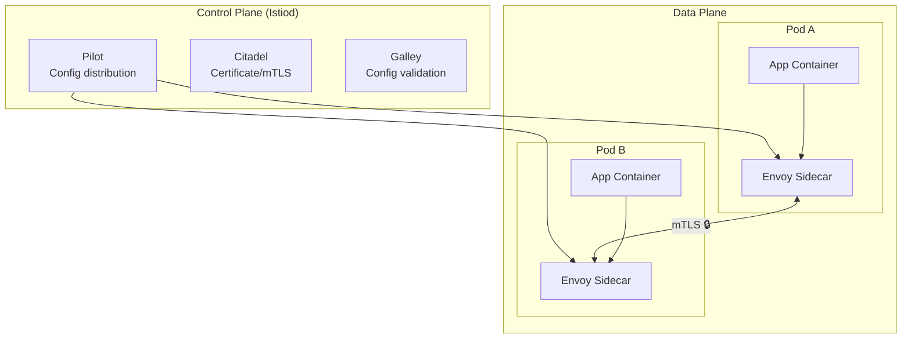

# Module 13: Multi-Cluster & Service Mesh
# மாடுல் 13: Multi-Cluster & Service Mesh

---

## 🎯 What? | என்ன?

**English:** Multi-cluster = running workloads across multiple K8s clusters (different clouds/regions). Service Mesh = transparent network layer for observability, security (mTLS), and traffic control between services.

**தமிழ்:** Multi-cluster = பல K8s clusters-ல் workloads run செய்வது (different clouds/regions). Service Mesh = services-க்கு இடையில் transparent network layer (observability, mTLS security, traffic control).

### Analogy | உதாரணம்
> Highway system: Multiple cities (clusters) connected by highways (mesh). Traffic police (sidecar proxies) at every intersection control flow, check IDs (mTLS), and report traffic data (observability).

> Highway: பல cities (clusters), highways-ஆல் connected. Traffic police (sidecar proxies) = traffic control, ID check (mTLS), data report.

---

## 📊 Architecture | கட்டமைப்பு



---

## ⚔️ Mesh Options | Mesh தேர்வுகள்

| Feature | Istio | Linkerd | Cilium |
|---------|-------|---------|--------|
| Proxy | Envoy (heavy, powerful) | Rust micro-proxy (lightweight) | eBPF (no sidecar!) |
| mTLS | ✅ | ✅ | ✅ |
| Performance | Higher latency | Very low latency | Lowest (kernel-level) |
| Complexity | Complex (many CRDs) | Simple | Moderate |
| L7 policies | Full (HTTP, gRPC) | Basic | Growing |
| Best for | Enterprise, complex routing | Simple mesh needs | Performance-critical |

> 💡 **தமிழ்:** Istio = powerful but complex. Linkerd = simple, fast. Cilium = no sidecar, eBPF magic (fastest!).

---

## 🛠️ Commands | Commands

### Istio

```bash
# Install
istioctl install --set profile=production

# Enable injection for namespace
kubectl label namespace production istio-injection=enabled

# mTLS — எல்லா services-க்கும் automatically encrypted
cat <<EOF | kubectl apply -f -
apiVersion: security.istio.io/v1beta1
kind: PeerAuthentication
metadata:
  name: strict-mtls
  namespace: production
spec:
  mtls:
    mode: STRICT    # All traffic must be mTLS (plain text rejected)
EOF

# Traffic splitting (Canary: 90% old, 10% new)
cat <<EOF | kubectl apply -f -
apiVersion: networking.istio.io/v1beta1
kind: VirtualService
metadata:
  name: my-app
spec:
  hosts: [my-app]
  http:
  - route:
    - destination:
        host: my-app
        subset: stable
      weight: 90
    - destination:
        host: my-app
        subset: canary
      weight: 10
---
apiVersion: networking.istio.io/v1beta1
kind: DestinationRule
metadata:
  name: my-app
spec:
  host: my-app
  subsets:
  - name: stable
    labels: {version: v1}
  - name: canary
    labels: {version: v2}
EOF

# Circuit breaker (prevent cascade failure)
cat <<EOF | kubectl apply -f -
apiVersion: networking.istio.io/v1beta1
kind: DestinationRule
metadata:
  name: payment-svc
spec:
  host: payment-svc
  trafficPolicy:
    connectionPool:
      tcp: {maxConnections: 100}
      http: {h2UpgradePolicy: DEFAULT, http1MaxPendingRequests: 100}
    outlierDetection:
      consecutive5xxErrors: 3
      interval: 30s
      baseEjectionTime: 60s    # 3 errors → eject for 60s
EOF
```

### Multi-Cluster (GKE + AKS + Talos)

```bash
# Approach 1: Shared mesh (same trust domain)
# Setup primary mesh on GKE
istioctl install --set values.global.meshID=mesh1 \
  --set values.global.network=gke-network

# Join AKS to mesh
istioctl install --set values.global.meshID=mesh1 \
  --set values.global.network=aks-network \
  --set values.global.remotePilotAddress=<gke-istiod-ip>

# Approach 2: Argo CD ApplicationSet (multi-cluster GitOps)
cat <<EOF | kubectl apply -f -
apiVersion: argoproj.io/v1alpha1
kind: ApplicationSet
metadata:
  name: my-app-multi
  namespace: argocd
spec:
  generators:
  - clusters:
      selector:
        matchLabels:
          env: production
  template:
    metadata:
      name: 'my-app-{{name}}'
    spec:
      source:
        repoURL: https://github.com/org/manifests
        path: apps/production
      destination:
        server: '{{server}}'
        namespace: production
EOF
```

### Cilium (No sidecar — eBPF)

```bash
# Install
helm install cilium cilium/cilium -n kube-system \
  --set hubble.enabled=true \
  --set hubble.relay.enabled=true

# Network Policy (L7 HTTP-level — more powerful than K8s default)
cat <<EOF | kubectl apply -f -
apiVersion: cilium.io/v2
kind: CiliumNetworkPolicy
metadata:
  name: api-access
spec:
  endpointSelector:
    matchLabels: {app: api}
  ingress:
  - fromEndpoints:
    - matchLabels: {app: frontend}
    toPorts:
    - ports: [{port: "8080", protocol: TCP}]
      rules:
        http:
        - method: GET                     # Only GET allowed!
          path: "/api/v1/products"        # Only this path!
EOF
```

---

## 📋 Cheat Sheet | விரைவு குறிப்பு

```
┌──────────────────────────────────────────────────┐
│     MULTI-CLUSTER & MESH CHEAT SHEET             │
├──────────────────────────────────────────────────┤
│ SERVICE MESH PROVIDES:                           │
│   mTLS (automatic encryption, zero code change)  │
│   Observability (metrics, traces, logs)          │
│   Traffic control (canary, circuit breaker)      │
│   Retries, timeouts, rate limiting              │
│                                                  │
│ MULTI-CLUSTER PATTERNS:                          │
│   1. Shared mesh (same trust domain)             │
│   2. Federated (separate control planes)         │
│   3. GitOps multi-cluster (ApplicationSet)       │
│                                                  │
│ YOUR PLATFORMS:                                   │
│   GKE    — Managed Istio (Anthos)                │
│   AKS    — Open Service Mesh / Istio             │
│   Talos  — Cilium (no sidecar, lightweight)      │
│   OKD    — Built-in SDN or Istio                 │
│                                                  │
│ CILIUM vs ISTIO:                                 │
│   Cilium = eBPF, no sidecar, lower latency       │
│   Istio  = Envoy, more features, higher latency  │
└──────────────────────────────────────────────────┘
```

---

## 🎤 Interview Q&A | நேர்முகத் தேர்வு

**Q: Why service mesh? What problem does it solve?**
- Application code-ல் retry logic, mTLS, metrics எழுத வேண்டாம்
- Infrastructure level-ல் handle (sidecar proxy handles all)
- Zero code change = any language works (Go, Java, Python all get same features)

**Q: Istio vs Cilium — when to use which?**
- Istio: Complex L7 routing, header-based routing, enterprise features, already using Envoy
- Cilium: Performance-critical, Talos/bare-metal (resource-constrained), kernel-level (eBPF = no sidecar overhead)

**Q: How to handle service discovery across clusters?**
- DNS-based: CoreDNS with multi-cluster plugin
- Mesh-based: Istio multi-cluster (shared trust domain)
- API gateway: Each cluster exposes gateway, global LB routes

---

## ✅ Self-Check | சுய மதிப்பீடு

- [ ] Service mesh architecture (control plane + data plane) explain முடியும்
- [ ] mTLS setup configure முடியும்
- [ ] Canary traffic splitting configure முடியும்
- [ ] Multi-cluster patterns explain முடியும்
- [ ] Istio vs Linkerd vs Cilium compare முடியும்
