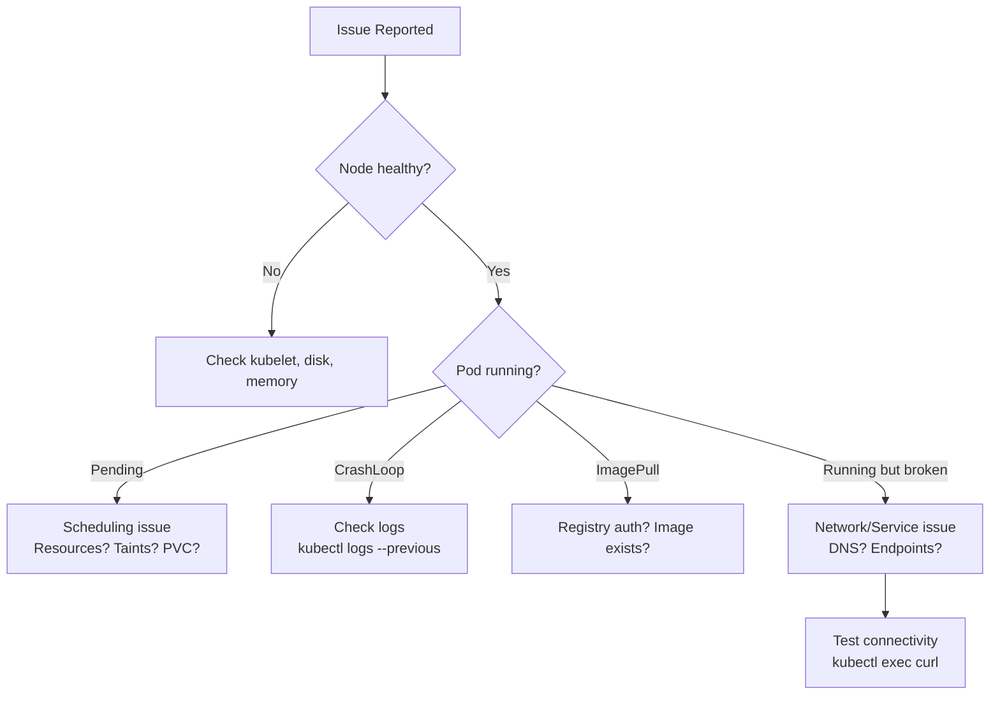

# Module 14: Troubleshooting & Disaster Recovery
# மாடுல் 14: Troubleshooting & Disaster Recovery

---

## 🎯 What? | என்ன?

**English:** Systematic debugging of K8s failures + backup/restore strategies to recover from disasters (etcd corruption, cluster loss, accidental deletion).

**தமிழ்:** K8s failures-ஐ systematic-ஆக debug செய்வது + disaster recovery strategies (etcd corruption, cluster loss, accidental deletion).

### Analogy | உதாரணம்
> Doctor diagnosing patient: Check vitals (node status) → symptoms (pod events) → tests (logs) → treatment (fix). Backup = health insurance (hope you never need it, but essential).

> Doctor: Vitals check (node status) → symptoms (pod events) → tests (logs) → treatment (fix). Backup = insurance.

---

## 📊 Troubleshooting Flow | Debug Flow



---

## 🛠️ Troubleshooting Commands | Debug Commands

### Pod Issues

```bash
# Pod stuck Pending — ஏன் schedule ஆகல?
kubectl describe pod <pod> | grep -A 10 Events
# Common: Insufficient cpu/memory, no matching node (taints), PVC not bound

# CrashLoopBackOff — App crash ஆகிறது
kubectl logs <pod> --previous          # Previous crash logs
kubectl logs <pod> -c <init-container> # Init container logs

# Debug with ephemeral container (production-safe!)
kubectl debug -it <pod> --image=busybox --target=<container>
# OR create debug copy
kubectl debug <pod> --copy-to=debug-pod --container=debug -- sh

# OOMKilled — Memory limit reached
kubectl describe pod <pod> | grep -i oom
kubectl top pod <pod> --containers     # Current memory usage
```

### Node Issues

```bash
# Node NotReady
kubectl describe node <node> | grep -A 5 Conditions
# Check: MemoryPressure, DiskPressure, PIDPressure

# SSH (normal clusters) — Talos-ல் SSH இல்லை!
ssh node01 "journalctl -u kubelet --since '5 min ago'"

# Talos-specific debugging (no SSH!)
talosctl dmesg --nodes <node>
talosctl logs kubelet --nodes <node>
talosctl service kubelet status --nodes <node>
talosctl get members                    # Cluster membership
talosctl health                         # Full cluster health check
```

### Network Issues

```bash
# Service has no endpoints?
kubectl get endpoints <service>
# Empty = selector doesn't match pod labels!

# DNS working?
kubectl run dnstest --image=busybox --rm -it -- nslookup my-service.my-ns.svc.cluster.local

# Pod-to-pod connectivity
kubectl exec <pod-a> -- curl -v http://<pod-b-ip>:8080

# CoreDNS issues
kubectl logs -n kube-system -l k8s-app=kube-dns
kubectl get configmap coredns -n kube-system -o yaml
```

### etcd Issues

```bash
# etcd cluster health
kubectl exec -n kube-system etcd-master -- etcdctl \
  --endpoints=https://127.0.0.1:2379 \
  --cacert=/etc/kubernetes/pki/etcd/ca.crt \
  --cert=/etc/kubernetes/pki/etcd/server.crt \
  --key=/etc/kubernetes/pki/etcd/server.key \
  endpoint health

# etcd performance
kubectl exec -n kube-system etcd-master -- etcdctl \
  endpoint status --write-out=table
```

---

## 🛠️ Disaster Recovery | DR Commands

### etcd Backup & Restore

```bash
# --- BACKUP (daily cronjob recommended!) ---
ETCDCTL_API=3 etcdctl snapshot save /backup/etcd-$(date +%Y%m%d).db \
  --endpoints=https://127.0.0.1:2379 \
  --cacert=/etc/kubernetes/pki/etcd/ca.crt \
  --cert=/etc/kubernetes/pki/etcd/server.crt \
  --key=/etc/kubernetes/pki/etcd/server.key

# Verify backup
etcdctl snapshot status /backup/etcd-20240101.db --write-out=table

# --- RESTORE ---
# 1. Stop kube-apiserver (move static pod manifest)
mv /etc/kubernetes/manifests/kube-apiserver.yaml /tmp/

# 2. Restore snapshot
etcdctl snapshot restore /backup/etcd-20240101.db \
  --data-dir=/var/lib/etcd-restored

# 3. Update etcd manifest to use new data-dir
# 4. Move apiserver manifest back
mv /tmp/kube-apiserver.yaml /etc/kubernetes/manifests/
```

### Velero (Full cluster backup)

```bash
# Install
velero install --provider aws --bucket my-backups \
  --secret-file ./credentials --plugins velero/velero-plugin-for-aws:v1.8.0

# Backup entire namespace
velero backup create prod-backup --include-namespaces=production

# Backup with schedule (daily)
velero schedule create daily-backup --schedule="0 2 * * *" \
  --include-namespaces=production,staging \
  --ttl 720h    # Keep 30 days

# Restore
velero restore create --from-backup prod-backup

# Restore specific resources only
velero restore create --from-backup prod-backup \
  --include-resources=deployments,services,configmaps

# Check backups
velero backup get
velero backup describe prod-backup --details
```

### Talos DR (no SSH — talosctl only!)

```bash
# Talos etcd backup
talosctl etcd snapshot /backup/talos-etcd.db --nodes <control-plane>

# Talos etcd restore (disaster scenario)
talosctl bootstrap --recover-from=/backup/talos-etcd.db --nodes <control-plane>

# Talos node reset (full wipe and rejoin)
talosctl reset --nodes <node> --graceful

# Talos upgrade (rolling — no downtime)
talosctl upgrade --nodes <node> --image ghcr.io/siderolabs/installer:v1.6.0
```

---

## 📋 Cheat Sheet | விரைவு குறிப்பு

```
┌──────────────────────────────────────────────────┐
│    TROUBLESHOOTING & DR CHEAT SHEET              │
├──────────────────────────────────────────────────┤
│ SYSTEMATIC DEBUG:                                │
│   1. kubectl get events --sort-by=.lastTimestamp │
│   2. kubectl describe <resource>                 │
│   3. kubectl logs (--previous for crashes)       │
│   4. kubectl debug (ephemeral container)         │
│   5. kubectl top (resource usage)                │
│                                                  │
│ COMMON POD STATES:                               │
│   Pending    = scheduling issue                  │
│   CrashLoop  = app error (check logs)            │
│   ImagePull  = registry/auth issue               │
│   OOMKilled  = need more memory limit            │
│   Evicted    = node disk/memory pressure         │
│                                                  │
│ BACKUP STRATEGY:                                 │
│   etcd snapshot = cluster state (CRDs, secrets)  │
│   Velero = namespaced resources + PVs            │
│   GitOps = manifests always in Git               │
│   Combined = etcd + Velero + Git                 │
│                                                  │
│ TALOS SPECIFIC:                                  │
│   No SSH! Use talosctl only                      │
│   talosctl dmesg / logs / service               │
│   talosctl etcd snapshot (backup)               │
│   talosctl health (cluster check)               │
└──────────────────────────────────────────────────┘
```

---

## 🎤 Interview Q&A | நேர்முகத் தேர்வு

**Q: Pod in CrashLoopBackOff — how to debug?**
1. `kubectl logs <pod> --previous` — crash-க்கு முன் logs
2. `kubectl describe pod` — events check
3. `kubectl debug` — ephemeral container attach
4. Common causes: config error, missing secret/configmap, port conflict, OOM

**Q: How do you backup a K8s cluster?**
- etcd snapshot (cluster state — all objects)
- Velero (namespace-level, includes PVs)
- GitOps ensures manifests always recoverable from Git
- Combined strategy: etcd daily + Velero hourly + Git always

**Q: Talos Linux — how to troubleshoot without SSH?**
- `talosctl dmesg` — kernel messages
- `talosctl logs <service>` — service logs
- `talosctl health` — full health check
- `talosctl get members` — cluster membership
- No SSH by design = smaller attack surface

---

## ✅ Self-Check | சுய மதிப்பீடு

- [ ] Pod failure systematic debug flow follow முடியும்
- [ ] etcd backup/restore execute முடியும்
- [ ] Velero setup and restore முடியும்
- [ ] Talos-specific troubleshooting explain முடியும்
- [ ] DR strategy design முடியும்
