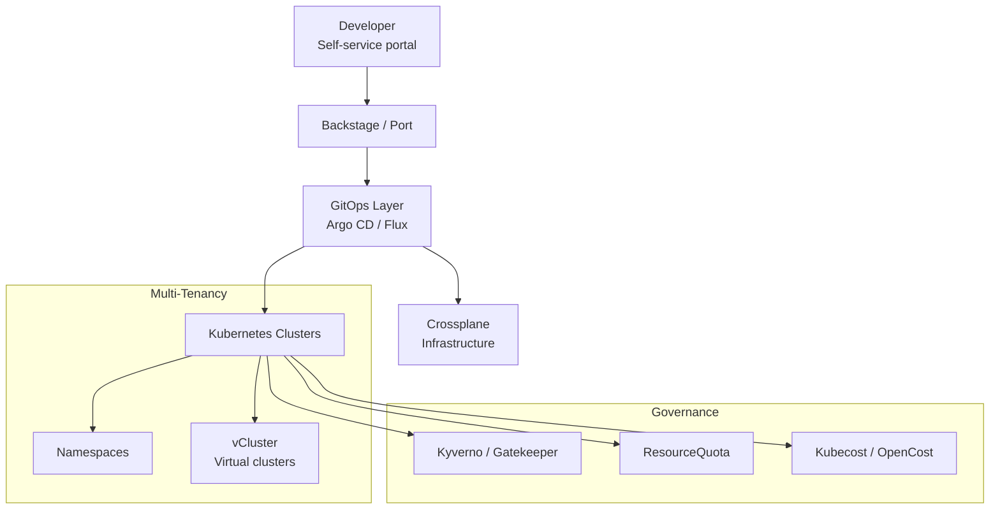

# Module 15: Production Patterns & Platform Engineering
# மாடுல் 15: Production Patterns & Platform Engineering

---

## 🎯 What? | என்ன?

**English:** Building an Internal Developer Platform (IDP) — self-service K8s for dev teams. Includes multi-tenancy, resource optimization, infrastructure-as-code, and platform abstractions.

**தமிழ்:** Internal Developer Platform (IDP) build செய்வது — dev teams-க்கு self-service K8s. Multi-tenancy, resource optimization, infrastructure-as-code, platform abstractions.

### Analogy | உதாரணம்
> Apartment building: Platform team = building management (maintains elevators, plumbing, electricity). Dev teams = tenants (use facilities, don't worry about plumbing). Self-service = tenant portal to request repairs.

> Apartment: Platform team = building management. Dev teams = tenants. Self-service portal = request repairs without calling plumber directly.

---

## 📊 Platform Engineering Stack



---

## 🛠️ Multi-Tenancy | Multi-Tenancy Commands

### Namespace-based (Simple)

```bash
# Team namespace with full isolation
cat <<EOF | kubectl apply -f -
apiVersion: v1
kind: Namespace
metadata:
  name: team-alpha
  labels:
    team: alpha
    cost-center: CC-1234
---
# Resource limits — team exceed செய்ய முடியாது
apiVersion: v1
kind: ResourceQuota
metadata:
  name: team-quota
  namespace: team-alpha
spec:
  hard:
    requests.cpu: "10"
    requests.memory: "20Gi"
    limits.cpu: "20"
    limits.memory: "40Gi"
    pods: "50"
    services: "10"
    persistentvolumeclaims: "20"
---
# Default limits for every pod (forgot to set = this applies)
apiVersion: v1
kind: LimitRange
metadata:
  name: default-limits
  namespace: team-alpha
spec:
  limits:
  - default:
      cpu: "500m"
      memory: "512Mi"
    defaultRequest:
      cpu: "100m"
      memory: "128Mi"
    type: Container
---
# Network isolation — same namespace only
apiVersion: networking.k8s.io/v1
kind: NetworkPolicy
metadata:
  name: deny-other-namespaces
  namespace: team-alpha
spec:
  podSelector: {}
  ingress:
  - from:
    - podSelector: {}    # Same namespace only
  policyTypes: [Ingress]
EOF
```

### vCluster (Virtual Clusters — strong isolation)

```bash
# vCluster = virtual K8s cluster inside a namespace
# Each team gets their own "cluster" (full admin!)
# But actually runs inside shared physical cluster

# Install vCluster CLI
curl -L -o vcluster "https://github.com/loft-sh/vcluster/releases/latest/download/vcluster-linux-amd64"
chmod +x vcluster && sudo mv vcluster /usr/local/bin/

# Create virtual cluster for team
vcluster create team-alpha -n team-alpha-vcluster

# Connect (team gets full cluster-admin in their vCluster!)
vcluster connect team-alpha -n team-alpha-vcluster

# Now team can: create namespaces, CRDs, RBAC — all isolated!
kubectl create namespace dev     # Inside vCluster
kubectl create namespace staging # Inside vCluster
```

---

## 🛠️ Resource Optimization | Resource Commands

### VPA (Vertical Pod Autoscaler)

```bash
# VPA = auto-recommends/sets right CPU/memory (right-sizing)
cat <<EOF | kubectl apply -f -
apiVersion: autoscaling.k8s.io/v1
kind: VerticalPodAutoscaler
metadata:
  name: my-app-vpa
spec:
  targetRef:
    apiVersion: apps/v1
    kind: Deployment
    name: my-app
  updatePolicy:
    updateMode: "Off"    # Recommendation only (safe start!)
  # "Auto" = VPA will restart pods with new limits
EOF

# Check recommendations
kubectl get vpa my-app-vpa -o yaml | grep -A 10 recommendation
```

### Goldilocks (VPA dashboard for all)

```bash
# Goldilocks = VPA recommendations for ALL deployments
helm install goldilocks fairwinds-stable/goldilocks -n goldilocks --create-namespace

# Enable for namespace
kubectl label namespace production goldilocks.fairwinds.com/enabled=true

# Access dashboard
kubectl port-forward -n goldilocks svc/goldilocks-dashboard 8080:80
# Shows: current requests vs recommended (save money!)
```

### Cluster Autoscaler / Karpenter

```bash
# Karpenter (AWS) — faster, smarter than Cluster Autoscaler
cat <<EOF | kubectl apply -f -
apiVersion: karpenter.sh/v1beta1
kind: NodePool
metadata:
  name: default
spec:
  template:
    spec:
      requirements:
      - key: "karpenter.sh/capacity-type"
        operator: In
        values: ["spot", "on-demand"]    # Prefer spot (cheaper!)
      - key: "node.kubernetes.io/instance-type"
        operator: In
        values: ["m5.large", "m5.xlarge", "m6i.large"]
  limits:
    cpu: "100"
    memory: "400Gi"
  disruption:
    consolidationPolicy: WhenUnderutilized    # Auto-shrink!
EOF
```

---

## 🛠️ Crossplane (Infrastructure-as-Code) | Crossplane

```bash
# Crossplane = provision cloud resources from K8s (Terraform alternative)
# Deploy a GCP Cloud SQL from K8s YAML!

cat <<EOF | kubectl apply -f -
apiVersion: sql.gcp.upbound.io/v1beta1
kind: DatabaseInstance
metadata:
  name: my-db
spec:
  forProvider:
    databaseVersion: POSTGRES_14
    region: us-central1
    settings:
    - tier: db-f1-micro
      diskSize: 20
  providerConfigRef:
    name: gcp-provider
EOF

# Dev team self-service: just apply YAML → get database!
# Platform team controls what's allowed via Compositions
```

---

## 🛠️ Talos Production Management

```bash
# Talos cluster upgrade (rolling, zero downtime)
talosctl upgrade --nodes 10.0.0.1,10.0.0.2,10.0.0.3 \
  --image ghcr.io/siderolabs/installer:v1.7.0

# Config patch (change settings without full reset)
talosctl patch machineconfig --nodes 10.0.0.1 -p '[
  {"op": "replace", "path": "/machine/kubelet/extraArgs/rotate-certificates", "value": "true"}
]'

# Generate machine config for new node
talosctl gen config my-cluster https://10.0.0.1:6443

# Cluster health check
talosctl health --nodes 10.0.0.1,10.0.0.2,10.0.0.3

# Get cluster members
talosctl get members --nodes 10.0.0.1
```

---

## 📋 Cheat Sheet | விரைவு குறிப்பு

```
┌──────────────────────────────────────────────────┐
│   PRODUCTION PATTERNS CHEAT SHEET                │
├──────────────────────────────────────────────────┤
│ MULTI-TENANCY:                                   │
│   Light: Namespace + RBAC + Quota + NetPol       │
│   Strong: vCluster (virtual cluster per team)    │
│                                                  │
│ RESOURCE OPTIMIZATION:                           │
│   VPA = right-size CPU/memory                    │
│   HPA = scale pod count                          │
│   Goldilocks = VPA dashboard (find waste)        │
│   Karpenter = smart node auto-provisioning       │
│                                                  │
│ PLATFORM ENGINEERING:                            │
│   Backstage/Port = developer portal              │
│   Crossplane = infra-as-K8s-YAML                 │
│   GitOps = Argo CD for deployments               │
│   Policy = Kyverno guardrails                    │
│                                                  │
│ COST GOVERNANCE:                                 │
│   Kubecost/OpenCost = per-team cost tracking     │
│   ResourceQuota = per-namespace limits           │
│   Spot/Preemptible nodes for non-critical        │
│   Goldilocks = find over-provisioned pods        │
│                                                  │
│ TALOS PRODUCTION:                                │
│   Immutable OS (no SSH, no shell)                │
│   Rolling upgrades (talosctl upgrade)            │
│   Config patches (no full reset needed)          │
│   Smallest attack surface                        │
└──────────────────────────────────────────────────┘
```

---

## 🎤 Interview Q&A | நேர்முகத் தேர்வு

**Q: Design multi-tenant K8s platform for 5 teams?**
1. Namespace per team + RBAC (team sees only own namespace)
2. ResourceQuota (CPU/memory limits per team)
3. NetworkPolicy (no cross-namespace by default)
4. LimitRange (default limits if pod doesn't specify)
5. Kyverno policies (enforce labels, block privileged)
6. Kubecost (per-team cost attribution)
7. If teams need cluster-admin → vCluster

**Q: How to reduce K8s costs by 40%?**
- VPA/Goldilocks → right-size (most pods over-provisioned)
- Spot/preemptible nodes for non-critical workloads
- Karpenter → consolidate underutilized nodes
- HPA → scale down during low traffic
- Delete unused PVCs, LoadBalancers

**Q: What is Platform Engineering?**
- Build golden paths (self-service templates)
- Abstract complexity (dev doesn't need to know K8s deeply)
- Guardrails not gates (policies auto-enforce, don't block progress)
- Backstage portal + GitOps + Crossplane = full platform

---

## ✅ Self-Check | சுய மதிப்பீடு

- [ ] Multi-tenancy (namespace vs vCluster) explain முடியும்
- [ ] VPA/HPA/Goldilocks configure முடியும்
- [ ] Crossplane concept explain முடியும்
- [ ] Talos production operations execute முடியும்
- [ ] Platform engineering strategy design முடியும்
- [ ] Cost optimization strategy present முடியும்
