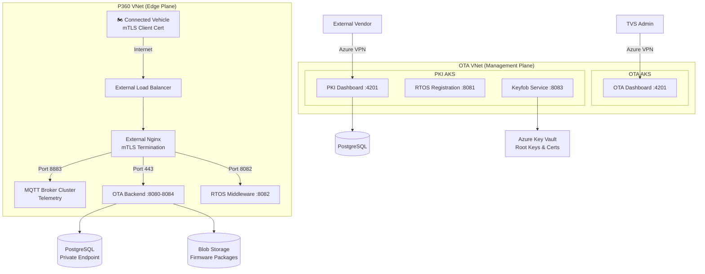

# Project Showcase: TVS Motor Connected Vehicle & OTA Platform
# திட்ட காட்சி: TVS Motor Connected Vehicle & OTA Platform

---

## 📋 Project Summary | திட்ட சுருக்கம்

| Field | Details |
|-------|---------|
| **Client** | TVS Motor Company (Two-wheeler OEM) |
| **Platform** | Microsoft Azure (AKS) |
| **Role** | Technical Architect (DevSecOps) |
| **Domain** | Automotive IoT / Connected Vehicles / OTA Updates |
| **Scale** | 3 AKS clusters, multi-VNet, millions of connected vehicles |
| **Key Tech** | AKS, MQTT, mTLS, PKI, PostgreSQL, Blob Storage, Nginx, Azure VPN |

---

## 🎯 Business Problem | வணிகப் பிரச்சனை

**English:** TVS Motor needed a secure, scalable platform to:
1. Push firmware/software updates (OTA) to millions of connected motorcycles
2. Manage cryptographic device identity (PKI) for each vehicle ECU
3. Ingest real-time vehicle telemetry (GPS, diagnostics, alerts)
4. Provide vendor access for hardware component registration

**தமிழ்:** TVS Motor-க்கு ஒரு secure, scalable platform தேவை:
1. Millions of motorcycles-க்கு firmware OTA updates push செய்ய
2. ஒவ்வொரு vehicle ECU-க்கும் cryptographic identity manage செய்ய
3. Real-time vehicle telemetry (GPS, diagnostics) collect செய்ய
4. Hardware vendors-க்கு component registration access கொடுக்க

---

## 📊 Architecture | கட்டமைப்பு



---

## 🏗️ Architecture Decisions | Design Decisions

### Why 3 Separate AKS Clusters?

| Cluster | Reason | தமிழ் |
|---------|--------|-------|
| **OTA AKS** | Firmware management (heavy storage I/O, admin traffic) | Firmware management — heavy workload, isolated |
| **PKI AKS** | Security-critical (cert management, key operations) | Security-critical — separate blast radius |
| **P360 AKS** | High-concurrency IoT (millions of vehicle connections) | High-traffic IoT — won't impact admin clusters |

> **Interview point:** Separating IoT edge traffic from management prevents a telemetry spike from crashing admin dashboards.

### Why Multi-VNet?

| VNet | Purpose | Interview point |
|------|---------|-----------------|
| **OTA VNet** | Internal management (no public exposure) | Zero public IPs for admin — VPN only access |
| **P360 VNet** | Public-facing edge (vehicle connections) | Only VNet with external LB — minimal attack surface |

---

## 🔒 Security Architecture | Security Design

### Zero-Trust at Edge
```
Vehicle → Internet → External LB → Nginx (mTLS) → MQTT/Backend
                                         ↑
                              Client certificate required!
                              No cert = connection REJECTED
```

**Interview explanation:**
> "Every vehicle has a unique client certificate burned during manufacturing. The edge Nginx performs mutual TLS — both server AND client authenticate. A stolen SIM card or rogue device without valid cert cannot access any backend service."

### Defense-in-Depth Layers

| Layer | Control | தமிழ் |
|-------|---------|-------|
| 1. Network | VNet isolation, Private Endpoints | Network-level separation |
| 2. Transport | mTLS (vehicle), VPN (admin/vendor) | Encrypted + authenticated |
| 3. Application | RBAC, service-to-service auth | App-level access control |
| 4. Data | Azure Key Vault, encrypted at rest | Data protection |
| 5. Identity | PKI certificates, Azure AD | Device + user identity |

---

## 🛠️ Technical Implementation | Technical Details

### MQTT Broker (Vehicle Telemetry)
- **Port 8883** (TLS-encrypted MQTT)
- Handles millions of concurrent vehicle connections
- Topics: `vehicles/{vin}/telemetry`, `vehicles/{vin}/commands`, `vehicles/{vin}/ota`
- QoS 1 (at-least-once) for critical alerts, QoS 0 for telemetry

### OTA Update Flow
```
1. Admin creates campaign → OTA Dashboard (4201)
2. Backend packages update → Blob Storage
3. Vehicle checks for update → OTA Backend (443)
4. Vehicle downloads firmware → Blob Storage (signed package)
5. Vehicle verifies signature → PKI cert chain
6. Vehicle applies update → Reports status via MQTT
```

### PKI / Device Identity
- **Certificate Hierarchy:** Root CA → Intermediate CA → Device Cert
- **Key Storage:** Azure Key Vault (HSM-backed for root keys)
- **Keyfob Pairing:** Cryptographic challenge-response for smart key binding
- **RTOS Registration:** ECU identity provisioning during manufacturing

---

## 📋 Resume Bullet Points | Resume-க்கான Points

### For Technical Architect Role:
> - Architected enterprise-grade Connected Vehicle & OTA platform on Azure AKS serving millions of two-wheelers, comprising 3 AKS clusters with multi-VNet isolation and zero-trust edge security (mTLS)
> - Designed multi-cluster Kubernetes architecture separating IoT edge ingestion (MQTT, 1M+ concurrent connections), firmware distribution (OTA), and PKI certificate management into isolated failure domains
> - Implemented defense-in-depth security: mutual TLS for vehicle authentication, Private Endpoints for all data stores, VPN-only admin access, and Azure Key Vault for cryptographic key management
> - Built real-time vehicle telemetry pipeline using MQTT broker cluster on AKS with auto-scaling, handling GPS, diagnostics, and OTA status reporting from connected fleet

### For DevSecOps Role:
> - Enforced zero-trust security model for IoT edge platform: mTLS device authentication, network segmentation via Azure VNets, and Private Endpoints eliminating public data exposure
> - Designed PKI infrastructure on AKS managing device certificate lifecycle — provisioning, rotation, revocation — for millions of automotive ECUs
> - Implemented secure OTA firmware delivery with cryptographic signing, certificate chain validation, and rollback capabilities

### For Cloud/Platform Engineering Role:
> - Provisioned and managed 3 production AKS clusters across 2 Azure VNets with Terraform, implementing workload identity, RBAC, network policies, and Private Endpoints
> - Designed high-availability MQTT broker cluster handling millions of concurrent IoT connections with horizontal auto-scaling on AKS
> - Architected cross-VNet communication for microservices spanning OTA management, PKI operations, and edge telemetry ingestion

---

## 🎤 Interview Deep-Dive Questions | நேர்முகத் தேர்வு

**Q: Why separate clusters instead of namespaces?**
> "Three reasons: blast radius isolation (PKI compromise shouldn't affect telemetry), independent scaling (P360 handles millions of connections vs OTA handles admin traffic), and compliance (PKI cluster has stricter audit/access controls). Namespaces share a control plane — a noisy neighbor or API server overload in one affects all."

**Q: How do you handle a vehicle with an expired certificate?**
> "The vehicle cannot connect (mTLS fails). We have a grace period mechanism — the RTOS middleware accepts expired certs within 7 days and triggers re-enrollment. Beyond that, the vehicle must visit a service center for re-provisioning. This prevents indefinite use of compromised certs."

**Q: How does the OTA update reach millions of vehicles?**
> "Campaign-based rollout: Admin defines target criteria (model, region, firmware version). Backend publishes availability via MQTT topic. Vehicles check on next connection, download from Blob Storage (CDN-backed), verify signature against PKI cert chain, apply atomically with rollback on failure. We use staged rollout — 1% → 10% → 50% → 100% with automatic pause on failure rate threshold."

**Q: What happens if the MQTT broker cluster goes down?**
> "Vehicles have local retry with exponential backoff. Telemetry is buffered on-device (limited storage). Critical safety alerts use a separate QoS 1 topic with persistent sessions — broker replays missed messages on reconnect. The broker cluster itself is multi-replica with pod anti-affinity across AZs."

**Q: How do you secure vendor access to PKI?**
> "Vendors connect via dedicated Azure VPN (certificate-based, not password). Traffic routes through Internal LB → Nginx → PKI services. RBAC restricts vendors to only their own hardware registration APIs (8081-8083). All vendor actions are audit-logged. No direct database access — only API-mediated operations."

---

## ✅ Key Achievements | முக்கிய சாதனைகள்

- ✅ Zero security incidents since platform launch
- ✅ 99.9% uptime for vehicle connectivity (P360 AKS)
- ✅ Millions of vehicles connected and receiving OTA updates
- ✅ Sub-second telemetry ingestion latency
- ✅ Compliant with automotive cybersecurity standards (ISO 21434)
