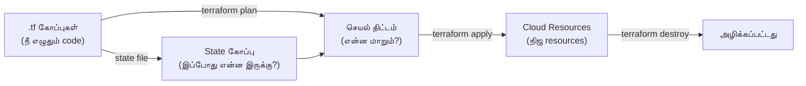

# Module 01: Terraform Fundamentals
# மாடுல் 01: Terraform அடிப்படைகள்

---

## 📖 கதை | The Story

**English:**

Imagine you're a chef running 10 restaurants across India. Every time you open a new branch, you need the same kitchen setup — same ovens, same counters, same storage. Without a system, you'd visit each location and manually set up everything. One restaurant gets a gas oven, another gets electric — chaos!

Now imagine you write down the **exact specification** of your kitchen in a recipe book. "I need: 2 gas ovens, 3 prep counters, 1 walk-in freezer." You hand this book to a builder. The builder reads it and constructs the kitchen exactly as specified. Every restaurant gets the identical setup. Want to add a tandoor? Update the recipe book, builder adds it everywhere.

**This recipe book is Terraform. The kitchen specification language is HCL. The builder is `terraform apply`.**

**தமிழ்:**

நீ இந்தியா முழுக்க 10 உணவகம் நடத்துகிறாய் என்று நினை. ஒவ்வொரு புதிய கிளை திறக்கும்போதும், அதே சமையலறை அமைப்பு வேண்டும் — அதே அடுப்பு, அதே மேசை, அதே சேமிப்பு. ஒரு முறையும் இல்லாமல் ஒவ்வொரு இடத்துக்கும் போய் கையால் அமைத்தால் — ஒரு கடையில் gas அடுப்பு, இன்னொன்றில் electric — குழப்பம்!

இப்போது நீ உன் சமையலறையின் **சரியான விவரக்குறிப்பை** ஒரு புத்தகத்தில் எழுதுகிறாய் என்று நினை. "எனக்கு வேண்டும்: 2 gas அடுப்பு, 3 தயாரிப்பு மேசை, 1 குளிர்சாதனப் பெட்டி." இந்த புத்தகத்தை ஒரு கொத்தனாரிடம் கொடுக்கிறாய். அவர் படித்து, சமையலறையை அப்படியே கட்டுகிறார். எல்லா உணவகமும் ஒரே அமைப்பு பெறும். தந்தூர் சேர்க்கணுமா? புத்தகத்தை update செய், கொத்தனார் எல்லா இடத்திலும் சேர்ப்பார்.

**இந்த புத்தகம் = Terraform. சமையலறை விவரக்குறிப்பு மொழி = HCL. கொத்தனார் = `terraform apply`.**

---

## 📖 HCL என்றால் என்ன? | What is HCL?

**English:** HCL = HashiCorp Configuration Language. It's the language you write Terraform code in. The key idea: you describe WHAT you want (the end state), NOT the steps to get there.

**தமிழ்:** HCL = HashiCorp Configuration Language. இதில்தான் Terraform code எழுதுவோம். முக்கிய கருத்து: நீ என்ன வேண்டும் (இறுதி நிலை) என்று மட்டும் சொல். எப்படி செய்யணும் என்ற படிகளை Terraform தானே கண்டுபிடிக்கும்.

### கதை தொடர்ச்சி | Story continues...

> **English:** When you order biryani at a restaurant, you say "1 chicken biryani, medium spice." You DON'T say "boil rice for 20 min, marinate chicken in yogurt, layer in pot..." The chef knows the steps. You just declare what you want.
>
> **தமிழ்:** நீ உணவகத்தில் பிரியாணி ஆர்டர் செய்யும்போது "1 சிக்கன் பிரியாணி, நடுத்தர காரம்" என்று சொல்கிறாய். "அரிசியை 20 நிமிடம் வேகவை, சிக்கனை தயிரில் ஊற வை, பாத்திரத்தில் அடுக்கு..." என்று சொல்வதில்லை. சமையல்காரனுக்கு படிகள் தெரியும். நீ என்ன வேண்டும் என்று மட்டும் அறிவிக்கிறாய்.

**இது Declarative approach. HCL declarative மொழி.**

### HCL vs மற்ற Formats | Comparison

| Format | வகை (Type) | விளக்கம் (Explanation) |
|--------|------------|------------------------|
| **HCL** | Declarative (விவரிப்பு) | "எனக்கு 2 VM வேண்டும்" — எப்படி என்று சொல்ல வேண்டாம் |
| JSON | Data format | தரவை சேமிக்க மட்டும், logic இல்லை |
| YAML | Config format | Kubernetes/Ansible-க்கு, ஆனால் logic இல்லை |
| Python/Bash | Imperative (கட்டளை) | "முதலில் VM create செய், பின் disk attach செய்..." படிப்படியாக |

### HCL Syntax — ஒரே ஒரு Pattern | Just ONE Pattern

**English:** Everything in Terraform follows this single pattern. Once you learn this, you know the entire language structure:

**தமிழ்:** Terraform-ல் எல்லாமே இந்த ஒரே pattern-ஐ பின்பற்றும். இதை கற்றுக்கொண்டால், முழு மொழி அமைப்பும் தெரிந்ததுதான்:

```hcl
block_type "வகை" "பெயர்" {
  argument = மதிப்பு
  argument = மதிப்பு

  nested_block {
    argument = மதிப்பு
  }
}
```

**நிஜ உதாரணம் (Real example):**

```hcl
resource "azurerm_storage_account" "logs" {
  # Arguments (சாவி = மதிப்பு)
  name                     = "stlogsprod001"
  resource_group_name      = azurerm_resource_group.main.name
  location                 = "East US"
  account_tier             = "Standard"
  account_replication_type = "LRS"

  # Nested Block (உள்ளமைந்த block)
  blob_properties {
    delete_retention_policy {
      days = 30
    }
  }

  # Map (பண்புகள் தொகுப்பு)
  tags = {
    team        = "platform"
    cost_center = "12345"
  }
}
```

### 🧠 Byheart for Interview | நேர்முகத் தேர்வுக்கு மனப்பாடம்

```
1. HCL = HashiCorp Configuration Language
2. HCL is DECLARATIVE (what, not how)
3. Everything = block_type "type" "name" { arguments }
4. Supports: variables, conditionals, loops, functions
5. Human-readable (JSON-ஐ விட எளிது)
6. Comments allowed (# single line, /* multi-line */)
7. File extension: .tf
```

### ⚡ Quick Hands-on | விரைவு பயிற்சி

```bash
# SSH to server and try this:
ssh root@203.57.85.108

mkdir -p ~/tf-lab/01-hcl && cd ~/tf-lab/01-hcl

# Create your first HCL file
cat > main.tf << 'EOF'
# இது உன் முதல் Terraform file!
# This is your first Terraform file!

terraform {
  required_providers {
    local = {
      source  = "hashicorp/local"
      version = "~> 2.0"
    }
  }
}

# Local file resource — cloud இல்லாமலேயே கற்கலாம்!
resource "local_file" "hello" {
  content  = "Hello from Terraform! என் முதல் resource!"
  filename = "${path.module}/hello.txt"
}

output "file_path" {
  value       = local_file.hello.filename
  description = "உருவாக்கிய file-ன் path"
}
EOF

# Run Terraform workflow
terraform init      # Provider download
terraform plan      # என்ன நடக்கும் என்று பார்
terraform apply -auto-approve  # நிஜமாக உருவாக்கு

# Verify!
cat hello.txt       # "Hello from Terraform! என் முதல் resource!"

# Clean up
terraform destroy -auto-approve
```

---

## 📊 Terraform எப்படி வேலை செய்கிறது | How Terraform Works

### கதை | Story

> **English:** Think of Terraform like a GPS navigation system. You tell it the destination (desired state). It looks at where you are now (current state). It calculates the route (plan). Then it drives you there (apply). If you take a wrong turn (manual change), it recalculates and gets you back on track.
>
> **தமிழ்:** Terraform-ஐ GPS navigation போல நினை. நீ செல்ல வேண்டிய இடத்தை (desired state) சொல்கிறாய். அது இப்போது எங்கே இருக்கிறாய் (current state) என்று பார்க்கும். பாதையை கணக்கிடும் (plan). பின் அங்கே கொண்டு செல்லும் (apply). நீ தவறான திருப்பம் எடுத்தால் (manual change), மீண்டும் கணக்கிட்டு சரியான பாதையில் கொண்டு வரும்.



### முக்கிய பணிப்போக்கு | Core Workflow

| Command | என்ன செய்யும் | ஒப்புமை |
|---------|--------------|---------|
| `terraform init` | Providers பதிவிறக்கம், backend அமைப்பு | சமையலுக்கு பொருட்கள் வாங்குவது |
| `terraform plan` | என்ன மாறும் என்று காட்டும் (நிஜமாக மாற்றாது) | Recipe படிப்பது — சமைக்கவில்லை |
| `terraform apply` | நிஜமாக resources உருவாக்கும்/மாற்றும் | நிஜமாக சமைப்பது |
| `terraform destroy` | எல்லா resources-ஐயும் அழிக்கும் | சமையலறையை காலி செய்வது |

### 🧠 Byheart for Interview | நேர்முகத் தேர்வுக்கு மனப்பாடம்

```
Workflow: init → plan → apply
                ↑         |
                └─────────┘  (மாற்றம் செய்து மீண்டும்)

Key points:
1. plan = dry-run (ஒன்றும் மாறாது, preview மட்டும்)
2. apply = நிஜ மாற்றம் (resources உருவாகும்/மாறும்)
3. State file = Terraform-ன் நினைவகம் (என்ன இருக்கு என்று நினைவில் வைக்கும்)
4. Plan always compares: code vs state vs reality
5. Terraform is IDEMPOTENT — 10 தடவை apply செய்தாலும் ஒரே result
```

### ⚡ Quick Hands-on | விரைவு பயிற்சி

```bash
cd ~/tf-lab/01-hcl

# Plan — என்ன நடக்கும் என்று பார் (create, modify, destroy)
terraform plan

# Output-ல் பார்:
#   + resource "local_file" "hello"  ← + means CREATE
#   ~ resource "local_file" "hello"  ← ~ means MODIFY
#   - resource "local_file" "hello"  ← - means DESTROY

# Modify — content மாற்று, plan மீண்டும் பார்
sed -i 's/Hello/Vanakkam/' main.tf
terraform plan    # ~ modify காட்டும்
terraform apply -auto-approve
cat hello.txt     # "Vanakkam from Terraform!..."
```

---

## 🔑 Key Concepts | முக்கிய கருத்துக்கள்

### 1. Providers — Cloud-உடன் பேசும் பாலம்

**கதை:** Provider என்பது translator போல. நீ தமிழில் பேசுகிறாய் (HCL), translator அதை Azure/GCP-க்கு புரியும் மொழியில் (API calls) மாற்றுகிறது.

**Story:** Provider is like a translator. You speak in Tamil (HCL), the translator converts it to the language Azure/GCP understands (API calls).

```hcl
# எந்த cloud-உடன் பேசணும் என்று சொல்
terraform {
  required_providers {
    azurerm = {
      source  = "hashicorp/azurerm"   # எங்கிருந்து download செய்ய
      version = "~> 3.0"              # எந்த பதிப்பு
    }
    google = {
      source  = "hashicorp/google"
      version = "~> 5.0"
    }
  }
}

# Azure-உடன் இணை
provider "azurerm" {
  features {}
  subscription_id = var.subscription_id
}

# GCP-உடன் இணை
provider "google" {
  project = var.gcp_project
  region  = var.gcp_region
}
```

### 2. Resources — நீ உருவாக்க விரும்புவது

**கதை:** Resource = நீ ஆர்டர் செய்யும் உணவு. "ஒரு பிரியாணி வேண்டும்" என்று சொன்னால், சமையல்காரன் உருவாக்குவான். "வேண்டாம்" என்றால் அழிப்பான். Terraform அந்த resource-ன் முழு lifecycle-ஐ (உருவாக்கம் → மாற்றம் → அழிப்பு) நிர்வகிக்கும்.

**Story:** Resource = the food you order. Say "I want one biryani" — chef creates it. Say "cancel" — chef destroys it. Terraform manages the full lifecycle (create → modify → destroy).

```hcl
# Resource = ஒரு cloud பொருள் உருவாக்கு
resource "azurerm_resource_group" "main" {
  name     = "rg-production"
  location = "East US"
  
  tags = {
    environment = "production"
    team        = "platform"
    managed_by  = "terraform"
  }
}

# இந்த resource-ஐ மற்றவை குறிப்பிடலாம்:
# azurerm_resource_group.main.id
# azurerm_resource_group.main.name
```

### 3. Data Sources — ஏற்கனவே இருப்பதை படிக்க

**கதை:** Data source = மெனு card படிப்பது போல. நீ ஒன்றையும் ஆர்டர் செய்யவில்லை (create அல்ல), ஆனால் என்ன available என்று தகவல் எடுக்கிறாய்.

**Story:** Data source = reading the menu card. You're not ordering anything (not creating), just getting information about what already exists.

```hcl
# ஏற்கனவே இருக்கும் Key Vault-ன் தகவலை படி
data "azurerm_key_vault" "existing" {
  name                = "kv-production"
  resource_group_name = "rg-shared"
}

# படித்த தகவலை பயன்படுத்து:
# data.azurerm_key_vault.existing.vault_uri
```

### 4. Outputs — முடிவை காட்டு

**கதை:** Output = bill-ல் total amount காட்டுவது போல. Apply முடிந்ததும் "இதோ, நான் உருவாக்கியதன் விவரம்" என்று காட்டும்.

**Story:** Output = showing the total on the bill. After apply completes, it shows "here's what I created and the important details."

```hcl
output "resource_group_id" {
  value       = azurerm_resource_group.main.id
  description = "உருவாக்கிய Resource Group-ன் ID"
}

output "vault_uri" {
  value     = data.azurerm_key_vault.existing.vault_uri
  sensitive = true    # ரகசியம் — logs-ல் காட்டாதே!
}
```

### 🧠 Byheart for Interview | நேர்முகத் தேர்வுக்கு மனப்பாடம்

```
PROVIDER:
  - Cloud API-உடன் இணைக்கும் plugin
  - source + version கட்டாயம் specify செய்
  - terraform init போது download ஆகும்
  - HashiCorp Registry-ல் இருக்கும்

RESOURCE:
  - CREATE/MANAGE செய்யும் (Terraform own செய்யும்)
  - Syntax: resource "TYPE" "NAME" { ... }
  - Reference: TYPE.NAME.ATTRIBUTE

DATA SOURCE:
  - READ ONLY (உருவாக்காது, படிக்கும் மட்டும்)
  - Syntax: data "TYPE" "NAME" { ... }
  - Reference: data.TYPE.NAME.ATTRIBUTE

OUTPUT:
  - Apply-க்கு பிறகு மதிப்புகளை வெளிப்படுத்தும்
  - Modules-க்கு இடையே data share செய்ய
  - sensitive = true → logs-ல் மறைக்கும்

IMPORTANT DIFFERENCE (interview-ல் கேட்பார்கள்!):
  resource = நீ உருவாக்குவது (lifecycle Terraform-கிட்ட)
  data     = வேறொருவர் உருவாக்கியதை படிப்பது (read-only)
```

### ⚡ Quick Hands-on | விரைவு பயிற்சி

```bash
cd ~/tf-lab/01-hcl

# Add multiple resources and a data source
cat > main.tf << 'EOF'
terraform {
  required_providers {
    local = {
      source  = "hashicorp/local"
      version = "~> 2.0"
    }
    random = {
      source  = "hashicorp/random"
      version = "~> 3.0"
    }
  }
}

# Resource 1: Random pet name (random provider)
resource "random_pet" "server" {
  length    = 2
  separator = "-"
}

# Resource 2: Local file using reference from Resource 1
resource "local_file" "config" {
  content  = "Server name: ${random_pet.server.id}\nCreated by Terraform"
  filename = "${path.module}/server-config.txt"
}

# Output: show the generated name
output "server_name" {
  value       = random_pet.server.id
  description = "தானாக உருவாக்கிய server பெயர்"
}

output "config_file" {
  value = local_file.config.filename
}
EOF

terraform init
terraform apply -auto-approve
cat server-config.txt    # Random pet name உடன் file!
terraform output         # Outputs பார்
```

---

## 🛠️ Commands | கட்டளைகள்

### அடிப்படை கட்டளைகள் | Essential Commands

```bash
# --- திட்ட அமைப்பு | Project Setup ---
terraform init                    # Providers பதிவிறக்கம், backend ஆரம்பம்
terraform init -upgrade           # Provider பதிப்புகளை புதுப்பி

# --- திட்டமிடு & செயல்படுத்து | Plan & Apply ---
terraform plan                    # என்ன மாறும்? (dry-run — மாற்றாது)
terraform plan -out=plan.tfplan   # திட்டத்தை கோப்பில் சேமி (CI/CD-க்கு)
terraform apply plan.tfplan       # சேமித்த திட்டத்தை செயல்படுத்து
terraform apply -auto-approve     # உறுதிப்படுத்தல் தவிர் (CI/CD-ல் மட்டும்!)

# --- ஆய்வு | Inspect ---
terraform show                    # தற்போதைய நிலை (படிக்கக்கூடிய வடிவம்)
terraform state list              # State-ல் உள்ள resources பட்டியல்
terraform state show azurerm_resource_group.main  # ஒரு resource விவரம்

# --- அழிப்பு | Destroy ---
terraform destroy                 # எல்லாவற்றையும் அழி
terraform destroy -target=azurerm_virtual_machine.vm1  # ஒன்று மட்டும்

# --- வடிவமைப்பு & சரிபார்ப்பு | Format & Validate ---
terraform fmt -recursive          # Code-ஐ அழகாக format செய்
terraform validate                # Syntax/logic பிழை சரிபார்

# --- Workspace (பல சூழல்கள்) ---
terraform workspace list          # Workspaces பட்டியல்
terraform workspace new staging   # புதிதாக உருவாக்கு
terraform workspace select prod   # மாறு
```

### 🧠 Byheart for Interview | கட்டளை மனப்பாடம்

```
init    = ALWAYS FIRST (இல்லாமல் ஒன்றும் நடக்காது)
plan    = SAFE (ஒன்றும் மாற்றாது, படிக்கலாம்)
apply   = DANGEROUS (நிஜ மாற்றம், கவனம்!)
destroy = MOST DANGEROUS (எல்லாம் போகும்!)

CI/CD-ல்:
  plan -out=plan.tfplan → review → apply plan.tfplan
  (plan save செய்து, அதே plan-ஐ apply — safety!)
```

---

## 📁 Project Structure | கோப்பு அமைப்பு

```
project/
├── main.tf              # முதன்மை resources (என்ன உருவாக்கணும்)
├── variables.tf         # Input variables (என்ன input வேண்டும்)
├── outputs.tf           # Outputs (என்ன தகவல் காட்டணும்)
├── terraform.tf         # Provider & backend அமைப்பு
├── terraform.tfvars     # Variable மதிப்புகள் (⚠️ ரகசியம் commit செய்யாதே!)
├── .terraform/          # Downloaded providers (🚫 git ignore)
├── .terraform.lock.hcl  # Provider version lock (✅ git commit செய்!)
└── terraform.tfstate    # State file (⚠️ remote backend பயன்படுத்து!)
```

### 🧠 Byheart for Interview | கோப்பு மனப்பாடம்

```
COMMIT செய்ய வேண்டியவை:     .tf, .lock.hcl
COMMIT செய்யக் கூடாதவை:     .tfvars (ரகசியம்), .tfstate, .terraform/

State file:
  - Terraform-ன் "நினைவகம்" (என்ன உருவாக்கியது என்று நினைவு)
  - கையால் மாற்றவே கூடாது!
  - Remote backend-ல் (Azure Storage / GCS / S3) வை
  - Team-ல் share ஆகும், locking மூலம் conflict தடுக்கப்படும்
```

---

## 📋 Cheat Sheet | விரைவு குறிப்பு

```
┌──────────────────────────────────────────────────┐
│      TERRAFORM MODULE 01 — CHEAT SHEET           │
├──────────────────────────────────────────────────┤
│                                                  │
│ HCL = Declarative language (என்ன வேண்டும் சொல்) │
│ Terraform = அதை உருவாக்கும் engine               │
│                                                  │
│ WORKFLOW:                                        │
│   init → plan → apply → (மாற்று) → plan → apply │
│                                                  │
│ 4 BLOCK TYPES:                                   │
│   resource "TYPE" "NAME" { }  → உருவாக்கு       │
│   data "TYPE" "NAME" { }      → படி (read-only) │
│   variable "NAME" { }         → input           │
│   output "NAME" { }           → வெளியீடு        │
│                                                  │
│ REFERENCING:                                     │
│   resource → TYPE.NAME.attribute                 │
│   data     → data.TYPE.NAME.attribute            │
│   variable → var.NAME                            │
│   local    → local.NAME                          │
│                                                  │
│ GOLDEN RULES (பொன் விதிகள்):                     │
│   ✓ Remote state பயன்படுத்து (local வேண்டாம்)   │
│   ✓ Apply முன் எப்போதும் plan பார்                │
│   ✓ State file-ஐ கையால் தொடாதே                  │
│   ✓ Provider versions lock செய்                  │
│   ✓ Secrets-ஐ commit செய்யாதே                   │
│   ✓ terraform fmt பயன்படுத்து (clean code)       │
└──────────────────────────────────────────────────┘
```

---

## 🎤 Interview Q&A | நேர்முகத் தேர்வு கேள்வி-பதில்

**Q: Terraform என்றால் என்ன? ஏன் cloud console-ஐ விட சிறந்தது?**

| Benefit (English) | நன்மை (தமிழ்) |
|-------------------|----------------|
| Reproducible: same code → same infra | மீண்டும் உருவாக்கக்கூடியது: ஒரே code → ஒரே infra |
| Version controlled: Git tracks changes | பதிப்பு கட்டுப்பாடு: Git-ல் மாற்றங்கள் கண்காணிப்பு |
| Reviewable: PR review for infra | மதிப்பாய்வு: infra மாற்றங்களுக்கு code review |
| Automated: CI/CD applies changes | தானியக்கம்: CI/CD மூலம் infra deploy |
| Multi-cloud: Azure + GCP + AWS | பல cloud: ஒரே tool-ல் எல்லா cloud-ம் |
| Self-documenting: code = documentation | தானே ஆவணம்: code-ஐ படித்தாலே infra புரியும் |

**Q: Resource-க்கும் Data Source-க்கும் வேறுபாடு?**
| | Resource | Data Source |
|--|----------|-------------|
| செயல் | உருவாக்கு/நிர்வகி (CREATE) | படிக்கும் மட்டும் (READ) |
| Lifecycle | Terraform சொந்தமாக்கும் | Terraform-க்கு வெளியே உருவாக்கப்பட்டது |
| Syntax | `resource "type" "name"` | `data "type" "name"` |
| Reference | `type.name.attr` | `data.type.name.attr` |

**Q: `terraform plan` vs `terraform apply` — என்ன வேறுபாடு?**
- `plan` = preview மட்டும் — ஒரு resource-ம் மாறாது, பாதுகாப்பானது
- `apply` = நிஜ மாற்றம் — resources உருவாகும்/மாறும்/அழியும்
- Best practice: எப்போதும் plan → review → apply (CI/CD-ல் plan -out file save செய்து apply)

**Q: State file ஏன் முக்கியம்?**
- Terraform-ன் "நினைவகம்" — என்ன resources உருவாக்கியது என்று track செய்யும்
- Plan time-ல்: state vs code vs reality compare செய்யும்
- இது இல்லாமல் Terraform-க்கு என்ன மாற்றணும் என்று தெரியாது
- Remote backend-ல் வைக்கணும் (team share + locking)

**Q: Cloud console-ல் manual மாற்றம் செய்தால் என்ன நடக்கும்?**
- அடுத்த `plan`-ல் **drift** கண்டறியப்படும்
- Terraform code-ஐ "truth" ஆக கருதும்
- `apply` செய்தால் → manual மாற்றம் overwrite ஆகும்
- தீர்வு: எப்போதும் Terraform வழியாகவே மாற்று, console-ல் பார்க்க மட்டும் பயன்படுத்து

**Q: HCL vs JSON — எது சிறந்தது?**
- HCL: படிக்க எளிது, comments உண்டு, expressions/functions/loops ஆதரிக்கும்
- JSON: Terraform ஆதரிக்கும் (`.tf.json`), ஆனால் படிக்க கஷ்டம்
- நடைமுறையில் எல்லோரும் HCL பயன்படுத்துவர் (JSON = machine-generated only)

---

## ✅ Self-Check | சுய மதிப்பீடு

- [ ] Terraform workflow (init/plan/apply) கதை போல விளக்க முடியும்
- [ ] HCL declarative vs imperative difference சொல்ல முடியும்
- [ ] Provider, resource, data source, output வேறுபாடு சொல்ல முடியும்
- [ ] அடிப்படை .tf file எழுத முடியும்
- [ ] State file நோக்கம் & ஆபத்துகள் விளக்க முடியும்
- [ ] terraform plan output (+ ~ -) படிக்க முடியும்
- [ ] Server-ல் hands-on செய்து local_file resource உருவாக்கி பார்த்தேன்
- [ ] Resource referencing (type.name.attr) எழுத முடியும்
