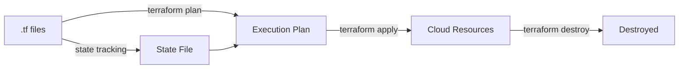

# Module 01: Terraform Fundamentals

---

## 📖 The Story

**English:**

Imagine you're a chef running 10 restaurants across India. Every time you open a new branch, you need the same kitchen setup — same ovens, same counters, same storage. Without a system, you'd visit each location and manually set up everything. One restaurant gets a gas oven, another gets electric — chaos!

Now imagine you write down the **exact specification** of your kitchen in a recipe book. "I need: 2 gas ovens, 3 prep counters, 1 walk-in freezer." You hand this book to a builder. The builder reads it and constructs the kitchen exactly as specified. Every restaurant gets the identical setup. Want to add a tandoor? Update the recipe book, builder adds it everywhere.

**This recipe book is Terraform. The kitchen specification language is HCL. The builder is `terraform apply`.**

**தமிழ்:**

நீ இந்தியா முழுக்க 10 உணவகம் நடத்துகிறாய் என்று நினை. ஒவ்வொரு புதிய கிளை திறக்கும்போதும், அதே சமையலறை அமைப்பு வேண்டும் — அதே அடுப்பு, அதே மேசை, அதே சேமிப்பு. ஒரு முறையும் இல்லாமல் ஒவ்வொரு இடத்துக்கும் போய் கையால் அமைத்தால் — ஒரு கடையில் gas அடுப்பு, இன்னொன்றில் electric — குழப்பம்!

இப்போது நீ உன் சமையலறையின் **சரியான விவரக்குறிப்பை** ஒரு புத்தகத்தில் எழுதுகிறாய் என்று நினை. "எனக்கு வேண்டும்: 2 gas அடுப்பு, 3 தயாரிப்பு மேசை, 1 குளிர்சாதனப் பெட்டி." இந்த புத்தகத்தை ஒரு கொத்தனாரிடம் கொடுக்கிறாய். அவர் படித்து, சமையலறையை அப்படியே கட்டுகிறார். எல்லா உணவகமும் ஒரே அமைப்பு பெறும். தந்தூர் சேர்க்கணுமா? புத்தகத்தை update செய், கொத்தனார் எல்லா இடத்திலும் சேர்ப்பார்.

**இந்த புத்தகம் = Terraform. சமையலறை விவரக்குறிப்பு மொழி = HCL. கொத்தனார் = `terraform apply`.**

---

## 📖 What is HCL?

**English:**

HCL = HashiCorp Configuration Language. It's the language you write Terraform code in.

The key idea: you describe WHAT you want (the desired end state), NOT HOW to build it (step-by-step instructions). This is called "declarative."

Think of ordering biryani at a restaurant. You say "1 chicken biryani, medium spice." You DON'T say "boil rice for 20 min, marinate chicken in yogurt, layer in pot..." The chef knows the steps. You just declare what you want. HCL works the same way — you declare the infrastructure you want, Terraform figures out how to create it.

**தமிழ்:**

HCL = HashiCorp Configuration Language. இதில்தான் Terraform code எழுதுவோம்.

முக்கிய கருத்து: நீ என்ன வேண்டும் (இறுதி நிலை) என்று மட்டும் சொல். எப்படி செய்யணும் (படிப்படியான வழிமுறை) என்று சொல்ல வேண்டாம். இதற்கு "declarative" (விவரிப்பு முறை) என்று பெயர்.

உணவகத்தில் பிரியாணி ஆர்டர் செய்வது போல நினை. நீ "1 சிக்கன் பிரியாணி, நடுத்தர காரம்" என்று சொல்கிறாய். "அரிசியை 20 நிமிடம் வேகவை, சிக்கனை தயிரில் ஊற வை, பாத்திரத்தில் அடுக்கு..." என்று சொல்வதில்லை. சமையல்காரனுக்கு படிகள் தெரியும். நீ என்ன வேண்டும் என்று மட்டும் அறிவிக்கிறாய். HCL-ம் அப்படியே — நீ என்ன infrastructure வேண்டும் என்று சொல், Terraform எப்படி உருவாக்குவது என்று தானே கண்டுபிடிக்கும்.

### HCL vs Other Formats

**English:**

| Format | Type | Use Case |
|--------|------|----------|
| **HCL** | Declarative | "I need 2 VMs" — don't tell how |
| JSON | Data format | Store data only, no logic |
| YAML | Config format | Kubernetes/Ansible, but no logic |
| Python/Bash | Imperative | "First create VM, then attach disk..." step by step |

**தமிழ்:**

| Format | வகை | பயன்பாடு |
|--------|------|-----------|
| **HCL** | Declarative (விவரிப்பு) | "எனக்கு 2 VM வேண்டும்" — எப்படி என்று சொல்ல வேண்டாம் |
| JSON | தரவு வடிவம் | தரவை சேமிக்க மட்டும், logic கிடையாது |
| YAML | உள்ளமைவு வடிவம் | Kubernetes/Ansible-க்கு, ஆனால் logic கிடையாது |
| Python/Bash | Imperative (கட்டளை) | "முதலில் VM உருவாக்கு, பின் disk இணை..." படிப்படியாக |

### HCL Syntax — Just ONE Pattern

**English:**

Everything in Terraform follows this single pattern. Learn this one structure and you know the entire language:

```hcl
block_type "type" "name" {
  argument = value
  argument = value

  nested_block {
    argument = value
  }
}
```

Real example:

```hcl
resource "azurerm_storage_account" "logs" {
  name                     = "stlogsprod001"
  resource_group_name      = azurerm_resource_group.main.name
  location                 = "East US"
  account_tier             = "Standard"
  account_replication_type = "LRS"

  blob_properties {
    delete_retention_policy {
      days = 30
    }
  }

  tags = {
    team        = "platform"
    cost_center = "12345"
  }
}
```

**தமிழ்:**

Terraform-ல் எல்லாமே இந்த ஒரே pattern-ஐ பின்பற்றும். இந்த ஒரு அமைப்பை கற்றுக்கொண்டால், முழு மொழியும் தெரிந்ததுதான்:

```hcl
block_வகை "type" "பெயர்" {
  argument = மதிப்பு
  argument = மதிப்பு

  nested_block {
    argument = மதிப்பு
  }
}
```

நிஜ உதாரணம்:

```hcl
resource "azurerm_storage_account" "logs" {
  name                     = "stlogsprod001"          # சேமிப்பக கணக்கின் பெயர்
  resource_group_name      = azurerm_resource_group.main.name  # எந்த group-ல்
  location                 = "East US"                # எங்கே உருவாக்க
  account_tier             = "Standard"               # தரம்
  account_replication_type = "LRS"                    # நகல் வகை

  blob_properties {                                   # Blob பண்புகள் (nested block)
    delete_retention_policy {
      days = 30                                       # 30 நாள் retention
    }
  }

  tags = {                                            # labels (Map வகை)
    team        = "platform"
    cost_center = "12345"
  }
}
```

### 🧠 Byheart for Interview

**English:**
```
1. HCL = HashiCorp Configuration Language
2. HCL is DECLARATIVE (describe what, not how)
3. Everything = block_type "type" "name" { arguments }
4. Supports: variables, conditionals, loops, functions
5. Human-readable (easier than JSON)
6. Comments: # single line, /* multi-line */
7. File extension: .tf
```

**தமிழ்:**
```
1. HCL = HashiCorp Configuration Language
2. HCL declarative மொழி (என்ன வேண்டும் என்று சொல், எப்படி என்று சொல்ல வேண்டாம்)
3. எல்லாமே ஒரே pattern = block_type "வகை" "பெயர்" { arguments }
4. ஆதரிக்கும்: variables, conditionals, loops, functions
5. மனிதர்கள் படிக்க எளிது (JSON-ஐ விட எளிமை)
6. Comments: # ஒற்றை வரி, /* பல வரி */
7. கோப்பு நீட்டிப்பு: .tf
```

### ⚡ Quick Hands-on

```bash
ssh root@203.57.85.108

mkdir -p ~/tf-lab/01-hcl && cd ~/tf-lab/01-hcl

cat > main.tf << 'EOF'
terraform {
  required_providers {
    local = {
      source  = "hashicorp/local"
      version = "~> 2.0"
    }
  }
}

resource "local_file" "hello" {
  content  = "Hello from Terraform!"
  filename = "${path.module}/hello.txt"
}

output "file_path" {
  value = local_file.hello.filename
}
EOF

terraform init
terraform plan
terraform apply -auto-approve
cat hello.txt
terraform destroy -auto-approve
```

---

## 📊 How Terraform Works

**English:**

Think of Terraform like a GPS navigation system:
- You tell it the **destination** (desired state in .tf files)
- It checks **where you are now** (current state from state file)
- It **calculates the route** (terraform plan)
- It **drives you there** (terraform apply)
- If you take a wrong turn manually, it recalculates and corrects

The core workflow is:
1. `terraform init` — Download required providers and set up backend
2. `terraform plan` — Preview what will change (safe — nothing actually changes)
3. `terraform apply` — Actually create/modify/destroy resources
4. `terraform destroy` — Delete all resources managed by this code

**தமிழ்:**

Terraform-ஐ GPS navigation அமைப்பு போல நினை:
- நீ **செல்ல வேண்டிய இடத்தை** சொல்கிறாய் (.tf files-ல் desired state)
- அது **இப்போது எங்கே இருக்கிறாய்** என்று பார்க்கும் (state file-லிருந்து current state)
- **பாதையை கணக்கிடும்** (terraform plan)
- **அங்கே கொண்டு செல்லும்** (terraform apply)
- நீ கையால் தவறான திருப்பம் எடுத்தால், மீண்டும் கணக்கிட்டு சரி செய்யும்

முக்கிய பணிப்போக்கு:
1. `terraform init` — தேவையான providers பதிவிறக்கம், backend அமைப்பு
2. `terraform plan` — என்ன மாறும் என்று முன்னோட்டம் (பாதுகாப்பு — ஒன்றும் மாறாது)
3. `terraform apply` — நிஜமாக resources உருவாக்கு/மாற்று/அழி
4. `terraform destroy` — இந்த code நிர்வகிக்கும் எல்லா resources-ஐயும் அழி



### 🧠 Byheart for Interview

**English:**
```
Workflow: init → plan → apply (modify code, repeat)

1. plan = dry-run (nothing changes, safe to run anytime)
2. apply = real change (resources get created/modified/destroyed)
3. State file = Terraform's memory (tracks what exists)
4. Plan compares: CODE vs STATE vs REALITY
5. Terraform is IDEMPOTENT — run apply 10 times, same result
6. + in plan = CREATE, ~ = MODIFY, - = DESTROY
```

**தமிழ்:**
```
பணிப்போக்கு: init → plan → apply (code மாற்று, மீண்டும் செய்)

1. plan = dry-run (ஒன்றும் மாறாது, எப்போது வேண்டுமானாலும் ஓட்டலாம்)
2. apply = நிஜ மாற்றம் (resources உருவாகும்/மாறும்/அழியும்)
3. State file = Terraform-ன் நினைவகம் (என்ன இருக்கு என்று கண்காணிக்கும்)
4. Plan ஒப்பிடும்: CODE vs STATE vs நிஜம்
5. Terraform IDEMPOTENT — 10 தடவை apply செய்தாலும் ஒரே முடிவு
6. plan-ல்: + = உருவாக்கு, ~ = மாற்று, - = அழி
```

### ⚡ Quick Hands-on

```bash
cd ~/tf-lab/01-hcl

# See the plan symbols
terraform plan
# Look for: + (create), ~ (modify), - (destroy)

# Modify content and see ~ in plan
sed -i 's/Hello/Vanakkam/' main.tf
terraform plan       # Shows ~ (modify)
terraform apply -auto-approve
cat hello.txt        # "Vanakkam from Terraform!"
```

---

## 🔑 Providers

**English:**

A Provider is like a translator between you and the cloud. You speak HCL, the provider translates it into Azure/GCP/AWS API calls. Without a provider, Terraform cannot talk to any cloud.

Key facts:
- Provider = plugin that knows how to talk to a specific cloud
- Downloaded during `terraform init`
- Must specify `source` (where to download) and `version` (which version)
- Lives in HashiCorp Registry (registry.terraform.io)

```hcl
terraform {
  required_providers {
    azurerm = {
      source  = "hashicorp/azurerm"
      version = "~> 3.0"
    }
    google = {
      source  = "hashicorp/google"
      version = "~> 5.0"
    }
  }
}

provider "azurerm" {
  features {}
  subscription_id = var.subscription_id
}

provider "google" {
  project = var.gcp_project
  region  = var.gcp_region
}
```

**தமிழ்:**

Provider என்பது உனக்கும் cloud-க்கும் இடையே உள்ள மொழிபெயர்ப்பாளர் போன்றது. நீ HCL-ல் பேசுகிறாய், provider அதை Azure/GCP/AWS API calls-ஆக மொழிபெயர்க்கும். Provider இல்லாமல், Terraform எந்த cloud-உடனும் பேச இயலாது.

முக்கிய உண்மைகள்:
- Provider = குறிப்பிட்ட cloud-உடன் எப்படி பேசுவது என்று தெரிந்த plugin
- `terraform init` போது download ஆகும்
- `source` (எங்கிருந்து download) மற்றும் `version` (எந்த பதிப்பு) கட்டாயம் குறிப்பிட வேண்டும்
- HashiCorp Registry-ல் (registry.terraform.io) கிடைக்கும்

```hcl
terraform {
  required_providers {
    azurerm = {
      source  = "hashicorp/azurerm"   # எங்கிருந்து download செய்ய
      version = "~> 3.0"              # எந்த பதிப்பு (3.x ஏதாவது)
    }
    google = {
      source  = "hashicorp/google"
      version = "~> 5.0"              # 5.x ஏதாவது
    }
  }
}

provider "azurerm" {
  features {}
  subscription_id = var.subscription_id   # எந்த Azure subscription
}

provider "google" {
  project = var.gcp_project               # எந்த GCP project
  region  = var.gcp_region                # எந்த region
}
```

---

## 🔑 Resources

**English:**

A Resource is the thing you want Terraform to CREATE and MANAGE. It's like ordering food — you tell the chef "I want biryani" and the chef creates it. Say "cancel" and it's destroyed. Terraform owns the full lifecycle: create → update → destroy.

Key facts:
- Resource = a cloud object (VM, VNet, Database, Storage Account, etc.)
- Terraform creates it, tracks it, updates it, and destroys it
- Syntax: `resource "TYPE" "NAME" { ... }`
- Reference it elsewhere: `TYPE.NAME.attribute`

```hcl
resource "azurerm_resource_group" "main" {
  name     = "rg-production"
  location = "East US"
  
  tags = {
    environment = "production"
    team        = "platform"
    managed_by  = "terraform"
  }
}

# Reference this resource elsewhere:
# azurerm_resource_group.main.id
# azurerm_resource_group.main.name
```

**தமிழ்:**

Resource என்பது Terraform உருவாக்கி நிர்வகிக்க வேண்டிய பொருள். உணவு ஆர்டர் செய்வது போல — நீ சமையல்காரனிடம் "பிரியாணி வேண்டும்" என்று சொல்கிறாய், அவன் உருவாக்குகிறான். "வேண்டாம்" என்றால் அழிக்கிறான். Terraform முழு lifecycle-ஐ சொந்தமாக நிர்வகிக்கும்: உருவாக்கம் → புதுப்பிப்பு → அழிப்பு.

முக்கிய உண்மைகள்:
- Resource = ஒரு cloud பொருள் (VM, VNet, Database, Storage Account, போன்றவை)
- Terraform உருவாக்கும், கண்காணிக்கும், புதுப்பிக்கும், அழிக்கும்
- Syntax: `resource "வகை" "பெயர்" { ... }`
- வேறு இடத்தில் குறிப்பிட: `வகை.பெயர்.attribute`

```hcl
resource "azurerm_resource_group" "main" {
  name     = "rg-production"      # Resource group பெயர்
  location = "East US"            # எந்த இடத்தில் உருவாக்க
  
  tags = {
    environment = "production"    # சூழல்
    team        = "platform"      # குழு
    managed_by  = "terraform"     # யார் நிர்வகிக்கிறார்கள்
  }
}

# இந்த resource-ஐ வேறு இடத்தில் குறிப்பிட:
# azurerm_resource_group.main.id    → resource-ன் ID
# azurerm_resource_group.main.name  → resource-ன் பெயர்
```

---

## 🔑 Data Sources

**English:**

A Data Source is for READING something that already exists. You're NOT creating anything — just getting information. It's like reading a menu card at a restaurant. You're not ordering food, just checking what's available.

Key facts:
- Data source = read existing resource (NOT create)
- The resource was created outside Terraform or by another Terraform state
- Syntax: `data "TYPE" "NAME" { ... }`
- Reference: `data.TYPE.NAME.attribute`

```hcl
data "azurerm_key_vault" "existing" {
  name                = "kv-production"
  resource_group_name = "rg-shared"
}

# Use the information:
# data.azurerm_key_vault.existing.vault_uri
```

**தமிழ்:**

Data Source என்பது ஏற்கனவே இருக்கும் ஒன்றை படிக்க பயன்படும். நீ ஒன்றையும் உருவாக்குவதில்லை — தகவல் மட்டும் எடுக்கிறாய். உணவகத்தில் மெனு card படிப்பது போல. நீ உணவு ஆர்டர் செய்யவில்லை, என்ன கிடைக்கும் என்று பார்க்கிறாய்.

முக்கிய உண்மைகள்:
- Data source = ஏற்கனவே இருக்கும் resource-ஐ படி (உருவாக்காது)
- அந்த resource Terraform-க்கு வெளியே அல்லது வேறு Terraform state மூலம் உருவாக்கப்பட்டது
- Syntax: `data "வகை" "பெயர்" { ... }`
- குறிப்பிட: `data.வகை.பெயர்.attribute`

```hcl
data "azurerm_key_vault" "existing" {
  name                = "kv-production"       # எந்த Key Vault
  resource_group_name = "rg-shared"           # எந்த resource group-ல் இருக்கு
}

# படித்த தகவலை பயன்படுத்து:
# data.azurerm_key_vault.existing.vault_uri   → Vault-ன் URL
```

---

## 🔑 Outputs

**English:**

Outputs display important information after `terraform apply` completes. Like a receipt at a restaurant — after your order is prepared, you get a bill showing what was made and the total. Outputs also let you pass values to other Terraform modules.

```hcl
output "resource_group_id" {
  value       = azurerm_resource_group.main.id
  description = "The ID of the resource group"
}

output "vault_uri" {
  value     = data.azurerm_key_vault.existing.vault_uri
  sensitive = true    # Don't show in logs!
}
```

**தமிழ்:**

`terraform apply` முடிந்ததும் முக்கியமான தகவல்களை காட்ட Outputs பயன்படும். உணவகத்தில் bill போல — ஆர்டர் தயாரானதும், என்ன செய்யப்பட்டது, மொத்தம் எவ்வளவு என்று receipt கிடைக்கும். Outputs மூலம் மற்ற Terraform modules-க்கு மதிப்புகளை அனுப்பவும் முடியும்.

```hcl
output "resource_group_id" {
  value       = azurerm_resource_group.main.id
  description = "Resource group-ன் ID"         # விளக்கம்
}

output "vault_uri" {
  value     = data.azurerm_key_vault.existing.vault_uri
  sensitive = true    # ரகசியம் — logs-ல் காட்டாதே!
}
```

---

## 🧠 Byheart for Interview — Key Concepts

**English:**
```
PROVIDER:
  - Plugin that connects to cloud API
  - Downloaded during terraform init
  - Must specify source + version
  - Lives in HashiCorp Registry

RESOURCE:
  - CREATE/MANAGE (Terraform owns lifecycle)
  - Syntax: resource "TYPE" "NAME" { ... }
  - Reference: TYPE.NAME.ATTRIBUTE

DATA SOURCE:
  - READ ONLY (doesn't create anything)
  - Syntax: data "TYPE" "NAME" { ... }
  - Reference: data.TYPE.NAME.ATTRIBUTE

OUTPUT:
  - Shows values after apply
  - Shares data between modules
  - sensitive = true hides from logs

KEY DIFFERENCE (they WILL ask this!):
  resource = YOU create it (Terraform owns lifecycle)
  data     = someone ELSE created it (read-only)
```

**தமிழ்:**
```
PROVIDER:
  - Cloud API-உடன் இணைக்கும் plugin
  - terraform init போது download ஆகும்
  - source + version கட்டாயம் குறிப்பிட வேண்டும்
  - HashiCorp Registry-ல் இருக்கும்

RESOURCE:
  - உருவாக்கு/நிர்வகி (Terraform lifecycle சொந்தமாக்கும்)
  - Syntax: resource "வகை" "பெயர்" { ... }
  - குறிப்பிட: வகை.பெயர்.ATTRIBUTE

DATA SOURCE:
  - படிக்க மட்டும் (ஒன்றும் உருவாக்காது)
  - Syntax: data "வகை" "பெயர்" { ... }
  - குறிப்பிட: data.வகை.பெயர்.ATTRIBUTE

OUTPUT:
  - Apply-க்கு பிறகு மதிப்புகளை காட்டும்
  - Modules இடையே data பகிர
  - sensitive = true → logs-ல் மறைக்கும்

முக்கிய வேறுபாடு (interview-ல் நிச்சயம் கேட்பார்கள்!):
  resource = நீ உருவாக்குவது (lifecycle Terraform கையில்)
  data     = வேறொருவர் உருவாக்கியது (படிக்க மட்டும்)
```

### ⚡ Quick Hands-on

```bash
cd ~/tf-lab/01-hcl

cat > main.tf << 'EOF'
terraform {
  required_providers {
    local = {
      source  = "hashicorp/local"
      version = "~> 2.0"
    }
    random = {
      source  = "hashicorp/random"
      version = "~> 3.0"
    }
  }
}

# Resource 1: Random name
resource "random_pet" "server" {
  length    = 2
  separator = "-"
}

# Resource 2: File using reference from Resource 1
resource "local_file" "config" {
  content  = "Server name: ${random_pet.server.id}\nManaged by Terraform"
  filename = "${path.module}/server-config.txt"
}

# Outputs
output "server_name" {
  value = random_pet.server.id
}

output "config_path" {
  value = local_file.config.filename
}
EOF

terraform init
terraform apply -auto-approve
cat server-config.txt
terraform output
terraform state list
```

---

## 🛠️ Commands

**English:**

```bash
# Project Setup
terraform init                    # Download providers, set up backend
terraform init -upgrade           # Upgrade provider versions

# Plan & Apply
terraform plan                    # Preview changes (safe — nothing changes)
terraform plan -out=plan.tfplan   # Save plan to file (for CI/CD)
terraform apply plan.tfplan       # Apply saved plan exactly
terraform apply -auto-approve     # Skip confirmation (CI/CD only!)

# Inspect
terraform show                    # Show current state (human-readable)
terraform state list              # List all resources in state
terraform state show TYPE.NAME    # Show specific resource details

# Destroy
terraform destroy                 # Delete ALL resources
terraform destroy -target=TYPE.NAME  # Delete one resource only

# Format & Validate
terraform fmt -recursive          # Auto-format all .tf files
terraform validate                # Check for syntax/logic errors

# Workspace
terraform workspace list          # List workspaces
terraform workspace new staging   # Create new workspace
terraform workspace select prod   # Switch workspace
```

**தமிழ்:**

```bash
# திட்ட அமைப்பு
terraform init                    # Providers பதிவிறக்கம், backend அமைப்பு
terraform init -upgrade           # Provider பதிப்புகளை புதுப்பி

# திட்டமிடு & செயல்படுத்து
terraform plan                    # மாற்றங்களை முன்னோட்டம் பார் (பாதுகாப்பு — ஒன்றும் மாறாது)
terraform plan -out=plan.tfplan   # திட்டத்தை கோப்பில் சேமி (CI/CD-க்கு)
terraform apply plan.tfplan       # சேமித்த திட்டத்தை அப்படியே செயல்படுத்து
terraform apply -auto-approve     # உறுதிப்படுத்தல் தவிர் (CI/CD-ல் மட்டும்!)

# ஆய்வு
terraform show                    # தற்போதைய நிலையை படிக்கக்கூடிய வடிவில் காட்டு
terraform state list              # State-ல் உள்ள எல்லா resources பட்டியல்
terraform state show TYPE.NAME    # ஒரு குறிப்பிட்ட resource விவரம்

# அழிப்பு
terraform destroy                 # எல்லா resources-ஐயும் அழி
terraform destroy -target=TYPE.NAME  # ஒரு resource மட்டும் அழி

# வடிவமைப்பு & சரிபார்ப்பு
terraform fmt -recursive          # எல்லா .tf files-ஐ அழகாக format செய்
terraform validate                # Syntax/logic பிழை சரிபார்

# Workspace (பல சூழல்கள்)
terraform workspace list          # Workspaces பட்டியல்
terraform workspace new staging   # புதிய workspace உருவாக்கு
terraform workspace select prod   # வேறு workspace-க்கு மாறு
```

### 🧠 Byheart for Interview

**English:**
```
init    = ALWAYS FIRST (nothing works without it)
plan    = SAFE (nothing changes, just preview)
apply   = DANGEROUS (real changes happen!)
destroy = MOST DANGEROUS (everything gets deleted!)

In CI/CD:
  plan -out=file → human review → apply file
  (save the plan, apply THAT EXACT plan — safety!)
```

**தமிழ்:**
```
init    = எப்போதும் முதலில் (இது இல்லாமல் ஒன்றும் நடக்காது)
plan    = பாதுகாப்பு (ஒன்றும் மாறாது, preview மட்டும்)
apply   = ஆபத்து (நிஜ மாற்றங்கள் நடக்கும்!)
destroy = மிகப்பெரிய ஆபத்து (எல்லாம் அழிக்கப்படும்!)

CI/CD-ல்:
  plan -out=file → மனித மதிப்பாய்வு → apply file
  (திட்டத்தை சேமி, அதே திட்டத்தை apply செய் — பாதுகாப்பு!)
```

---

## 📁 Project Structure

**English:**

```
project/
├── main.tf              # Primary resources (what to create)
├── variables.tf         # Input variable declarations
├── outputs.tf           # Output declarations
├── terraform.tf         # Provider & backend configuration
├── terraform.tfvars     # Variable values (⚠️ DON'T commit secrets!)
├── .terraform/          # Downloaded providers (🚫 gitignore this!)
├── .terraform.lock.hcl  # Provider version lock (✅ DO commit!)
└── terraform.tfstate    # State file (⚠️ use remote backend!)
```

**தமிழ்:**

```
project/
├── main.tf              # முதன்மை resources (என்ன உருவாக்கணும்)
├── variables.tf         # Input variable அறிவிப்புகள்
├── outputs.tf           # Output அறிவிப்புகள்
├── terraform.tf         # Provider & backend உள்ளமைவு
├── terraform.tfvars     # Variable மதிப்புகள் (⚠️ ரகசியங்களை commit செய்யாதே!)
├── .terraform/          # பதிவிறக்கிய providers (🚫 gitignore செய்!)
├── .terraform.lock.hcl  # Provider பதிப்பு பூட்டு (✅ commit செய்!)
└── terraform.tfstate    # State கோப்பு (⚠️ remote backend பயன்படுத்து!)
```

### 🧠 Byheart for Interview

**English:**
```
MUST COMMIT:     .tf files, .terraform.lock.hcl
NEVER COMMIT:    .tfvars (secrets), .tfstate, .terraform/

State file facts:
  - Terraform's "memory" (remembers what it created)
  - NEVER edit manually!
  - Store in remote backend (Azure Storage / GCS / S3)
  - Shared across team, locking prevents conflicts
```

**தமிழ்:**
```
COMMIT செய்ய வேண்டும்:     .tf files, .terraform.lock.hcl
COMMIT செய்யவே கூடாது:     .tfvars (ரகசியம்), .tfstate, .terraform/

State file உண்மைகள்:
  - Terraform-ன் "நினைவகம்" (என்ன உருவாக்கியது என்று நினைவில் வைக்கும்)
  - கையால் மாற்றவே கூடாது!
  - Remote backend-ல் சேமி (Azure Storage / GCS / S3)
  - Team-ல் பகிரப்படும், locking மூலம் மோதல்கள் தடுக்கப்படும்
```

---

## 📋 Cheat Sheet

**English:**
```
┌──────────────────────────────────────────────────┐
│      TERRAFORM MODULE 01 — CHEAT SHEET           │
├──────────────────────────────────────────────────┤
│ HCL = Declarative language (say what, not how)   │
│ Terraform = engine that builds it                │
│                                                  │
│ WORKFLOW: init → plan → apply (repeat)           │
│                                                  │
│ 4 BLOCK TYPES:                                   │
│   resource "TYPE" "NAME" { }  → create/manage    │
│   data "TYPE" "NAME" { }      → read only        │
│   variable "NAME" { }         → input            │
│   output "NAME" { }           → display result   │
│                                                  │
│ REFERENCING:                                     │
│   resource → TYPE.NAME.attribute                 │
│   data     → data.TYPE.NAME.attribute            │
│   variable → var.NAME                            │
│   local    → local.NAME                          │
│                                                  │
│ GOLDEN RULES:                                    │
│   ✓ Always use remote state                      │
│   ✓ Always plan before apply                     │
│   ✓ Never edit state file manually               │
│   ✓ Lock provider versions                       │
│   ✓ Never commit secrets                         │
│   ✓ Use terraform fmt for clean code             │
└──────────────────────────────────────────────────┘
```

**தமிழ்:**
```
┌──────────────────────────────────────────────────┐
│      TERRAFORM மாடுல் 01 — விரைவு குறிப்பு       │
├──────────────────────────────────────────────────┤
│ HCL = Declarative மொழி (என்ன வேண்டும் சொல்)     │
│ Terraform = அதை உருவாக்கும் engine               │
│                                                  │
│ பணிப்போக்கு: init → plan → apply (மீண்டும் செய்) │
│                                                  │
│ 4 BLOCK வகைகள்:                                  │
│   resource "வகை" "பெயர்" { }  → உருவாக்கு/நிர்வகி│
│   data "வகை" "பெயர்" { }      → படிக்க மட்டும்   │
│   variable "பெயர்" { }         → input            │
│   output "பெயர்" { }           → முடிவு காட்டு    │
│                                                  │
│ குறிப்பிடும் முறை:                                │
│   resource → வகை.பெயர்.attribute                  │
│   data     → data.வகை.பெயர்.attribute             │
│   variable → var.பெயர்                            │
│   local    → local.பெயர்                          │
│                                                  │
│ பொன் விதிகள்:                                    │
│   ✓ எப்போதும் remote state பயன்படுத்து           │
│   ✓ Apply முன் எப்போதும் plan பார்                │
│   ✓ State file-ஐ கையால் மாற்றாதே                 │
│   ✓ Provider பதிப்புகளை பூட்டு                    │
│   ✓ ரகசியங்களை commit செய்யாதே                   │
│   ✓ terraform fmt பயன்படுத்து (சுத்தமான code)    │
└──────────────────────────────────────────────────┘
```

---

## 🎤 Interview Q&A

**Q: What is Terraform and why use it over manual cloud console?**

**English:**
| Benefit | Explanation |
|---------|-------------|
| Reproducible | Same code → same infrastructure every time |
| Version controlled | Git tracks all infra changes |
| Reviewable | PR review for infra (like code review) |
| Automated | CI/CD can apply infra changes |
| Multi-cloud | One tool for Azure + GCP + AWS |
| Self-documenting | Read code = understand infra |

**தமிழ்:**
| நன்மை | விளக்கம் |
|--------|----------|
| மீண்டும் உருவாக்கக்கூடியது | ஒரே code → எப்போதும் ஒரே infrastructure |
| பதிப்பு கட்டுப்பாடு | Git எல்லா infra மாற்றங்களையும் கண்காணிக்கும் |
| மதிப்பாய்வு | Infra மாற்றங்களுக்கு PR review (code review போல) |
| தானியக்கம் | CI/CD மூலம் infra மாற்றங்களை apply செய்யலாம் |
| பல cloud | Azure + GCP + AWS எல்லாவற்றுக்கும் ஒரே tool |
| தானே ஆவணம் | Code-ஐ படித்தாலே infra புரியும் |

---

**Q: What is the difference between resource and data source?**

**English:**
| | Resource | Data Source |
|--|----------|-------------|
| Action | CREATE/MANAGE | READ only |
| Lifecycle | Terraform owns it | Created outside Terraform |
| Syntax | `resource "type" "name"` | `data "type" "name"` |
| Reference | `type.name.attr` | `data.type.name.attr` |

**தமிழ்:**
| | Resource | Data Source |
|--|----------|-------------|
| செயல் | உருவாக்கு/நிர்வகி | படிக்கும் மட்டும் |
| Lifecycle | Terraform சொந்தமாக்கும் | Terraform-க்கு வெளியே உருவாக்கப்பட்டது |
| Syntax | `resource "வகை" "பெயர்"` | `data "வகை" "பெயர்"` |
| குறிப்பிட | `வகை.பெயர்.attr` | `data.வகை.பெயர்.attr` |

---

**Q: What is the state file and why is it important?**

**English:**
- Terraform's "memory" — tracks what resources exist
- During plan: compares code vs state vs actual cloud reality
- Without it, Terraform wouldn't know what to create/modify/destroy
- Must be stored remotely (Azure Storage / S3 / GCS) for team use
- Locking prevents two people from applying at the same time

**தமிழ்:**
- Terraform-ன் "நினைவகம்" — என்ன resources இருக்கின்றன என்று கண்காணிக்கும்
- Plan போது: code vs state vs நிஜ cloud நிலை ஒப்பிடும்
- இது இல்லாமல், Terraform-க்கு என்ன உருவாக்க/மாற்ற/அழிக்க வேண்டும் என்று தெரியாது
- Team பயன்பாட்டுக்கு remote-ல் (Azure Storage / S3 / GCS) சேமிக்க வேண்டும்
- Locking — இரண்டு பேர் ஒரே நேரத்தில் apply செய்வதை தடுக்கும்

---

**Q: What happens if someone makes a manual change in cloud console?**

**English:**
- Next `terraform plan` detects the **drift** (difference between state and reality)
- Terraform treats code as the single source of truth
- `terraform apply` will overwrite the manual change to match the code
- Solution: always make changes through Terraform, use console only to view

**தமிழ்:**
- அடுத்த `terraform plan`-ல் **drift** (state-க்கும் நிஜத்துக்கும் வேறுபாடு) கண்டறியப்படும்
- Terraform code-ஐ ஒரே உண்மை மூலமாக கருதும்
- `terraform apply` செய்தால் → கையால் செய்த மாற்றம் code-க்கு match ஆக மேலெழுதப்படும்
- தீர்வு: எப்போதும் Terraform வழியாக மாற்றம் செய், console-ஐ பார்க்க மட்டும் பயன்படுத்து

---

## ✅ Self-Check | சுய மதிப்பீடு

**English:**
- [ ] I can explain Terraform workflow (init/plan/apply) like a story
- [ ] I can explain HCL (declarative vs imperative)
- [ ] I can explain the difference between provider, resource, data source, output
- [ ] I can write a basic .tf file
- [ ] I can explain state file purpose and dangers
- [ ] I can read terraform plan output (+ ~ -)
- [ ] I have done the hands-on on the server
- [ ] I can write resource references (type.name.attr)

**தமிழ்:**
- [ ] Terraform workflow (init/plan/apply) கதை போல விளக்க முடியும்
- [ ] HCL (declarative vs imperative) விளக்க முடியும்
- [ ] Provider, resource, data source, output வேறுபாடு விளக்க முடியும்
- [ ] அடிப்படை .tf file எழுத முடியும்
- [ ] State file நோக்கம் & ஆபத்துகள் விளக்க முடியும்
- [ ] terraform plan output (+ ~ -) படிக்க முடியும்
- [ ] Server-ல் hands-on செய்து பார்த்தேன்
- [ ] Resource reference (type.name.attr) எழுத முடியும்
