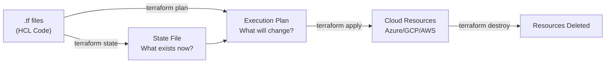

# Module 01: Terraform Fundamentals
# மாடுல் 01: Terraform அடிப்படைகள்

---

## 🎯 What? | என்ன?

**English:** Terraform = Infrastructure-as-Code (IaC). Write YAML-like code (HCL) → Terraform creates real cloud resources (VMs, networks, databases). Delete the code → resources destroyed.

**தமிழ்:** Terraform = Infrastructure-as-Code. Code எழுதினால் → cloud resources create ஆகும் (VMs, networks, databases). Code delete செய்தால் → resources destroy ஆகும்.

### Analogy | உதாரணம்
> Blueprint for a house: Architect draws a plan (HCL code), builder constructs it (terraform apply). Want to add a room? Update the blueprint, builder adds it. Tear down? Remove from blueprint.

> வீட்டு blueprint: Architect plan வரைகிறார் (HCL code), builder கட்டுகிறார் (apply). Room add? Blueprint update. Demolish? Blueprint-லிருந்து remove.

---

## 📊 How Terraform Works | எப்படி வேலை செய்கிறது



### Core Workflow

```
terraform init     → Download providers, setup backend
terraform plan     → Show what WILL change (dry-run)
terraform apply    → Actually create/modify resources
terraform destroy  → Delete everything
```

---

## 🔑 Key Concepts | முக்கிய கருத்துக்கள்

### 1. Providers (Cloud APIs)

```hcl
# Provider = எந்த cloud-ல் resources create செய்ய வேண்டும்?
terraform {
  required_providers {
    azurerm = {
      source  = "hashicorp/azurerm"
      version = "~> 3.0"    # Version constraint
    }
    google = {
      source  = "hashicorp/google"
      version = "~> 5.0"
    }
  }
}

provider "azurerm" {
  features {}
  subscription_id = var.subscription_id
}

provider "google" {
  project = var.gcp_project
  region  = var.gcp_region
}
```

### 2. Resources (What to create)

```hcl
# Resource = ஒரு cloud object (VM, VNet, Database, etc.)
resource "azurerm_resource_group" "main" {
  name     = "rg-production"
  location = "East US"
  
  tags = {
    environment = "production"
    team        = "platform"
    managed_by  = "terraform"
  }
}

# Resource reference: azurerm_resource_group.main.id
# Other resources-ல் இதை refer செய்யலாம்
```

### 3. Data Sources (Read existing)

```hcl
# Data source = already existing resource-ஐ READ (create அல்ல!)
data "azurerm_subscription" "current" {}

data "azurerm_key_vault" "existing" {
  name                = "kv-production"
  resource_group_name = "rg-shared"
}

# Use: data.azurerm_key_vault.existing.vault_uri
```

### 4. Outputs

```hcl
# Output = terraform apply முடிந்ததும் show செய்ய
output "resource_group_id" {
  value       = azurerm_resource_group.main.id
  description = "The ID of the resource group"
}

output "vault_uri" {
  value     = data.azurerm_key_vault.existing.vault_uri
  sensitive = true    # Don't show in logs!
}
```

---

## 🛠️ Commands | Commands

```bash
# --- Project Setup ---
terraform init                    # Download providers, init backend
terraform init -upgrade           # Upgrade provider versions

# --- Plan & Apply ---
terraform plan                    # Dry-run — show changes
terraform plan -out=plan.tfplan   # Save plan to file (for CI/CD)
terraform apply plan.tfplan       # Apply saved plan (exact changes)
terraform apply -auto-approve     # Skip confirmation (CI/CD only!)

# --- Inspect ---
terraform show                    # Current state in human-readable
terraform state list              # List all resources in state
terraform state show azurerm_resource_group.main  # Specific resource

# --- Destroy ---
terraform destroy                 # Delete ALL resources
terraform destroy -target=azurerm_virtual_machine.vm1  # Single resource

# --- Format & Validate ---
terraform fmt -recursive          # Format all .tf files
terraform validate                # Check syntax & logic errors

# --- Workspace (multiple environments) ---
terraform workspace list          # Show workspaces
terraform workspace new staging   # Create new
terraform workspace select prod   # Switch
```

---

## 📁 Project Structure | File Layout

```
project/
├── main.tf           # Primary resources
├── variables.tf      # Input variable declarations
├── outputs.tf        # Output declarations
├── terraform.tf      # Provider & backend config
├── terraform.tfvars  # Variable values (DON'T commit secrets!)
├── .terraform/       # Downloaded providers (gitignored)
├── .terraform.lock.hcl  # Provider version lock (DO commit!)
└── terraform.tfstate    # State file (use remote backend!)
```

---

## 📋 Cheat Sheet | விரைவு குறிப்பு

```
┌──────────────────────────────────────────────────┐
│         TERRAFORM FUNDAMENTALS CHEAT SHEET       │
├──────────────────────────────────────────────────┤
│ WORKFLOW:                                        │
│   init → plan → apply → (modify) → plan → apply │
│                                                  │
│ KEY FILES:                                       │
│   .tf        = HCL code (resources, vars)        │
│   .tfvars    = variable values                   │
│   .tfstate   = what exists (NEVER edit manually!)│
│   .lock.hcl  = provider versions (commit this!)  │
│                                                  │
│ RESOURCE SYNTAX:                                 │
│   resource "TYPE" "NAME" { ... }                 │
│   data "TYPE" "NAME" { ... }                     │
│   variable "NAME" { type, default, description } │
│   output "NAME" { value, sensitive }             │
│                                                  │
│ REFERENCING:                                     │
│   resource: azurerm_resource_group.main.id       │
│   data:     data.azurerm_key_vault.kv.vault_uri  │
│   variable: var.location                         │
│   local:    local.env_prefix                     │
│                                                  │
│ GOLDEN RULES:                                    │
│   ✓ Always use remote state (never local!)       │
│   ✓ Always run plan before apply                 │
│   ✓ Never edit .tfstate manually                 │
│   ✓ Lock provider versions                       │
│   ✓ Don't commit .tfvars with secrets            │
└──────────────────────────────────────────────────┘
```

---

## 🎤 Interview Q&A | நேர்முகத் தேர்வு

**Q: What is Terraform and why use it over manual cloud console?**
- Reproducible: same code → same infrastructure every time
- Version controlled: Git history = infrastructure history
- Reviewable: PR review for infra changes (like code review)
- Automated: CI/CD can apply infra changes
- Multi-cloud: same tool for Azure + GCP + AWS

**Q: What is the difference between resource and data source?**
- `resource` = CREATE/MANAGE a new cloud object. Terraform owns its lifecycle.
- `data` = READ an existing object (created outside Terraform or by another state). Read-only reference.

**Q: What happens if you modify a resource in cloud console (outside Terraform)?**
- Next `terraform plan` detects drift (difference between state and reality).
- Plan shows changes to bring reality back to match code.
- `terraform apply` overwrites manual changes → code is truth.

---

## ✅ Self-Check | சுய மதிப்பீடு

- [ ] Terraform workflow (init/plan/apply) explain முடியும்
- [ ] Provider, resource, data source difference explain முடியும்
- [ ] Basic .tf file structure write முடியும்
- [ ] State file purpose explain முடியும்
- [ ] terraform plan output read முடியும்
