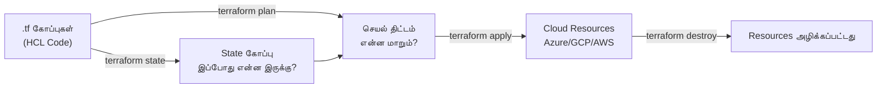

# Module 01: Terraform Fundamentals
# மாடுல் 01: Terraform அடிப்படைகள்

---

## 🎯 What? | என்ன?

**English:** Terraform = Infrastructure-as-Code (IaC). Write code in HCL language → Terraform creates real cloud resources (VMs, networks, databases). Delete the code → resources get destroyed.

**தமிழ்:** Terraform என்பது Infrastructure-as-Code (IaC) கருவி. HCL மொழியில் code எழுதினால் → cloud-ல் நிஜமான resources உருவாக்கப்படும் (VMs, networks, databases). அந்த code-ஐ அழித்தால் → resources-ம் அழிக்கப்படும்.

### Analogy | ஒப்புமை உதாரணம்

> **English:** Blueprint for a house — Architect draws a plan (HCL code), builder constructs it (terraform apply). Want to add a room? Update the blueprint, builder adds it. Tear down? Remove from blueprint.

> **தமிழ்:** வீட்டு வரைபடம் போல — வாஸ்துக்காரர் plan வரைகிறார் (HCL code), கொத்தனார் அதை கட்டுகிறார் (terraform apply). ஒரு அறை சேர்க்கணுமா? வரைபடத்தை மாற்று, கொத்தனார் சேர்ப்பார். இடிக்கணுமா? வரைபடத்திலிருந்து நீக்கு.

---

## 📖 What is HCL? | HCL என்றால் என்ன?

**English:** HCL = HashiCorp Configuration Language — the language Terraform uses. You describe WHAT you want (desired end state), not HOW to build it (step-by-step instructions).

**தமிழ்:** HCL = HashiCorp Configuration Language — Terraform-க்கான மொழி. நீ என்ன வேண்டும் (இறுதி நிலை) என்று மட்டும் சொல், எப்படி செய்யணும் (படிப்படியான வழிமுறை) என்று சொல்ல வேண்டாம். Terraform தானே வழியை கண்டுபிடிக்கும்.

### எளிமையான ஒப்புமை | Layman Analogy

```
┌──────────────────────────────────────────────────────┐
│  உணவகத்தில் ஆர்டர் படிவம் (= HCL)                   │
│  RESTAURANT ORDER FORM (= HCL)                      │
│                                                      │
│  மேசை: 5             (= resource பெயர்)              │
│  உணவு: பிரியாணி      (= resource வகை)               │
│  காரம்: நடுத்தரம்     (= attribute/பண்பு)             │
│  எண்ணிக்கை: 2        (= attribute/பண்பு)             │
│  ரைத்தா: ஆம்         (= attribute/பண்பு)             │
│                                                      │
│  சமையல்காரனிடம் எப்படி சமைக்கணும் என்று              │
│  சொல்ல வேண்டாம். என்ன வேண்டும் என்று மட்டும் சொல்.   │
│  சமையல்காரன் எப்படி என்று தானே முடிவு செய்வான்.      │
│                                                      │
│  HCL = என்ன வேண்டும் என்று சொல்வது (declarative)     │
│  Terraform = அதை உருவாக்கும் சமையல்காரன்            │
└──────────────────────────────────────────────────────┘
```

### HCL vs மற்ற Formats | ஒப்பீடு

| Format | வகை | பயன்பாடு |
|--------|------|-----------|
| **HCL** | Declarative (விவரிப்பு) | Terraform (.tf files) |
| JSON | தரவு பரிமாற்றம் | APIs, configs |
| YAML | உள்ளமைவு கோப்புகள் | Kubernetes, Ansible |
| Python/Bash | Imperative (கட்டளை) | "முதலில் இதை செய், அப்புறம் அதை செய்..." |

**முக்கிய வேறுபாடு:**
- **YAML/JSON** = தரவை சேமிக்க மட்டும் (logic கிடையாது)
- **Python** = படிப்படியாக சொல்ல வேண்டும் ("VM create செய், காத்திரு, disk attach செய்...")
- **HCL** = இறுதி நிலை மட்டும் சொல் ("எனக்கு 2 disk-உடன் ஒரு VM வேண்டும்") — Terraform தானே வரிசையை தீர்மானிக்கும்

### HCL Syntax கட்டமைப்பு | Building Blocks

```hcl
# ──── Block (Terraform-ல் எல்லாமே இந்த ஒரே pattern!) ────
# block_type "label1" "label2" { ... }

resource "azurerm_storage_account" "logs" {
  # ──── Arguments (சாவி = மதிப்பு) ────
  name                     = "stlogsprod001"
  resource_group_name      = azurerm_resource_group.main.name
  location                 = "East US"
  account_tier             = "Standard"
  account_replication_type = "LRS"

  # ──── Nested Block (உள்ளமைந்த block) ────
  blob_properties {
    delete_retention_policy {
      days = 30
    }
  }

  # ──── Map (பண்புகள் தொகுப்பு) ────
  tags = {
    team        = "platform"
    cost_center = "12345"
  }
}

# ──── Locals (கணக்கிடப்பட்ட மதிப்புகள்) ────
locals {
  env_prefix = "${var.environment}-${var.region}"
}

# ──── Conditional (நிபந்தனை — true என்றால் மட்டும் உருவாக்கு) ────
resource "azurerm_log_analytics_workspace" "monitor" {
  count = var.enable_monitoring ? 1 : 0
  name  = "law-${local.env_prefix}"
  # ...
}
```

### நிஜ உதாரணங்கள் | Real-Time Examples

**உதாரணம் 1: எளிய Resource Group உருவாக்கம்**
```hcl
resource "azurerm_resource_group" "dev" {
  name     = "rg-dev-india"
  location = "Central India"
}
```
> **English:** "I want a resource group named `rg-dev-india` in Central India."
> **தமிழ்:** "எனக்கு Central India-ல் `rg-dev-india` என்ற resource group வேண்டும்."
> Azure API-ஐ call செய்யணும், authenticate செய்யணும், POST request அனுப்பணும் — இதெல்லாம் நீ சொல்ல வேண்டாம். Terraform தானே செய்யும்.

**உதாரணம் 2: Variables (மறுபயன்பாட்டு template)**
```hcl
variable "environment" {
  type    = string
  default = "dev"
}

resource "azurerm_resource_group" "main" {
  name     = "rg-${var.environment}-india"
  location = var.location

  tags = {
    env        = var.environment
    managed_by = "terraform"
  }
}
```
> **தமிழ்:** ஒரே template — வெவ்வேறு மதிப்புகளை கொடுத்தால் dev/staging/prod-க்கு தனித்தனி resource group உருவாகும். ஒரு தடவை எழுது, பல தடவை பயன்படுத்து!

**உதாரணம் 3: Referencing (resources ஒன்றையொன்று குறிப்பிடுதல்)**
```hcl
resource "azurerm_virtual_network" "main" {
  name                = "vnet-production"
  address_space       = ["10.0.0.0/16"]
  location            = azurerm_resource_group.main.location      # ← இங்கே reference!
  resource_group_name = azurerm_resource_group.main.name          # ← இங்கே reference!
}

resource "azurerm_subnet" "aks" {
  name                 = "snet-aks"
  resource_group_name  = azurerm_resource_group.main.name
  virtual_network_name = azurerm_virtual_network.main.name        # ← இங்கே reference!
  address_prefixes     = ["10.0.1.0/24"]
}
```
> **தமிழ்:** `azurerm_resource_group.main.location` = "resource group-ன் location என்னவோ அதையே பயன்படுத்து" என்று பொருள்.
> Resource Group-ன் location மாறினால் → VNet தானாகவே மாறும். இதுதான் HCL-ன் சக்தி!

### HCL சுருக்கம் | Summary

```
Terraform-ல் எல்லாமே இந்த ஒரே pattern:

  block_type "வகை" "பெயர்" {
    argument = மதிப்பு
    argument = மதிப்பு

    nested_block {
      argument = மதிப்பு
    }
  }

அவ்வளவுதான். முழு மொழியுமே இந்த pattern-ன் திரும்பத் திரும்ப வருவதுதான்!
```

---

## 📊 How Terraform Works | Terraform எப்படி வேலை செய்கிறது



### முக்கிய பணிப்போக்கு | Core Workflow

```
terraform init     → Providers பதிவிறக்கம், backend அமைப்பு
terraform plan     → என்ன மாறும் என்று காட்டு (dry-run, நிஜமாக மாற்றாது)
terraform apply    → நிஜமாக resources உருவாக்கு/மாற்று
terraform destroy  → எல்லாவற்றையும் அழி
```

**தமிழ் விளக்கம்:**
- `init` = சமையலுக்கு முன் பொருட்களை வாங்கி வைப்பது போல (providers download)
- `plan` = சமையல் செய்யும் முன் recipe படிப்பது போல (preview, ஒன்றும் நடக்காது)
- `apply` = நிஜமாக சமைப்பது (resources உருவாகும்!)
- `destroy` = சமைத்ததை தூக்கி எறிவது (resources அழிக்கப்படும்!)

---

## 🔑 Key Concepts | முக்கிய கருத்துக்கள்

### 1. Providers (Cloud API இணைப்பு)

**தமிழ்:** Provider = எந்த cloud-உடன் பேசணும் என்று Terraform-க்கு சொல்வது. Azure-உடன் பேசணும்னா azurerm provider, GCP-உடன் பேசணும்னா google provider.

```hcl
# Provider = எந்த cloud-ல் resources உருவாக்க வேண்டும்?
terraform {
  required_providers {
    azurerm = {
      source  = "hashicorp/azurerm"
      version = "~> 3.0"    # பதிப்பு கட்டுப்பாடு
    }
    google = {
      source  = "hashicorp/google"
      version = "~> 5.0"
    }
  }
}

provider "azurerm" {
  features {}
  subscription_id = var.subscription_id
}

provider "google" {
  project = var.gcp_project
  region  = var.gcp_region
}
```

### 2. Resources (என்ன உருவாக்கணும்)

**தமிழ்:** Resource = நீ உருவாக்க விரும்பும் ஒரு cloud பொருள் (VM, VNet, Database போன்றவை). Terraform இதன் வாழ்க்கை சுழற்சியை (lifecycle) முழுவதுமாக நிர்வகிக்கும்.

```hcl
# Resource = ஒரு cloud பொருள் (VM, VNet, Database, முதலியன)
resource "azurerm_resource_group" "main" {
  name     = "rg-production"
  location = "East US"
  
  tags = {
    environment = "production"
    team        = "platform"
    managed_by  = "terraform"
  }
}

# Resource-ஐ குறிப்பிட: azurerm_resource_group.main.id
# மற்ற resources-ல் இதை reference செய்யலாம்
```

### 3. Data Sources (ஏற்கனவே இருப்பதை படிக்க)

**தமிழ்:** Data source = ஏற்கனவே இருக்கும் resource-ஐ படிக்க மட்டும் (உருவாக்காது!). வேறொருவர் உருவாக்கிய resource-ன் தகவலை எடுக்க பயன்படும்.

```hcl
# Data source = ஏற்கனவே இருக்கும் resource-ஐ படி (உருவாக்காது!)
data "azurerm_subscription" "current" {}

data "azurerm_key_vault" "existing" {
  name                = "kv-production"
  resource_group_name = "rg-shared"
}

# பயன்பாடு: data.azurerm_key_vault.existing.vault_uri
```

### 4. Outputs (வெளியீடு)

**தமிழ்:** Output = terraform apply முடிந்ததும் முக்கியமான தகவல்களை காட்ட. மற்ற modules-க்கு மதிப்புகளை அனுப்பவும் பயன்படும்.

```hcl
# Output = apply முடிந்ததும் முக்கிய தகவல்களை காட்ட
output "resource_group_id" {
  value       = azurerm_resource_group.main.id
  description = "Resource group-ன் ID"
}

output "vault_uri" {
  value     = data.azurerm_key_vault.existing.vault_uri
  sensitive = true    # logs-ல் காட்டாதே! (ரகசியம்)
}
```

---

## 🛠️ Commands | கட்டளைகள்

```bash
# --- திட்ட அமைப்பு | Project Setup ---
terraform init                    # Providers பதிவிறக்கம், backend ஆரம்பம்
terraform init -upgrade           # Provider பதிப்புகளை மேம்படுத்து

# --- திட்டமிடு & செயல்படுத்து | Plan & Apply ---
terraform plan                    # என்ன மாறும் என்று முன்னோட்டம் (dry-run)
terraform plan -out=plan.tfplan   # திட்டத்தை கோப்பில் சேமி (CI/CD-க்கு)
terraform apply plan.tfplan       # சேமித்த திட்டத்தை செயல்படுத்து
terraform apply -auto-approve     # உறுதிப்படுத்தல் தவிர் (CI/CD-ல் மட்டும்!)

# --- ஆய்வு | Inspect ---
terraform show                    # தற்போதைய நிலையை படிக்கக்கூடிய வடிவில் காட்டு
terraform state list              # State-ல் உள்ள அனைத்து resources பட்டியல்
terraform state show azurerm_resource_group.main  # குறிப்பிட்ட resource விவரம்

# --- அழிப்பு | Destroy ---
terraform destroy                 # எல்லா resources-ஐயும் அழி
terraform destroy -target=azurerm_virtual_machine.vm1  # ஒரு resource மட்டும் அழி

# --- வடிவமைப்பு & சரிபார்ப்பு | Format & Validate ---
terraform fmt -recursive          # எல்லா .tf files-ஐ சரியான format-க்கு மாற்று
terraform validate                # syntax & logic பிழைகளை சரிபார்

# --- Workspace (பல சூழல்கள்) | Multiple Environments ---
terraform workspace list          # Workspaces பட்டியல்
terraform workspace new staging   # புதிய workspace உருவாக்கு
terraform workspace select prod   # வேறு workspace-க்கு மாறு
```

---

## 📁 Project Structure | கோப்பு அமைப்பு

```
project/
├── main.tf              # முதன்மை resources (என்ன உருவாக்கணும்)
├── variables.tf         # Input variable அறிவிப்புகள் (என்ன input வேண்டும்)
├── outputs.tf           # Output அறிவிப்புகள் (என்ன output காட்டணும்)
├── terraform.tf         # Provider & backend உள்ளமைவு
├── terraform.tfvars     # Variable மதிப்புகள் (ரகசியங்களை commit செய்யாதே!)
├── .terraform/          # பதிவிறக்கிய providers (gitignore செய்)
├── .terraform.lock.hcl  # Provider பதிப்பு பூட்டு (commit செய்!)
└── terraform.tfstate    # State கோப்பு (remote backend பயன்படுத்து!)
```

---

## 📋 Cheat Sheet | விரைவு குறிப்பு

```
┌──────────────────────────────────────────────────┐
│      TERRAFORM அடிப்படை CHEAT SHEET              │
├──────────────────────────────────────────────────┤
│ பணிப்போக்கு | WORKFLOW:                          │
│   init → plan → apply → (மாற்று) → plan → apply │
│                                                  │
│ முக்கிய கோப்புகள் | KEY FILES:                   │
│   .tf        = HCL code (resources, vars)        │
│   .tfvars    = variable மதிப்புகள்                │
│   .tfstate   = என்ன இருக்கு (கையால் மாற்றாதே!)   │
│   .lock.hcl  = provider பதிப்புகள் (commit செய்!) │
│                                                  │
│ RESOURCE எழுதும் முறை | SYNTAX:                   │
│   resource "வகை" "பெயர்" { ... }                 │
│   data "வகை" "பெயர்" { ... }                     │
│   variable "பெயர்" { type, default, description }│
│   output "பெயர்" { value, sensitive }            │
│                                                  │
│ குறிப்பிடும் முறை | REFERENCING:                  │
│   resource: azurerm_resource_group.main.id       │
│   data:     data.azurerm_key_vault.kv.vault_uri  │
│   variable: var.location                         │
│   local:    local.env_prefix                     │
│                                                  │
│ பொன் விதிகள் | GOLDEN RULES:                     │
│   ✓ எப்போதும் remote state பயன்படுத்து           │
│   ✓ apply-க்கு முன் எப்போதும் plan பார்            │
│   ✓ .tfstate-ஐ கையால் மாற்றவே கூடாது             │
│   ✓ Provider பதிப்புகளை பூட்டு                    │
│   ✓ ரகசியங்கள் உள்ள .tfvars-ஐ commit செய்யாதே   │
└──────────────────────────────────────────────────┘
```

---

## 🎤 Interview Q&A | நேர்முகத் தேர்வு கேள்வி-பதில்

**Q: Terraform என்றால் என்ன? Cloud console-ஐ விட ஏன் இது சிறந்தது?**

| English | தமிழ் |
|---------|--------|
| Reproducible: same code → same infra every time | மீண்டும் உருவாக்கக்கூடியது: ஒரே code → ஒரே infrastructure எப்போதும் |
| Version controlled: Git history = infra history | பதிப்பு கட்டுப்பாடு: Git history = infrastructure வரலாறு |
| Reviewable: PR review for infra changes | மதிப்பாய்வு: infra மாற்றங்களுக்கு PR review செய்யலாம் |
| Automated: CI/CD can apply infra changes | தானியக்கம்: CI/CD pipeline மூலம் infra மாற்றலாம் |
| Multi-cloud: same tool for Azure + GCP + AWS | பல cloud: Azure + GCP + AWS எல்லாவற்றுக்கும் ஒரே tool |

**Q: Resource-க்கும் Data Source-க்கும் என்ன வேறுபாடு?**
- `resource` = புதிய cloud பொருளை உருவாக்கு/நிர்வகி. Terraform அதன் lifecycle-ஐ சொந்தமாக்கும்.
- `data` = ஏற்கனவே இருக்கும் பொருளை படிக்க மட்டும். Terraform-க்கு வெளியே உருவாக்கப்பட்டது. படிக்க மட்டும் (read-only).

**Q: Cloud console-ல் (Terraform-க்கு வெளியே) ஒரு resource-ஐ மாற்றினால் என்ன நடக்கும்?**
- அடுத்த `terraform plan`-ல் drift கண்டறியப்படும் (state-க்கும் நிஜத்துக்கும் இடையே வேறுபாடு).
- Plan காட்டும்: நிஜத்தை code-க்கு match ஆக கொண்டு வர என்ன மாற்றங்கள் தேவை.
- `terraform apply` செய்தால் → கையால் செய்த மாற்றங்கள் மேலெழுதப்படும் → code-தான் உண்மை!

**Q: HCL என்றால் என்ன? JSON-ல் இருந்து எப்படி வேறுபடுகிறது?**
- HCL = HashiCorp Configuration Language. Terraform-க்கான declarative மொழி.
- JSON-ஐ விட படிக்க எளிது, comments எழுதலாம், variables/expressions ஆதரிக்கும்.
- JSON declarative ஆனால் logic இல்லை; HCL-ல் conditionals, loops, functions எல்லாம் உண்டு.

---

## ✅ Self-Check | சுய மதிப்பீடு

- [ ] Terraform workflow (init/plan/apply) விளக்க முடியும்
- [ ] Provider, resource, data source வேறுபாடு விளக்க முடியும்
- [ ] அடிப்படை .tf file அமைப்பு எழுத முடியும்
- [ ] State file-ன் நோக்கம் விளக்க முடியும்
- [ ] terraform plan output படிக்க முடியும்
- [ ] HCL என்ன, ஏன் declarative என்று விளக்க முடியும்
- [ ] Resource referencing எழுத முடியும்
