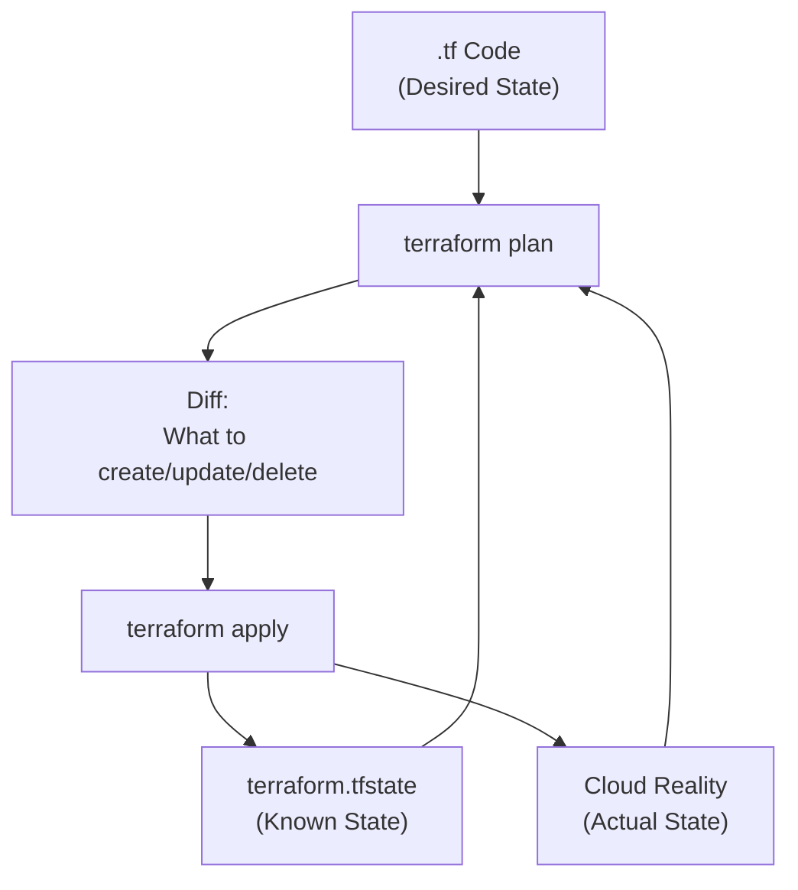
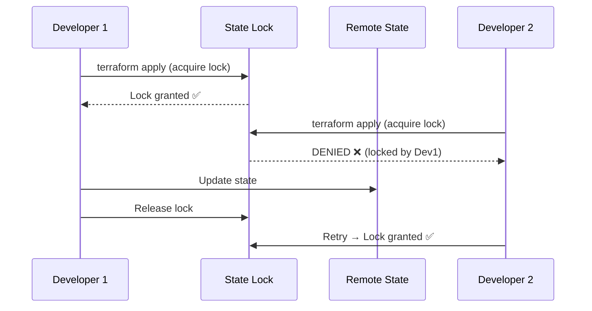

# Module 02: State Management
# மாடுல் 02: State Management (நிலை மேலாண்மை)

---

## 🎯 What? | என்ன?

**English:** State = Terraform's memory of what exists in the cloud. It maps your code to real resources. Without state, Terraform doesn't know what it created.

**தமிழ்:** State = Cloud-ல் என்ன இருக்கிறது என்ற Terraform-ன் memory. Code-ஐ real resources-உடன் map செய்கிறது. State இல்லாமல், Terraform-க்கு எதை create செய்தது என்று தெரியாது.

### Analogy | உதாரணம்
> Shopping list vs receipt: Your `.tf` code = shopping list (what you WANT). State file = receipt (what you ACTUALLY bought). Plan = comparing list vs receipt to know what to buy next.

> Shopping list vs receipt: Code = shopping list. State = receipt. Plan = compare to know what's pending.

---

## 📊 State Architecture | State கட்டமைப்பு



---

## 🔑 Remote Backends | Remote State

### Why Remote? (NEVER use local state in teams!)

| Local State | Remote State |
|-------------|--------------|
| On your laptop | Azure Blob / GCS / S3 |
| No locking (team conflicts!) | Locking ✓ (one person at a time) |
| Lost if laptop dies | Durable, backed up |
| No sharing | Team can share |

### Azure Backend

```hcl
# terraform.tf — Azure Blob Storage backend
terraform {
  backend "azurerm" {
    resource_group_name  = "rg-terraform-state"
    storage_account_name = "sttfstateproduction"
    container_name       = "tfstate"
    key                  = "production/aks.tfstate"  # Path in container
  }
}

# Create the backend storage FIRST (bootstrap):
# az group create -n rg-terraform-state -l eastus
# az storage account create -n sttfstateproduction -g rg-terraform-state -l eastus --sku Standard_LRS
# az storage container create -n tfstate --account-name sttfstateproduction
```

### GCP Backend

```hcl
# terraform.tf — GCS backend
terraform {
  backend "gcs" {
    bucket = "my-project-terraform-state"
    prefix = "production/gke"
  }
}

# Create bucket first:
# gsutil mb -l us-central1 gs://my-project-terraform-state
# gsutil versioning set on gs://my-project-terraform-state
```

---

## 🔒 State Locking | State Lock



```bash
# If lock stuck (someone's apply crashed):
terraform force-unlock LOCK_ID
# ⚠️ DANGEROUS — only if you're SURE no one is running!
```

---

## 🛠️ State Operations | State Commands

```bash
# --- Inspect State ---
terraform state list                              # List all resources
terraform state show azurerm_kubernetes_cluster.aks  # Details of one resource
terraform state pull > state.json                 # Download state (read-only)

# --- Move/Rename (refactoring) ---
# Renamed resource in code? Tell Terraform it's the same thing:
terraform state mv azurerm_resource_group.old azurerm_resource_group.new

# Moved to module? 
terraform state mv azurerm_virtual_network.vnet module.network.azurerm_virtual_network.vnet

# --- Import (adopt existing resource) ---
# Resource exists in cloud but NOT in Terraform state:
terraform import azurerm_resource_group.main /subscriptions/xxx/resourceGroups/rg-production

# Terraform 1.5+ import block (declarative — better!):
import {
  to = azurerm_resource_group.main
  id = "/subscriptions/xxx/resourceGroups/rg-production"
}

# --- Remove from state (stop managing without destroying) ---
terraform state rm azurerm_virtual_machine.legacy
# Resource stays in cloud, Terraform forgets about it

# --- Replace (force recreate) ---
terraform apply -replace=azurerm_virtual_machine.vm1
# Destroy and recreate (tainted behavior)
```

---

## 📋 Workspaces | Workspaces

```hcl
# Workspaces = same code, different state files
# Good for: dev/staging/prod with SAME infrastructure pattern

# Create & switch
# terraform workspace new dev
# terraform workspace new staging  
# terraform workspace new prod
# terraform workspace select prod

# Use in code:
resource "azurerm_resource_group" "main" {
  name     = "rg-${terraform.workspace}-platform"
  location = var.location
}

resource "azurerm_kubernetes_cluster" "aks" {
  name                = "aks-${terraform.workspace}"
  node_count          = terraform.workspace == "prod" ? 5 : 2
  vm_size             = terraform.workspace == "prod" ? "Standard_D4s_v3" : "Standard_D2s_v3"
}
```

### Workspaces vs Directories

| Approach | When to use | தமிழ் |
|----------|-------------|-------|
| **Workspaces** | Same infra, different sizes (dev=small, prod=big) | Same code, different scale |
| **Directories** | Different infra per env (prod has WAF, dev doesn't) | Different architecture per env |

---

## 📋 Cheat Sheet | விரைவு குறிப்பு

```
┌──────────────────────────────────────────────────┐
│         STATE MANAGEMENT CHEAT SHEET             │
├──────────────────────────────────────────────────┤
│ BACKENDS:                                        │
│   Azure: azurerm (Blob Storage + Table locking)  │
│   GCP:   gcs (Cloud Storage + built-in locking)  │
│   AWS:   s3 + DynamoDB (locking)                 │
│                                                  │
│ STATE COMMANDS:                                  │
│   state list   = show all resources              │
│   state show   = details of one resource         │
│   state mv     = rename/move (refactor)          │
│   state rm     = stop managing (don't destroy)   │
│   import       = adopt existing resource         │
│   force-unlock = break stuck lock                │
│                                                  │
│ GOLDEN RULES:                                    │
│   ✓ Always use remote backend                    │
│   ✓ Enable versioning on state bucket            │
│   ✓ Never edit state JSON manually               │
│   ✓ Use 'moved' blocks over 'state mv' in code  │
│   ✓ One state per component (not monolith!)      │
│                                                  │
│ STATE SPLITTING STRATEGY:                        │
│   networking.tfstate  (VNets, subnets)           │
│   aks.tfstate         (K8s clusters)             │
│   data.tfstate        (databases, storage)       │
│   iam.tfstate         (roles, identities)        │
└──────────────────────────────────────────────────┘
```

---

## 🎤 Interview Q&A | நேர்முகத் தேர்வு

**Q: What happens if two people run terraform apply at the same time?**
- Remote backend has locking. Second person gets "state locked" error.
- Must wait until first apply completes and releases lock.
- If lock is stuck (crash), use `terraform force-unlock` carefully.

**Q: How do you handle state for a large team?**
- Remote backend (Azure Blob / GCS) with locking
- Split state into smaller components (networking, AKS, data — not one monolith)
- CI/CD applies Terraform (humans only run plan locally)
- State access via IAM (only CI service principal can write)

**Q: Someone deleted a resource manually. What happens?**
- `terraform plan` detects drift: "resource exists in state but not in cloud"
- Plan proposes recreating it (to match desired state)
- If you DON'T want it anymore: `terraform state rm` to remove from state

---

## ✅ Self-Check | சுய மதிப்பீடு

- [ ] Remote backend configure முடியும் (Azure + GCP)
- [ ] State locking explain முடியும்
- [ ] terraform import execute முடியும்
- [ ] State split strategy design முடியும்
- [ ] Workspace vs directory approach choose முடியும்
