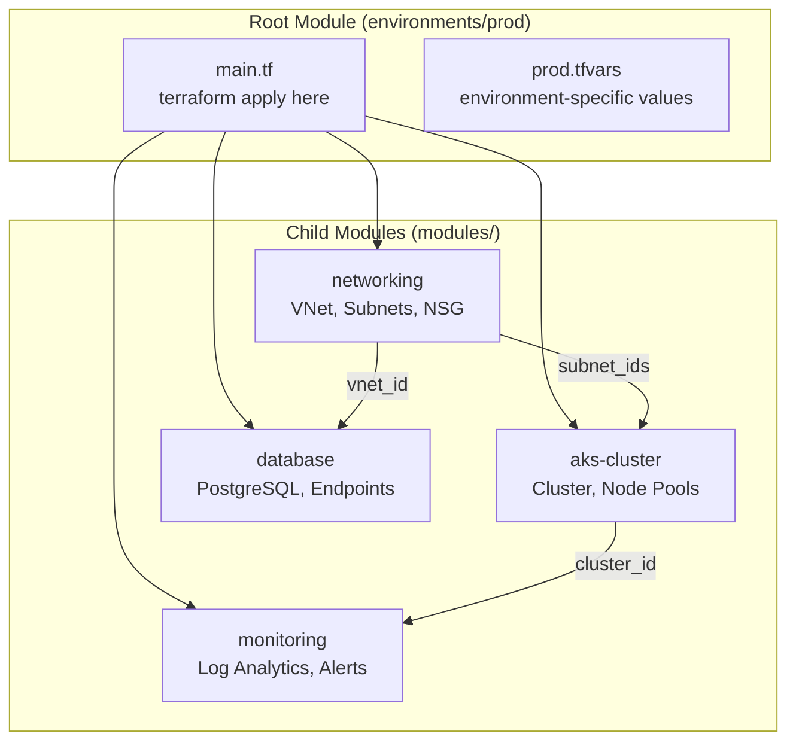
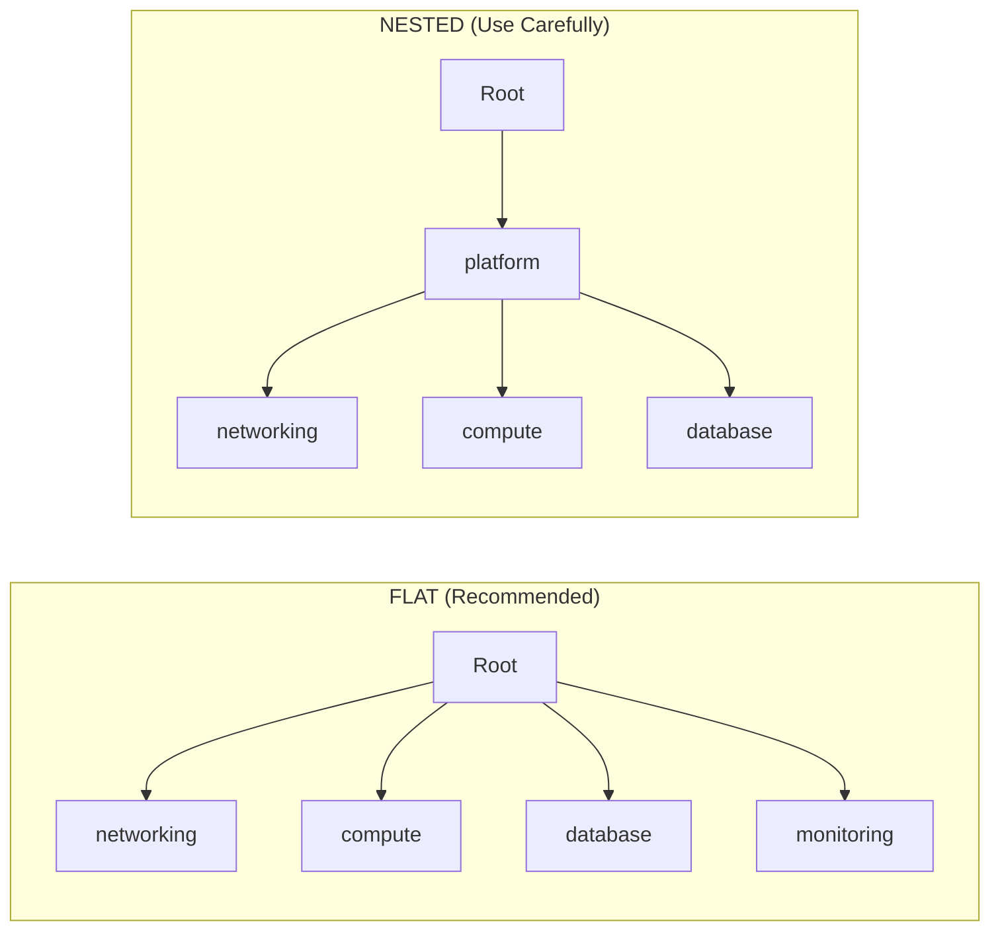

# Module 03: Modules & Reusability

---

## 📖 The Story

**English:**

Think of modules like cooking recipes (சமையல் குறிப்பு). Once you perfect a biryani recipe, you don't reinvent it each time. You reuse the same recipe with different ingredients (chicken/mutton/veg).

Imagine your grandmother has a perfect sambar recipe. She wrote it down: what ingredients to use (variables), the cooking steps (resources), and what you get at the end (outputs). Now anyone in the family can make the same sambar — your mom uses it with drumstick, your aunt uses it with brinjal. Same recipe, different inputs, consistent quality.

In Terraform, a module IS that recipe. You write it once: "Here's how to create an AKS cluster." Then every team uses the same module — one team passes "production" settings, another passes "dev" settings. Same pattern, different values, consistent infrastructure.

At TVS OTA, we had ONE AKS module reused across 3 clusters (dev, staging, prod). Without modules, 3 separate copy-paste configs = 3x the bugs. With modules, fix one bug = fixed everywhere.

**தமிழ்:**

Modules என்பது சமையல் குறிப்பு மாதிரி. பிரியாணி recipe perfect செய்தபிறகு, ஒவ்வொரு தடவையும் புதிதாக கண்டுபிடிக்க வேண்டாம். அதே recipe-ஐ வெவ்வேறு பொருட்களுடன் மறுபயன்பாடு செய்.

உன் பாட்டிக்கு perfect சாம்பார் recipe இருக்கிறது. அதை எழுதி வைத்திருக்கிறார்: என்ன பொருட்கள் வேண்டும் (variables), சமையல் படிகள் (resources), கடைசியில் என்ன கிடைக்கும் (outputs). குடும்பத்தில் யாரும் அதே சாம்பார் செய்யலாம் — அம்மா முருங்கைக்காயுடன், அத்தை கத்தரிக்காயுடன். அதே recipe, வெவ்வேறு inputs, ஒரே தரம்.

TVS OTA-ல், ஒரே AKS module-ஐ 3 clusters-க்கு (dev, staging, prod) reuse செய்தோம். Modules இல்லாமல் 3 copy-paste configs = 3 மடங்கு bugs. Modules-உடன், ஒரு bug fix = எல்லா இடத்திலும் fix.

---

## 📊 Core Concepts

### What are Modules?

**English:**

A module is a container for multiple resources used together. Every Terraform configuration is a module. The directory where you run `terraform apply` is the **root module**. Any module that root calls is a **child module**.

Think of it architecturally:
- **Root Module** = The orchestra conductor (directs everything)
- **Child Module** = Individual musicians (each plays their part)
- **Module Interface** = Sheet music (variables in, outputs out)

**தமிழ்:**

Module என்பது ஒன்றாக பயன்படுத்தப்படும் resources-ன் container. ஒவ்வொரு Terraform configuration-ம் ஒரு module. `terraform apply` run செய்யும் directory = **root module**. Root call செய்யும் module = **child module**.

Architecture perspective:
- **Root Module** = Orchestra conductor (எல்லாவற்றையும் direct செய்யும்)
- **Child Module** = தனிப்பட்ட musicians (ஒவ்வொருவரும் தங்கள் part play செய்வர்)
- **Module Interface** = Sheet music (variables உள்ளே, outputs வெளியே)

### Module Structure

```
modules/aks-cluster/
├── main.tf          # Resource definitions (the logic)
├── variables.tf     # Input variables (the interface contract)
├── outputs.tf       # Output values (what you expose)
├── versions.tf      # Provider & terraform version constraints
├── locals.tf        # Internal computed values
├── data.tf          # Data sources
└── README.md        # Usage documentation
```

### Root Module vs Child Module



**English:**

Root module is where you orchestrate. It calls child modules, passes variables, and wires outputs between them. Child modules are self-contained — they don't know about each other. The root module is the glue.

**தமிழ்:**

Root module orchestrate செய்யும் இடம். Child modules-ஐ call செய்து, variables pass செய்து, outputs-ஐ wire செய்யும். Child modules self-contained — ஒன்று மற்றொன்றைப் பற்றி தெரியாது. Root module-தான் glue.

---

### Module Sources

**English:**

Where can Terraform fetch modules from? Multiple sources:

| Source | Syntax | Use Case |
|--------|--------|----------|
| Local path | `source = "./modules/aks"` | Same repo, fast iteration |
| Terraform Registry | `source = "Azure/aks/azurerm"` | Community/official modules |
| GitHub | `source = "github.com/org/repo//modules/aks"` | Private org modules |
| Git (generic) | `source = "git::https://git.example.com/modules.git//aks"` | Gerrit/Bitbucket |
| S3/GCS | `source = "s3::https://bucket.s3.amazonaws.com/module.zip"` | Air-gapped environments |
| Private Registry | `source = "app.terraform.io/org/aks/azurerm"` | Enterprise governance |

**தமிழ்:**

Terraform modules-ஐ எங்கிருந்து fetch செய்யலாம்?

| Source | எப்போது பயன்படுத்துவது |
|--------|----------------------|
| Local path | அதே repo-ல், fast iteration |
| Registry | Community/official modules |
| GitHub/Git | Private org modules |
| S3/GCS | Air-gapped (internet இல்லாத) environments |
| Private Registry | Enterprise governance & compliance |

### Module Versioning (Critical for Production)

**English:**

Never use unversioned modules in production. Always pin versions:

```hcl
# GOOD — pinned version
module "aks" {
  source  = "Azure/aks/azurerm"
  version = "9.1.0"  # Explicit pin
}

# GOOD — version constraint
module "aks" {
  source  = "Azure/aks/azurerm"
  version = "~> 9.0"  # Allows 9.x but not 10.0
}

# BAD — no version = latest = surprise breaking changes
module "aks" {
  source = "Azure/aks/azurerm"
}

# Git source with tag
module "networking" {
  source = "git::https://bitbucket.org/tvs/infra-modules.git//networking?ref=v2.3.1"
}
```

**தமிழ்:**

Production-ல் version இல்லாத modules ஒருபோதும் வேண்டாம். எப்போதும் version pin செய்:

- `version = "9.1.0"` — exact pin, safest
- `version = "~> 9.0"` — 9.x OK, 10.0 block
- No version = latest = surprise breaking changes (ஆபத்து!)
- Git tag = `?ref=v2.3.1` — specific commit/tag

---

## 🧠 Byheart for Interview

**English:**
```
1. Module = reusable container of Terraform resources with defined interface
2. Root module = directory where terraform apply runs
3. Child module = called by another module via module block
4. Module contract: variables.tf (inputs) + outputs.tf (outputs)
5. Sources: local, registry, git, S3/GCS, private registry
6. ALWAYS version-pin modules in production (version = "~> x.y")
7. Module composition: flat (all modules called from root) vs nested (modules calling modules)
8. DRY principle: Don't Repeat Yourself — but don't over-abstract either
9. Module should do ONE thing well (Single Responsibility Principle)
10. Modules hide complexity but EXPOSE necessary configuration
11. terraform get downloads modules, terraform init initializes them
12. Module outputs wire to other module inputs through root module
```

**தமிழ்:**
```
1. Module = defined interface-உடன் reusable resource container
2. Root module = terraform apply run செய்யும் directory
3. Child module = module block வழியாக call செய்யப்படும்
4. Module contract: variables.tf (inputs) + outputs.tf (outputs)
5. Sources: local, registry, git, S3/GCS, private registry
6. Production-ல் எப்போதும் version pin செய் (version = "~> x.y")
7. Flat composition (root-ல் இருந்து அனைத்தும் call) vs Nested (modules calling modules)
8. DRY: Repeat செய்யாதே — ஆனால் over-abstract-ம் செய்யாதே
9. Module ஒரே ஒரு வேலையை நன்றாக செய்ய வேண்டும் (SRP)
10. Modules complexity-ஐ மறைக்கும், ஆனால் தேவையான config-ஐ expose செய்யும்
11. terraform get = download modules, terraform init = initialize
12. Module outputs → root module → other module inputs (wiring)
```

---

## ⚡ Quick Hands-on

```bash
ssh root@203.57.85.108

# === Lab Setup ===
mkdir -p ~/tf-lab/03-modules && cd ~/tf-lab/03-modules

# ============================================================
# EXERCISE 1: Basic Module Creation
# ============================================================

mkdir -p modules/webserver

# --- Module: variables.tf (Input Interface) ---
cat > modules/webserver/variables.tf << 'EOF'
variable "server_name" {
  type        = string
  description = "Name of the web server"
}

variable "environment" {
  type        = string
  description = "Environment (dev/staging/prod)"
  validation {
    condition     = contains(["dev", "staging", "prod"], var.environment)
    error_message = "Environment must be dev, staging, or prod."
  }
}

variable "instance_count" {
  type        = number
  default     = 1
  description = "Number of instances"
}

variable "enable_ssl" {
  type    = bool
  default = false
}
EOF

# --- Module: main.tf (Resources/Logic) ---
cat > modules/webserver/main.tf << 'EOF'
locals {
  # Internal logic — not exposed to caller
  name_prefix = "${var.environment}-${var.server_name}"
  ssl_suffix  = var.enable_ssl ? "-ssl" : ""
}

resource "local_file" "config" {
  count    = var.instance_count
  content  = <<-CONTENT
    Server: ${local.name_prefix}${local.ssl_suffix}-${count.index}
    Environment: ${var.environment}
    SSL Enabled: ${var.enable_ssl}
    Instance: ${count.index + 1} of ${var.instance_count}
  CONTENT
  filename = "${path.root}/output/${local.name_prefix}-${count.index}.conf"
}
EOF

# --- Module: outputs.tf (What we expose) ---
cat > modules/webserver/outputs.tf << 'EOF'
output "server_names" {
  value       = local_file.config[*].filename
  description = "List of generated config file paths"
}

output "name_prefix" {
  value       = local.name_prefix
  description = "The computed name prefix"
}
EOF

# --- Root Module: Call the child module ---
cat > main.tf << 'EOF'
# Root module calls child module with different configs

module "web_dev" {
  source         = "./modules/webserver"
  server_name    = "api-gateway"
  environment    = "dev"
  instance_count = 1
  enable_ssl     = false
}

module "web_prod" {
  source         = "./modules/webserver"
  server_name    = "api-gateway"
  environment    = "prod"
  instance_count = 3
  enable_ssl     = true
}

# Output from modules
output "dev_servers" {
  value = module.web_dev.server_names
}

output "prod_servers" {
  value = module.web_prod.server_names
}
EOF

mkdir -p output
terraform init
terraform apply -auto-approve

# See the result — same module, different configs!
cat output/dev-api-gateway-0.conf
cat output/prod-api-gateway-0.conf

# ============================================================
# EXERCISE 2: Module Composition (Flat Pattern)
# ============================================================

cd ~/tf-lab/03-modules
mkdir -p modules/networking modules/compute

# --- Networking Module ---
cat > modules/networking/variables.tf << 'EOF'
variable "vnet_name" {
  type = string
}
variable "address_space" {
  type    = string
  default = "10.0.0.0/16"
}
variable "subnet_prefixes" {
  type    = list(string)
  default = ["10.0.1.0/24", "10.0.2.0/24"]
}
EOF

cat > modules/networking/main.tf << 'EOF'
resource "local_file" "vnet" {
  content  = "VNet: ${var.vnet_name}\nCIDR: ${var.address_space}\nSubnets: ${join(", ", var.subnet_prefixes)}"
  filename = "${path.root}/output/network-${var.vnet_name}.txt"
}
EOF

cat > modules/networking/outputs.tf << 'EOF'
output "vnet_id" {
  value = "vnet-${var.vnet_name}-id"
}
output "subnet_ids" {
  value = [for i, prefix in var.subnet_prefixes : "subnet-${i}-id"]
}
EOF

# --- Compute Module (depends on networking output) ---
cat > modules/compute/variables.tf << 'EOF'
variable "cluster_name" {
  type = string
}
variable "subnet_id" {
  type        = string
  description = "Subnet ID from networking module"
}
variable "node_count" {
  type    = number
  default = 3
}
EOF

cat > modules/compute/main.tf << 'EOF'
resource "local_file" "cluster" {
  content  = "Cluster: ${var.cluster_name}\nSubnet: ${var.subnet_id}\nNodes: ${var.node_count}"
  filename = "${path.root}/output/cluster-${var.cluster_name}.txt"
}
EOF

cat > modules/compute/outputs.tf << 'EOF'
output "cluster_endpoint" {
  value = "https://${var.cluster_name}.example.com"
}
EOF

# --- Root: Flat Composition (wiring modules together) ---
cat > main.tf << 'EOF'
# FLAT PATTERN: Root module orchestrates all child modules
# Modules don't know about each other — root wires them

module "network" {
  source        = "./modules/networking"
  vnet_name     = "tvs-prod-vnet"
  address_space = "10.0.0.0/16"
  subnet_prefixes = ["10.0.1.0/24", "10.0.2.0/24", "10.0.3.0/24"]
}

module "aks_cluster" {
  source       = "./modules/compute"
  cluster_name = "tvs-ota-prod"
  subnet_id    = module.network.subnet_ids[0]  # Wire output → input
  node_count   = 5
}

output "cluster_url" {
  value = module.aks_cluster.cluster_endpoint
}
EOF

terraform init
terraform apply -auto-approve
cat output/network-tvs-prod-vnet.txt
cat output/cluster-tvs-ota-prod.txt

# ============================================================
# EXERCISE 3: Module with for_each (Multiple Instances)
# ============================================================

cat > main.tf << 'EOF'
# Create multiple environments from a map using for_each

variable "environments" {
  type = map(object({
    instance_count = number
    enable_ssl     = bool
  }))
  default = {
    dev = {
      instance_count = 1
      enable_ssl     = false
    }
    staging = {
      instance_count = 2
      enable_ssl     = true
    }
    prod = {
      instance_count = 3
      enable_ssl     = true
    }
  }
}

module "webservers" {
  for_each = var.environments   # Creates one module instance per environment

  source         = "./modules/webserver"
  server_name    = "ota-api"
  environment    = each.key
  instance_count = each.value.instance_count
  enable_ssl     = each.value.enable_ssl
}

# Access specific module instance
output "prod_servers" {
  value = module.webservers["prod"].server_names
}

# Access all instances
output "all_prefixes" {
  value = { for env, mod in module.webservers : env => mod.name_prefix }
}
EOF

terraform init
terraform apply -auto-approve
```

---

## 🔥 Scenario Challenges

### Scenario 1: Module Design Decision

**English:**

Your team manages infrastructure for 3 microservices. Each needs: VNet + Subnet, AKS Cluster, PostgreSQL DB, Key Vault. An engineer proposes ONE "mega-module" that creates everything.

**Question:** What's wrong with this? How would you design it?

**Answer:**

The mega-module violates Single Responsibility Principle. Problems:
1. Can't reuse networking without creating a database
2. One change affects everything — blast radius too large
3. Can't test components independently
4. Different teams own different layers — coupling teams together

Correct design: Separate modules per concern, flat composition from root:
```
modules/
├── networking/      # VNet, Subnets, NSG, Route Tables
├── aks-cluster/     # AKS, Node Pools, RBAC
├── database/        # PostgreSQL, Private Endpoints
└── keyvault/        # Key Vault, Access Policies
```

Root module wires them together:
```hcl
module "network"  { source = "./modules/networking" ... }
module "aks"      { source = "./modules/aks-cluster"; subnet_id = module.network.subnet_ids[0] }
module "db"       { source = "./modules/database"; subnet_id = module.network.subnet_ids[1] }
module "kv"       { source = "./modules/keyvault"; ... }
```

**தமிழ்:**

Mega-module = Single Responsibility Principle மீறல்.
- Networking இல்லாமல் database மட்டும் reuse செய்ய முடியாது
- ஒரு மாற்றம் எல்லாவற்றையும் பாதிக்கும் — blast radius பெரியது
- Components-ஐ independently test செய்ய முடியாது

சரியான design: ஒவ்வொரு concern-க்கும் தனி module, root-ல் flat composition.

### Scenario 2: Version Conflict

**English:**

Team A pins module at v2.3.0. Team B needs a feature in v3.0.0 which has breaking changes. Both teams deploy to same environment.

**Question:** How do you handle this without breaking Team A?

**Answer:**

1. **Semantic versioning contract:** Major = breaking, Minor = feature, Patch = fix
2. **Strategy:** Keep v2.x branch maintained with backports for critical fixes
3. **Migration path:** Provide upgrade guide + `moved` blocks for state migration
4. **Parallel versions:** Both v2 and v3 can coexist if resource naming doesn't conflict
5. **Feature flags:** Add variables that enable new behavior without breaking old:
   ```hcl
   variable "enable_v3_networking" {
     type    = bool
     default = false  # Existing users unaffected
   }
   ```

**தமிழ்:**

1. Semantic versioning: Major = breaking, Minor = feature, Patch = fix
2. v2.x branch-ஐ maintain செய்து critical fixes backport செய்
3. Upgrade guide + `moved` blocks கொடு state migration-க்கு
4. Feature flags: புதிய behavior-ஐ variable-ல் hide செய், default = false

### Scenario 3: When NOT to Create a Module

**English:**

Junior engineer wants to create a module for a single S3 bucket used in one place.

**Question:** Is this a good idea?

**Answer:**

**No.** Module creation has overhead:
- Separate directory, interface, documentation
- Indirection makes code harder to read
- If used in only ONE place, you're adding complexity for zero reuse benefit

**When to create a module:**
- Resource pattern used 2+ times
- Complex resource with many defaults you want to standardize
- Cross-team shared infrastructure with governance needs
- Encapsulating cloud-provider quirks so consumers don't care

**When NOT to:**
- Single-use resource (just put it in root)
- Wrapping single resource with no added logic
- Premature abstraction (YAGNI — You Ain't Gonna Need It)

**தமிழ்:**

**இல்லை.** Module overhead இருக்கிறது:
- தனி directory, interface, documentation
- ஒரே இடத்தில் மட்டும் பயன்படுத்தினால், reuse benefit இல்லாமல் complexity கூடும்

**Module உருவாக்க வேண்டும்:**
- 2+ தடவை pattern பயன்படுத்தினால்
- Complex resource-க்கு standardize செய்ய
- Cross-team shared infrastructure

**Module வேண்டாம்:**
- ஒரே இடத்தில் பயன்படுத்தும் resource
- Single resource-ஐ wrap செய்வது (added logic இல்லாமல்)
- YAGNI — You Ain't Gonna Need It

---

## 🏗️ Real Project References

### TVS OTA: Shared AKS Module Across 3 Clusters

**English:**

**Problem:** TVS Connected Vehicle Platform needed 3 AKS clusters (dev, staging, prod) with different specs but same architecture.

**Solution:** One `aks-cluster` module, three different `tfvars`:

```
infra/
├── modules/
│   └── aks-cluster/
│       ├── main.tf         # AKS resource, node pools, RBAC
│       ├── variables.tf    # 25+ variables with sensible defaults
│       ├── outputs.tf      # cluster_id, kubelet_identity, fqdn
│       └── versions.tf     # azurerm ~> 3.0 constraint
├── environments/
│   ├── dev/
│   │   ├── main.tf         # module "aks" { source = "../../modules/aks-cluster" }
│   │   └── dev.tfvars      # node_count=2, vm_size=Standard_D2s_v3
│   ├── staging/
│   │   ├── main.tf
│   │   └── staging.tfvars  # node_count=3, vm_size=Standard_D4s_v3
│   └── prod/
│       ├── main.tf
│       └── prod.tfvars     # node_count=5, vm_size=Standard_D8s_v3, zones=[1,2,3]
└── terragrunt.hcl          # DRY backend config
```

**Architecture decisions:**
1. Module exposes `var.availability_zones` — prod uses [1,2,3], dev uses [] (no HA needed)
2. Module has `var.enable_defender` — prod=true, dev=false (cost saving)
3. Node pool config is a `list(object(...))` — flexible for system+user pools
4. Private cluster toggle: `var.private_cluster_enabled` — prod=true, dev=false (easier debugging)

```hcl
# environments/prod/main.tf
module "aks" {
  source = "../../modules/aks-cluster"

  cluster_name        = "tvs-ota-prod"
  resource_group_name = "rg-tvs-ota-prod"
  kubernetes_version  = "1.28.3"
  
  # Prod-specific
  private_cluster_enabled = true
  availability_zones      = [1, 2, 3]
  enable_defender         = true
  
  node_pools = [
    {
      name       = "system"
      vm_size    = "Standard_D4s_v3"
      node_count = 3
      mode       = "System"
    },
    {
      name       = "ota"
      vm_size    = "Standard_D8s_v3"
      node_count = 5
      mode       = "User"
      labels     = { workload = "ota-processing" }
      taints     = ["workload=ota:NoSchedule"]
    }
  ]
  
  # Wired from networking module
  vnet_subnet_id = module.network.aks_subnet_id
}
```

**தமிழ்:**

TVS OTA-ல் ஒரே AKS module 3 clusters-க்கு:
- dev: 2 nodes, small VMs, no HA, no Defender
- staging: 3 nodes, medium VMs
- prod: 5 nodes, large VMs, 3 availability zones, Defender enabled, private cluster

Architecture decisions:
- `availability_zones` variable → prod = HA, dev = no HA (cost save)
- `enable_defender` → prod = security, dev = skip (cost save)
- `node_pools` as list(object) → flexible system + user pools
- `private_cluster_enabled` → prod = secure, dev = easy debug

### EB CI/CT: Module Per Infrastructure Component

**English:**

**Problem:** Embedded CI/CT pipeline needed separate infra components that different teams own.

**Solution:** Module-per-component with clear ownership:

```
infra/
├── modules/
│   ├── networking/          # Team: Platform
│   │   ├── vnet, subnets, NSGs, peering
│   │   └── CODEOWNERS: @platform-team
│   ├── compute/             # Team: DevOps  
│   │   ├── VM scale sets, build agents
│   │   └── CODEOWNERS: @devops-team
│   ├── storage/             # Team: Platform
│   │   ├── Blob, file shares, lifecycle policies
│   │   └── CODEOWNERS: @platform-team
│   └── ci-agents/           # Team: DevOps
│       ├── Self-hosted agents, Docker-in-Docker
│       └── CODEOWNERS: @devops-team
└── environments/
    └── prod/
        └── main.tf          # Orchestrates all modules
```

**Key design:**
- Each module has independent `terraform plan` capability
- Networking outputs feed into compute/storage via remote state or output variables
- CODEOWNERS enforce PR reviews per module
- Each module versioned independently (git tags: `networking-v1.2.0`, `compute-v2.0.1`)

**தமிழ்:**

EB CI/CT-ல் module-per-component:
- networking/ → Platform team own செய்யும்
- compute/ → DevOps team own செய்யும்
- storage/ → Platform team own செய்யும்
- ci-agents/ → DevOps team own செய்யும்

ஒவ்வொரு module-ம் independently plan/apply செய்யக்கூடியது. CODEOWNERS PR reviews enforce செய்யும். Git tags-ல் independent versioning.

---

## 📊 Module Composition Patterns

### Flat vs Nested Composition



**English:**

| Pattern | Pros | Cons | When to Use |
|---------|------|------|-------------|
| **Flat** | Simple, clear dependencies, easy to debug | More wiring in root | Most cases (80%+) |
| **Nested** | Encapsulates related infra together | Harder to debug, version independently | Platform-as-a-Service patterns |

**Architect's rule:** Prefer flat. Use nested only when a group of modules ALWAYS deploy together and have a clear higher-level abstraction.

**தமிழ்:**

| Pattern | நன்மை | தீமை | எப்போது |
|---------|--------|------|---------|
| **Flat** | Simple, clear, debug easy | Root-ல் அதிக wiring | பெரும்பாலான cases (80%+) |
| **Nested** | Related infra-ஐ encapsulate | Debug கடினம் | Platform-as-a-Service patterns |

Architect rule: Flat prefer செய். Nested = modules ALWAYS ஒன்றாக deploy ஆகும்போது மட்டும்.

---

## 📋 Best Practices

### Module Design Principles

**English:**

```
1. SINGLE RESPONSIBILITY: One module = one concern (networking OR compute, not both)
2. EXPLICIT INTERFACES: Every input/output documented with description
3. SENSIBLE DEFAULTS: Modules work out-of-box for common case
4. VALIDATE INPUTS: Use validation blocks to fail fast
5. VERSION EVERYTHING: Semantic versioning (major.minor.patch)
6. DON'T HARDCODE: No hardcoded values — everything through variables
7. PROVIDER PASS-THROUGH: Don't configure providers inside modules
8. OUTPUT GENEROUSLY: Expose IDs, names, endpoints — you'll need them later
9. TEST MODULES: Use terratest or terraform test framework
10. README: Every module needs usage examples
```

**தமிழ்:**

```
1. SINGLE RESPONSIBILITY: ஒரு module = ஒரு concern
2. EXPLICIT INTERFACES: ஒவ்வொரு input/output-க்கும் description
3. SENSIBLE DEFAULTS: Common case-க்கு out-of-box வேலை செய்யும்
4. VALIDATE INPUTS: validation blocks-ல் fast fail
5. VERSION EVERYTHING: Semantic versioning
6. DON'T HARDCODE: Variables வழியாக எல்லாம்
7. PROVIDER PASS-THROUGH: Modules உள்ளே provider configure செய்யாதே
8. OUTPUT GENEROUSLY: IDs, names, endpoints expose செய்
9. TEST MODULES: terratest / terraform test
10. README: ஒவ்வொரு module-க்கும் usage examples
```

### Provider Configuration Anti-Pattern

```hcl
# ❌ BAD — Provider configured inside module
# modules/aks/main.tf
provider "azurerm" {
  features {}
  subscription_id = var.subscription_id  # DON'T DO THIS
}

# ✅ GOOD — Provider configured in root, passed to module
# environments/prod/main.tf
provider "azurerm" {
  features {}
  subscription_id = "xxx"
}

module "aks" {
  source = "../../modules/aks-cluster"
  providers = {
    azurerm = azurerm  # Pass provider explicitly
  }
}
```

**English:**

Why? Because modules should be provider-agnostic in configuration. Root module owns the provider config (credentials, subscription, region). Module receives it. This allows:
- Same module used across different subscriptions
- Testing with mock providers
- Multi-region deployments with aliased providers

**தமிழ்:**

ஏன்? Modules provider configuration-ல் agnostic ஆக இருக்க வேண்டும். Root module provider config own செய்யும் (credentials, subscription, region). Module receive செய்யும். இது:
- வெவ்வேறு subscriptions-ல் same module use
- Mock providers-ல் testing
- Aliased providers-ல் multi-region deployments

---

## 🧪 Module Testing

**English:**

Modules must be tested. Two approaches:

### 1. Terraform Native Test (v1.6+)

```hcl
# modules/webserver/tests/basic.tftest.hcl
run "creates_server_config" {
  command = apply

  variables {
    server_name    = "test-server"
    environment    = "dev"
    instance_count = 1
    enable_ssl     = false
  }

  assert {
    condition     = output.name_prefix == "dev-test-server"
    error_message = "Name prefix should be dev-test-server"
  }
}

run "validates_environment" {
  command = plan
  expect_failures = [var.environment]

  variables {
    server_name = "test"
    environment = "invalid"  # Should fail validation
  }
}
```

### 2. Terratest (Go-based, integration tests)

```go
// test/aks_module_test.go
func TestAksModule(t *testing.T) {
    terraformOptions := terraform.WithDefaultRetryableErrors(t, &terraform.Options{
        TerraformDir: "../modules/aks-cluster",
        Vars: map[string]interface{}{
            "cluster_name": "test-cluster",
            "node_count":   1,
        },
    })

    defer terraform.Destroy(t, terraformOptions)
    terraform.InitAndApply(t, terraformOptions)

    endpoint := terraform.Output(t, terraformOptions, "cluster_endpoint")
    assert.Contains(t, endpoint, "test-cluster")
}
```

**தமிழ்:**

Modules-ஐ test செய்ய வேண்டும்:
1. **Terraform Native Test** (v1.6+) — `.tftest.hcl` files, unit test style
2. **Terratest** (Go) — Full integration tests, real resources create/destroy

Production modules-க்கு CI pipeline-ல் automated testing mandatory.

---

## Publishing to Private Registry

**English:**

For enterprise teams, publish modules to private registry for governance:

```bash
# Terraform Cloud/Enterprise Private Registry
# Module naming convention: terraform-<PROVIDER>-<NAME>
# Example: terraform-azurerm-aks-cluster

# Repository structure required:
# - Root contains module code
# - Tagged releases (v1.0.0, v1.1.0)
# - README.md with usage examples

# In terraform Cloud UI:
# Settings → Modules → Add Module → Select VCS repo
```

```hcl
# Consuming from private registry
module "aks" {
  source  = "app.terraform.io/tvs-motors/aks-cluster/azurerm"
  version = "~> 2.0"
  
  cluster_name = "ota-prod"
  node_count   = 5
}
```

**Alternative: Git-based (no registry needed)**

```hcl
# For teams using Gerrit/Bitbucket without registry
module "networking" {
  source = "git::https://bitbucket.org/tvs/terraform-modules.git//networking?ref=v1.5.0"
}
```

**தமிழ்:**

Enterprise teams-க்கு private registry-ல் publish செய்:
- Module naming: `terraform-<PROVIDER>-<NAME>`
- Tagged releases: v1.0.0, v1.1.0
- Registry இல்லாத teams: Git URL + tag reference பயன்படுத்து

---

## 🎤 Interview Q&A

### Q1: "How do you decide when to create a module vs keeping resources in root?"

**English:**

"I apply the **Rule of Two** — if I see the same resource pattern appearing in two or more places, that's a signal to extract into a module. But it's not just about repetition:

1. **Complexity hiding**: If a resource requires 15+ lines of boilerplate with specific defaults (like AKS with node pools, RBAC, monitoring), I create a module to encapsulate that complexity behind a clean interface.

2. **Cross-team sharing**: If Platform team creates infrastructure patterns that Application teams consume, modules provide the contract.

3. **Governance**: When security/compliance requires specific configurations (encryption enabled, public access disabled), modules bake those in as defaults.

I do NOT create modules for single-use resources, or wrapping a single resource without adding value. That's unnecessary indirection."

**தமிழ்:**

"**Rule of Two** apply செய்வேன் — ஒரே resource pattern 2+ இடங்களில் இருந்தால், module-ஆக extract செய்வேன். ஆனால் repetition மட்டுமல்ல:

1. **Complexity hiding**: 15+ lines boilerplate resource-க்கு module உருவாக்குவேன்
2. **Cross-team sharing**: Platform team → Application teams-க்கு contract ஆக
3. **Governance**: Security defaults bake-in செய்ய

Single-use resources-க்கு module உருவாக்க மாட்டேன். Unnecessary indirection."

---

### Q2: "Flat composition vs nested modules — which do you prefer and why?"

**English:**

"I strongly prefer **flat composition** for 80% of cases. Here's why:

**Flat = Root calls all modules directly:**
- Clear dependency graph — I can see all wiring in one place
- Easy to debug — `terraform state list` shows clean module paths
- Independent lifecycle — can target specific modules in apply
- Easier refactoring — can replace one module without affecting others

**Nested = Module calls other modules:**
- I use this ONLY for Platform-as-a-Service patterns where a group of resources ALWAYS deploy together
- Example: An 'application-stack' module that internally creates networking + compute + DNS, because an application ALWAYS needs all three

The key anti-pattern I avoid: nesting for 'organization'. If you're nesting just to group things in a directory, you're adding indirection without value. The flat root module IS your organization layer."

**தமிழ்:**

"80% cases-ல் **flat composition** prefer செய்வேன்:

**Flat:** Clear dependency graph, easy debug, independent lifecycle, easy refactor

**Nested:** Platform-as-a-Service pattern-க்கு மட்டும் — resources ALWAYS ஒன்றாக deploy ஆகும்போது

Anti-pattern: Organization-க்காக nesting. Directory grouping-க்கு nesting = unnecessary indirection. Root module-தான் organization layer."

---

### Q3: "How do you handle breaking changes in a shared module?"

**English:**

"I follow a structured approach:

1. **Semantic Versioning**: Major = breaking, Minor = additive, Patch = fix. Teams pin to `~> 2.0` so they get 2.x patches but not 3.0 breaking changes.

2. **Deprecation path**: Before removing a variable, I mark it deprecated in the description and add a validation warning. Give teams 2 sprint cycles to migrate.

3. **moved blocks** (Terraform 1.1+): When refactoring module internals, use `moved` blocks so existing state migrates without destroy/recreate:
   ```hcl
   moved {
     from = azurerm_kubernetes_cluster.main
     to   = azurerm_kubernetes_cluster.this
   }
   ```

4. **Changelog + Migration Guide**: Every major version ships with explicit before/after examples.

5. **Parallel versions**: Maintain v2.x branch for critical fixes while v3.x is the active development line.

At TVS, we maintained AKS module v2 for 3 months after v3 release. Teams migrated at their pace. We only deprecated v2 after all consumers upgraded."

**தமிழ்:**

"Structured approach follow செய்வேன்:

1. **Semantic Versioning**: Major = breaking, Minor = additive, Patch = fix
2. **Deprecation path**: Remove முன் 2 sprint cycles warning கொடு
3. **moved blocks**: State migration without destroy/recreate
4. **Changelog + Migration Guide**: Before/after examples
5. **Parallel versions**: v2.x maintain while v3.x active

TVS-ல் AKS module v2-ஐ v3 release-க்குப் பிறகு 3 மாதங்கள் maintain செய்தோம்."

---

### Q4: "How do you test Terraform modules in CI/CD?"

**English:**

"Multi-layered testing strategy:

1. **Static Analysis** (seconds):
   - `terraform fmt -check` — formatting
   - `terraform validate` — syntax/type checking
   - `tflint` — provider-specific best practices
   - `checkov`/`tfsec` — security scanning

2. **Unit Tests** (seconds, no infra):
   - Terraform native tests (`.tftest.hcl`) with `command = plan`
   - Validate variable constraints, output formats
   - Mock providers where possible

3. **Integration Tests** (minutes, real infra):
   - Terratest in Go — apply, verify, destroy
   - Creates real resources in sandbox subscription
   - Tests actual cloud provider behavior

4. **Contract Tests** (seconds):
   - Verify module outputs match expected schema
   - Ensure interface compatibility across versions

Pipeline flow:
```
PR → fmt + validate + tflint + tfsec → Unit tests → Integration tests (sandbox) → Merge → Tag release
```

At EB, we ran integration tests nightly (not per-PR, too slow + costly). PR checks were static + unit only."

**தமிழ்:**

"Multi-layered testing:

1. **Static Analysis** (seconds): fmt, validate, tflint, checkov
2. **Unit Tests** (seconds): .tftest.hcl with plan
3. **Integration Tests** (minutes): Terratest, real resources
4. **Contract Tests** (seconds): Output schema verification

Pipeline: PR → static + unit → Merge → nightly integration → Tag release"

---

### Q5: "You have 50 modules in your organization. How do you manage them?"

**English:**

"At scale, module management becomes a platform engineering concern:

1. **Monorepo vs Multi-repo**: I prefer **monorepo for related modules** (all Azure modules in one repo) with path-based versioning (`git tag networking-v1.2.0`). Unrelated modules (different clouds) get separate repos.

2. **Module catalog**: Private registry (Terraform Cloud) or internal documentation site. Engineers browse available modules before writing new ones — avoids duplication.

3. **Ownership (CODEOWNERS)**: Each module directory has explicit owners. PRs require owner approval.

4. **Automated testing**: CI runs on every module change. Tests catch regressions before release.

5. **Deprecation lifecycle**: 
   - Active → Deprecated (warning in README) → Archived (read-only) → Removed
   - Minimum 90 days between stages

6. **Scaffolding**: `cookiecutter` or internal CLI to generate new modules with correct structure, CI config, and test boilerplate.

7. **Dependency scanning**: Track which modules depend on which. When module A changes, know who's affected."

**தமிழ்:**

"Scale-ல் module management = platform engineering:

1. **Monorepo**: Related modules ஒரே repo, path-based versioning
2. **Module catalog**: Engineers browse before writing new ones
3. **CODEOWNERS**: Module directory-க்கு explicit owners
4. **Automated testing**: CI catches regressions
5. **Deprecation lifecycle**: Active → Deprecated → Archived → Removed
6. **Scaffolding**: Template-ல் இருந்து new module generate
7. **Dependency scanning**: Module changes யாரை affect செய்யும் என்று track"

---

### Q6: "What's the difference between module composition and Terragrunt?"

**English:**

"They solve overlapping but different problems:

**Module Composition (native Terraform):**
- Modules encapsulate resource patterns
- Root module wires modules together
- Native, no extra tools needed
- Module = reusable resource template

**Terragrunt:**
- DRY configuration for root modules (backend config, provider config)
- Manages dependencies BETWEEN root modules (separate state files)
- Generates boilerplate (remote state, variable inheritance)
- Not a replacement for modules — it CALLS modules

In practice, I use both:
- Modules for reusable resource patterns
- Terragrunt to DRY-up environment configurations and manage inter-module dependencies

```
# Terragrunt hierarchy
environments/
├── terragrunt.hcl          # Common backend + provider config
├── dev/
│   ├── terragrunt.hcl      # Inherits from parent, sets env=dev
│   ├── networking/
│   │   └── terragrunt.hcl  # Calls modules/networking
│   └── aks/
│       └── terragrunt.hcl  # Calls modules/aks, depends_on networking
└── prod/
    ├── ...
```

Without Terragrunt, you'd copy backend config 20 times. With it, define once, inherit everywhere."

**தமிழ்:**

"**Modules:** Resource patterns reuse (aks module, networking module)
**Terragrunt:** Root module configuration DRY (backend, provider, variable inheritance)

இரண்டும் ஒன்றை replace செய்யாது — complement செய்யும்:
- Modules = reusable resource templates
- Terragrunt = DRY configuration management + dependency orchestration"

---

## ✅ Self-Check

### Conceptual Understanding

- [ ] Can you explain root module vs child module with a real example?
- [ ] Can you draw the flat composition pattern for a 3-tier app?
- [ ] Do you know when to create a module vs when NOT to?
- [ ] Can you explain module versioning and why it matters?
- [ ] Can you describe the provider pass-through pattern?

### Architecture Decisions

- [ ] Can you justify flat vs nested composition for a given scenario?
- [ ] Can you design a module interface (variables + outputs) for an AKS cluster?
- [ ] Can you explain how you'd handle breaking changes in a shared module?
- [ ] Can you describe your module testing strategy for CI/CD?
- [ ] Can you compare module composition vs Terragrunt?

### Hands-on Verification

- [ ] Created a module with variables, resources, and outputs
- [ ] Called same module with different inputs (for_each pattern)
- [ ] Wired output from one module to input of another
- [ ] Understood module source types (local, registry, git)

### Interview Readiness

- [ ] Can explain module design with TVS OTA or EB CI/CT as real example
- [ ] Can whiteboard module composition for any given architecture
- [ ] Can discuss trade-offs (abstraction vs complexity, DRY vs YAGNI)
- [ ] Can explain 50-module management strategy at scale

---

## 🗺️ Quick Reference Card

```
┌─────────────────────────────────────────────────────────────┐
│                    MODULE CHEAT SHEET                         │
├─────────────────────────────────────────────────────────────┤
│ Structure:    variables.tf → main.tf → outputs.tf           │
│ Call:         module "name" { source = "./path" }           │
│ Output ref:  module.name.output_name                        │
│ Version:     version = "~> 2.0"                            │
│ Git source:  source = "git::url//path?ref=v1.0.0"         │
│ for_each:    module "x" { for_each = var.map }             │
│ Provider:    providers = { azurerm = azurerm.alias }       │
│ Download:    terraform get / terraform init                 │
│ Test:        terraform test (native) / terratest (Go)      │
├─────────────────────────────────────────────────────────────┤
│ DESIGN RULES:                                               │
│ • Single Responsibility (one concern per module)            │
│ • Prefer flat composition (root wires all modules)          │
│ • No provider config inside modules                         │
│ • Validate inputs, expose outputs generously                │
│ • Version pin in production (always!)                       │
│ • Rule of Two (2+ uses → extract module)                   │
│ • YAGNI (don't create modules you won't reuse)             │
├─────────────────────────────────────────────────────────────┤
│ COMMON SOURCES:                                             │
│ • Local:    "./modules/aks"                                │
│ • Registry: "Azure/aks/azurerm" (version required)         │
│ • GitHub:   "github.com/org/repo//path"                    │
│ • Generic:  "git::https://url.git//path?ref=tag"          │
│ • Private:  "app.terraform.io/org/name/provider"           │
└─────────────────────────────────────────────────────────────┘
```

---

*Next: [Module 04 — Variables, Expressions & Functions](module_04_variables_expressions.md)*
