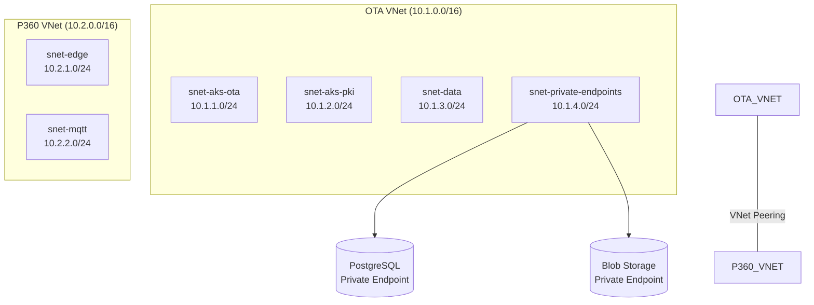

# Module 05: Azure Networking
# மாடுல் 05: Azure Networking (நெட்வொர்க்கிங்)

---

## 🎯 What? | என்ன?

**English:** Terraform to provision Azure networking: VNets, Subnets, NSGs, VNet Peering, Private Endpoints, VPN Gateways — the foundation for all workloads.

**தமிழ்:** Azure networking-ஐ Terraform-ல் provision செய்வது: VNets, Subnets, NSGs, Peering, Private Endpoints — எல்லா workloads-க்கும் foundation.

### Analogy | உதாரணம்
> City planning: VNet = city boundary. Subnets = neighborhoods. NSG = gates between neighborhoods. Peering = highway between cities. Private Endpoint = private back-door entrance.

---

## 📊 TVS Platform Network Design



---

## 🛠️ Full Network Module | Complete Example

```hcl
# modules/networking/variables.tf
variable "project" { type = string }
variable "environment" { type = string }
variable "location" { type = string }
variable "resource_group_name" { type = string }

variable "vnets" {
  type = map(object({
    address_space = list(string)
    subnets = map(object({
      address_prefix    = string
      service_endpoints = optional(list(string), [])
      delegation        = optional(string, null)
    }))
  }))
}

# modules/networking/main.tf
resource "azurerm_virtual_network" "this" {
  for_each            = var.vnets
  name                = "vnet-${var.project}-${each.key}-${var.environment}"
  address_space       = each.value.address_space
  location            = var.location
  resource_group_name = var.resource_group_name

  tags = {
    environment = var.environment
    project     = var.project
  }
}

resource "azurerm_subnet" "this" {
  for_each = { for item in local.flat_subnets : "${item.vnet_key}-${item.subnet_key}" => item }

  name                 = "snet-${each.value.subnet_key}"
  resource_group_name  = var.resource_group_name
  virtual_network_name = azurerm_virtual_network.this[each.value.vnet_key].name
  address_prefixes     = [each.value.address_prefix]
  service_endpoints    = each.value.service_endpoints

  dynamic "delegation" {
    for_each = each.value.delegation != null ? [each.value.delegation] : []
    content {
      name = "delegation"
      service_delegation {
        name = delegation.value
      }
    }
  }
}

locals {
  flat_subnets = flatten([
    for vnet_key, vnet in var.vnets : [
      for subnet_key, subnet in vnet.subnets : {
        vnet_key       = vnet_key
        subnet_key     = subnet_key
        address_prefix = subnet.address_prefix
        service_endpoints = subnet.service_endpoints
        delegation     = subnet.delegation
      }
    ]
  ])
}
```

---

## 🛠️ NSG (Network Security Group)

```hcl
resource "azurerm_network_security_group" "edge" {
  name                = "nsg-edge-${var.environment}"
  location            = var.location
  resource_group_name = var.resource_group_name

  # Allow MQTT from internet (vehicles)
  security_rule {
    name                       = "allow-mqtt"
    priority                   = 100
    direction                  = "Inbound"
    access                     = "Allow"
    protocol                   = "Tcp"
    source_port_range          = "*"
    destination_port_range     = "8883"
    source_address_prefix      = "Internet"
    destination_address_prefix = "*"
  }

  # Allow HTTPS from internet (OTA downloads)
  security_rule {
    name                       = "allow-https"
    priority                   = 200
    direction                  = "Inbound"
    access                     = "Allow"
    protocol                   = "Tcp"
    source_port_range          = "*"
    destination_port_range     = "443"
    source_address_prefix      = "Internet"
    destination_address_prefix = "*"
  }

  # Deny all other inbound
  security_rule {
    name                       = "deny-all-inbound"
    priority                   = 4096
    direction                  = "Inbound"
    access                     = "Deny"
    protocol                   = "*"
    source_port_range          = "*"
    destination_port_range     = "*"
    source_address_prefix      = "*"
    destination_address_prefix = "*"
  }
}

resource "azurerm_subnet_network_security_group_association" "edge" {
  subnet_id                 = azurerm_subnet.this["p360-edge"].id
  network_security_group_id = azurerm_network_security_group.edge.id
}
```

---

## 🛠️ VNet Peering

```hcl
# Bidirectional peering (both sides needed!)
resource "azurerm_virtual_network_peering" "ota_to_p360" {
  name                      = "peer-ota-to-p360"
  resource_group_name       = var.resource_group_name
  virtual_network_name      = azurerm_virtual_network.this["ota"].name
  remote_virtual_network_id = azurerm_virtual_network.this["p360"].id
  allow_forwarded_traffic   = true
}

resource "azurerm_virtual_network_peering" "p360_to_ota" {
  name                      = "peer-p360-to-ota"
  resource_group_name       = var.resource_group_name
  virtual_network_name      = azurerm_virtual_network.this["p360"].name
  remote_virtual_network_id = azurerm_virtual_network.this["ota"].id
  allow_forwarded_traffic   = true
}
```

---

## 🛠️ Private Endpoints (Zero public exposure)

```hcl
# Private Endpoint for PostgreSQL — no public internet access!
resource "azurerm_private_endpoint" "postgres" {
  name                = "pe-postgres-${var.environment}"
  location            = var.location
  resource_group_name = var.resource_group_name
  subnet_id           = azurerm_subnet.this["ota-private-endpoints"].id

  private_service_connection {
    name                           = "psc-postgres"
    private_connection_resource_id = azurerm_postgresql_flexible_server.main.id
    subresource_names              = ["postgresqlServer"]
    is_manual_connection           = false
  }

  private_dns_zone_group {
    name                 = "default"
    private_dns_zone_ids = [azurerm_private_dns_zone.postgres.id]
  }
}

resource "azurerm_private_dns_zone" "postgres" {
  name                = "privatelink.postgres.database.azure.com"
  resource_group_name = var.resource_group_name
}

resource "azurerm_private_dns_zone_virtual_network_link" "postgres" {
  name                  = "link-postgres-ota"
  resource_group_name   = var.resource_group_name
  private_dns_zone_name = azurerm_private_dns_zone.postgres.name
  virtual_network_id    = azurerm_virtual_network.this["ota"].id
}
```

---

## 📋 Cheat Sheet | விரைவு குறிப்பு

```
┌──────────────────────────────────────────────────┐
│       AZURE NETWORKING CHEAT SHEET               │
├──────────────────────────────────────────────────┤
│ COMPONENTS:                                      │
│   VNet          = isolated network boundary      │
│   Subnet        = segment within VNet            │
│   NSG           = firewall rules (allow/deny)    │
│   VNet Peering  = connect 2 VNets (non-transit!) │
│   Private EP    = private access to PaaS         │
│   Private DNS   = name resolution for PE         │
│                                                  │
│ CIDR PLANNING (TVS example):                     │
│   OTA VNet:  10.1.0.0/16 (65k IPs)             │
│   P360 VNet: 10.2.0.0/16 (65k IPs)             │
│   Don't overlap! Peering needs unique CIDRs      │
│                                                  │
│ SECURITY PATTERN:                                │
│   Public-facing: NSG allow specific ports only   │
│   Internal: NSG deny all, allow specific subnets │
│   Data: Private Endpoints (zero public access)   │
│                                                  │
│ PEERING:                                         │
│   Must create BOTH directions                    │
│   Not transitive (A↔B, B↔C ≠ A↔C)              │
│   Same region = free, cross-region = cost        │
└──────────────────────────────────────────────────┘
```

---

## 🎤 Interview Q&A | நேர்முகத் தேர்வு

**Q: How did you design network isolation for TVS OTA platform?**
- Two VNets: OTA (management) + P360 (edge/public-facing)
- VNet peering for cross-VNet communication
- NSG: Only ports 443 and 8883 open on edge VNet
- Private Endpoints: PostgreSQL and Blob never exposed publicly
- VPN Gateway: Admin access only via VPN (no public dashboard)

**Q: Private Endpoint vs Service Endpoint — difference?**
- Service Endpoint: traffic stays on Azure backbone but resource still has public IP
- Private Endpoint: resource gets a PRIVATE IP in your VNet. No public IP at all. More secure.

---

## ✅ Self-Check | சுய மதிப்பீடு

- [ ] VNet + Subnet + NSG provision முடியும்
- [ ] VNet Peering (bidirectional) configure முடியும்
- [ ] Private Endpoint setup முடியும்
- [ ] CIDR planning for multi-VNet design முடியும்
- [ ] NSG rules design முடியும் (least privilege)
