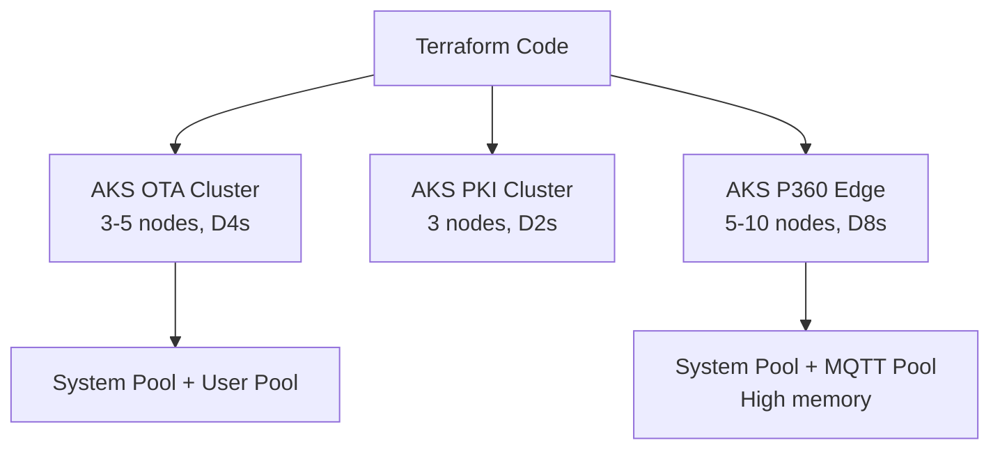

# Module 07: Azure AKS
# மாடுல் 07: Azure AKS (Kubernetes Cluster Provisioning)

---

## 🎯 What? | என்ன?

**English:** Provision production-grade AKS clusters with Terraform — node pools, workload identity, network policies, monitoring, and multi-cluster patterns (like TVS OTA platform).

**தமிழ்:** Production-grade AKS clusters-ஐ Terraform-ல் provision செய்வது — node pools, workload identity, network policies, monitoring.

---

## 📊 TVS-Style Multi-Cluster AKS



---

## 🛠️ Production AKS Cluster

```hcl
resource "azurerm_kubernetes_cluster" "ota" {
  name                = "aks-ota-${var.environment}"
  location            = var.location
  resource_group_name = azurerm_resource_group.main.name
  dns_prefix          = "aks-ota-${var.environment}"
  kubernetes_version  = var.kubernetes_version    # Pin version!

  # --- System Node Pool (control workloads) ---
  default_node_pool {
    name                = "system"
    node_count          = 3
    vm_size             = "Standard_D4s_v3"
    vnet_subnet_id      = azurerm_subnet.aks.id
    zones               = ["1", "2", "3"]          # HA across AZs
    max_pods            = 50
    os_disk_size_gb     = 128
    os_disk_type        = "Managed"
    
    upgrade_settings {
      max_surge = "25%"
    }

    node_labels = {
      "nodepool" = "system"
    }
  }

  # --- Identity (no service principal — use managed identity!) ---
  identity {
    type = "SystemAssigned"
  }

  # --- Networking ---
  network_profile {
    network_plugin    = "azure"         # Azure CNI (not kubenet!)
    network_policy    = "calico"        # Network policies enabled
    load_balancer_sku = "standard"
    service_cidr      = "172.16.0.0/16"
    dns_service_ip    = "172.16.0.10"
  }

  # --- RBAC ---
  azure_active_directory_role_based_access_control {
    azure_rbac_enabled = true
    managed            = true
  }

  # --- Monitoring ---
  oms_agent {
    log_analytics_workspace_id = azurerm_log_analytics_workspace.main.id
  }

  # --- Security ---
  key_vault_secrets_provider {
    secret_rotation_enabled = true
  }

  # --- Maintenance window ---
  maintenance_window {
    allowed {
      day   = "Saturday"
      hours = [2, 3, 4]
    }
  }

  tags = local.common_tags

  lifecycle {
    ignore_changes = [
      default_node_pool[0].node_count  # Ignore if cluster autoscaler changes count
    ]
  }
}
```

---

## 🛠️ Additional Node Pools

```hcl
# User workload pool (larger, for applications)
resource "azurerm_kubernetes_cluster_node_pool" "user" {
  name                  = "user"
  kubernetes_cluster_id = azurerm_kubernetes_cluster.ota.id
  vm_size               = "Standard_D8s_v3"
  node_count            = 3
  min_count             = 2
  max_count             = 10
  enable_auto_scaling   = true           # Cluster autoscaler!
  zones                 = ["1", "2", "3"]
  vnet_subnet_id        = azurerm_subnet.aks.id
  max_pods              = 50

  node_labels = {
    "nodepool"    = "user"
    "workload"    = "application"
  }

  node_taints = []   # No taints — general workloads

  tags = local.common_tags
}

# MQTT pool (high memory for P360 edge cluster)
resource "azurerm_kubernetes_cluster_node_pool" "mqtt" {
  name                  = "mqtt"
  kubernetes_cluster_id = azurerm_kubernetes_cluster.p360.id
  vm_size               = "Standard_E8s_v3"    # Memory-optimized!
  min_count             = 3
  max_count             = 20
  enable_auto_scaling   = true
  zones                 = ["1", "2", "3"]

  node_labels = {
    "nodepool" = "mqtt"
    "workload" = "messaging"
  }

  node_taints = ["workload=mqtt:NoSchedule"]   # Only MQTT pods here

  tags = local.common_tags
}
```

---

## 🛠️ Workload Identity (Pod-level Azure access)

```hcl
# Enable workload identity on cluster
resource "azurerm_kubernetes_cluster" "ota" {
  # ... (above config)
  oidc_issuer_enabled       = true
  workload_identity_enabled = true
}

# User-assigned identity for the app
resource "azurerm_user_assigned_identity" "ota_app" {
  name                = "id-ota-app-${var.environment}"
  resource_group_name = azurerm_resource_group.main.name
  location            = var.location
}

# Federated credential (link K8s SA to Azure identity)
resource "azurerm_federated_identity_credential" "ota_app" {
  name                = "fed-ota-app"
  resource_group_name = azurerm_resource_group.main.name
  parent_id           = azurerm_user_assigned_identity.ota_app.id
  audience            = ["api://AzureADTokenExchange"]
  issuer              = azurerm_kubernetes_cluster.ota.oidc_issuer_url
  subject             = "system:serviceaccount:production:ota-app-sa"
}

# Grant access to Key Vault
resource "azurerm_role_assignment" "kv_access" {
  scope                = azurerm_key_vault.main.id
  role_definition_name = "Key Vault Secrets User"
  principal_id         = azurerm_user_assigned_identity.ota_app.principal_id
}
```

---

## 📋 Cheat Sheet | விரைவு குறிப்பு

```
┌──────────────────────────────────────────────────┐
│         AZURE AKS TERRAFORM CHEAT SHEET          │
├──────────────────────────────────────────────────┤
│ NETWORKING:                                      │
│   Azure CNI     = pod gets VNet IP (recommended) │
│   Kubenet       = pod gets overlay IP (limited)  │
│   network_policy= "calico" (enable NetworkPolicy)│
│                                                  │
│ IDENTITY:                                        │
│   SystemAssigned identity (not service principal)│
│   Workload Identity for pod-level access         │
│   OIDC issuer + federated credential            │
│                                                  │
│ NODE POOLS:                                      │
│   System pool = small, control plane workloads   │
│   User pool   = applications, auto-scaling       │
│   Specialized = GPU, high-memory (taints!)       │
│                                                  │
│ SECURITY HARDENING:                              │
│   ✓ Azure RBAC enabled                          │
│   ✓ Network policy (Calico)                     │
│   ✓ Private cluster (optional, no public API)   │
│   ✓ Key Vault secrets provider                  │
│   ✓ Defender for Containers                     │
│   ✓ Maintenance window (controlled upgrades)    │
│                                                  │
│ LIFECYCLE:                                       │
│   ignore_changes on node_count (autoscaler!)     │
│   Pin kubernetes_version (don't auto-upgrade)    │
└──────────────────────────────────────────────────┘
```

---

## 🎤 Interview Q&A | நேர்முகத் தேர்வு

**Q: How do you design AKS for production?**
- Multiple node pools (system + user + specialized)
- Azure CNI with Calico network policies
- Availability zones (3 AZs for HA)
- Cluster autoscaler (min/max per pool)
- Workload identity (no static credentials)
- Maintenance window (Saturday night upgrades)
- Pinned K8s version (tested before upgrade)

**Q: Private cluster vs public — when?**
- Private: internal apps, compliance requirement, no public API server
- Public: need external access (CI/CD from GitHub, multi-cloud GitOps)
- Compromise: public API + authorized IP ranges

---

## ✅ Self-Check | சுய மதிப்பீடு

- [ ] Production AKS cluster provision முடியும்
- [ ] Multiple node pools with autoscaling configure முடியும்
- [ ] Workload identity setup முடியும்
- [ ] Network profile (CNI + Calico) explain முடியும்
- [ ] Security hardening checklist apply முடியும்
