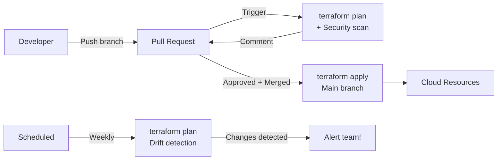

# Module 14: CI/CD for Terraform
# மாடுல் 14: Terraform CI/CD Pipeline

---

## 🎯 What? | என்ன?

**English:** Automate Terraform in CI/CD — plan on PR, apply on merge, drift detection, and GitOps workflows using GitHub Actions, Jenkins, and Atlantis.

**தமிழ்:** Terraform-ஐ CI/CD-ல் automate — PR-ல் plan, merge-ல் apply, drift detection, GitOps workflows.

---

## 📊 Workflow Pattern



---

## 🛠️ GitHub Actions

```yaml
# .github/workflows/terraform.yml
name: Terraform
on:
  pull_request:
    paths: ['terraform/**']
  push:
    branches: [main]
    paths: ['terraform/**']

env:
  TF_VERSION: "1.7.0"
  WORKING_DIR: "terraform/environments/production"

jobs:
  plan:
    if: github.event_name == 'pull_request'
    runs-on: ubuntu-latest
    permissions:
      contents: read
      pull-requests: write
      id-token: write    # For OIDC auth to Azure/GCP
    steps:
    - uses: actions/checkout@v4

    - uses: hashicorp/setup-terraform@v3
      with:
        terraform_version: ${{ env.TF_VERSION }}

    # Azure OIDC login (no secrets stored!)
    - uses: azure/login@v2
      with:
        client-id: ${{ secrets.AZURE_CLIENT_ID }}
        tenant-id: ${{ secrets.AZURE_TENANT_ID }}
        subscription-id: ${{ secrets.AZURE_SUBSCRIPTION_ID }}

    - name: Terraform Init
      working-directory: ${{ env.WORKING_DIR }}
      run: terraform init

    - name: Terraform Plan
      working-directory: ${{ env.WORKING_DIR }}
      run: terraform plan -out=plan.tfplan -no-color
      continue-on-error: true

    # Post plan as PR comment
    - name: Comment Plan
      uses: actions/github-script@v7
      with:
        script: |
          const plan = `${{ steps.plan.outputs.stdout }}`;
          github.rest.issues.createComment({
            issue_number: context.issue.number,
            owner: context.repo.owner,
            repo: context.repo.repo,
            body: `### Terraform Plan\n\`\`\`\n${plan.substring(0, 60000)}\n\`\`\``
          });

    - name: Security Scan
      uses: bridgecrewio/checkov-action@v12
      with:
        directory: ${{ env.WORKING_DIR }}
        framework: terraform

  apply:
    if: github.event_name == 'push' && github.ref == 'refs/heads/main'
    runs-on: ubuntu-latest
    environment: production    # Requires manual approval!
    permissions:
      contents: read
      id-token: write
    steps:
    - uses: actions/checkout@v4
    - uses: hashicorp/setup-terraform@v3
      with:
        terraform_version: ${{ env.TF_VERSION }}
    - uses: azure/login@v2
      with:
        client-id: ${{ secrets.AZURE_CLIENT_ID }}
        tenant-id: ${{ secrets.AZURE_TENANT_ID }}
        subscription-id: ${{ secrets.AZURE_SUBSCRIPTION_ID }}

    - name: Terraform Apply
      working-directory: ${{ env.WORKING_DIR }}
      run: |
        terraform init
        terraform apply -auto-approve

  drift-detection:
    runs-on: ubuntu-latest
    schedule:
      - cron: '0 6 * * 1'    # Every Monday 6 AM
    steps:
    - uses: actions/checkout@v4
    - uses: hashicorp/setup-terraform@v3
    - name: Check Drift
      working-directory: ${{ env.WORKING_DIR }}
      run: |
        terraform init
        terraform plan -detailed-exitcode -no-color
        # Exit code 2 = changes detected (drift!)
```

---

## 🛠️ Jenkins Pipeline

```groovy
// Jenkinsfile
pipeline {
    agent { label 'terraform' }
    
    environment {
        TF_DIR = 'terraform/environments/production'
        ARM_CLIENT_ID     = credentials('azure-client-id')
        ARM_CLIENT_SECRET = credentials('azure-client-secret')
        ARM_TENANT_ID     = credentials('azure-tenant-id')
        ARM_SUBSCRIPTION_ID = credentials('azure-subscription-id')
    }
    
    stages {
        stage('Init') {
            steps {
                dir(env.TF_DIR) {
                    sh 'terraform init'
                }
            }
        }
        
        stage('Plan') {
            steps {
                dir(env.TF_DIR) {
                    sh 'terraform plan -out=plan.tfplan'
                }
            }
        }
        
        stage('Security Scan') {
            steps {
                dir(env.TF_DIR) {
                    sh '''
                        terraform show -json plan.tfplan > plan.json
                        checkov -f plan.json --framework terraform_plan --hard-fail-on HIGH
                    '''
                }
            }
        }
        
        stage('Approve') {
            when { branch 'main' }
            steps {
                input message: 'Apply terraform changes?', ok: 'Apply'
            }
        }
        
        stage('Apply') {
            when { branch 'main' }
            steps {
                dir(env.TF_DIR) {
                    sh 'terraform apply plan.tfplan'
                }
            }
        }
    }
    
    post {
        always {
            archiveArtifacts artifacts: "${env.TF_DIR}/plan.tfplan", fingerprint: true
        }
    }
}
```

---

## 🛠️ Atlantis (GitOps for Terraform)

```yaml
# atlantis.yaml (repo-level config)
version: 3
projects:
- name: production-aks
  dir: terraform/environments/production
  workspace: default
  autoplan:
    when_modified: ["*.tf", "../../modules/**/*.tf"]
    enabled: true
  apply_requirements: [approved, mergeable]

- name: staging-aks
  dir: terraform/environments/staging
  workspace: default
  autoplan:
    enabled: true
  apply_requirements: [mergeable]
```

```
# Usage in PR comments:
# atlantis plan -p production-aks    → runs plan
# atlantis apply -p production-aks   → applies (after approval)
```

---

## 📋 Cheat Sheet | விரைவு குறிப்பு

```
┌──────────────────────────────────────────────────┐
│      TERRAFORM CI/CD CHEAT SHEET                 │
├──────────────────────────────────────────────────┤
│ WORKFLOW:                                        │
│   PR opened → plan + security scan + comment     │
│   PR merged → apply (with approval gate)         │
│   Schedule  → drift detection                    │
│                                                  │
│ AUTH (no long-lived secrets!):                   │
│   Azure: OIDC (Workload Identity Federation)     │
│   GCP:   OIDC (Workload Identity)               │
│   AWS:   OIDC (AssumeRoleWithWebIdentity)        │
│                                                  │
│ TOOLS:                                           │
│   GitHub Actions = simple, native                 │
│   Jenkins        = enterprise, existing infra    │
│   Atlantis       = GitOps, PR-driven, self-host  │
│   Terraform Cloud = managed, Sentinel policies   │
│                                                  │
│ SAFETY:                                          │
│   ✓ Plan saved (-out=plan.tfplan)                │
│   ✓ Apply uses saved plan (exact changes)        │
│   ✓ Manual approval for production               │
│   ✓ Drift detection (weekly scheduled)           │
│   ✓ State lock prevents parallel applies         │
└──────────────────────────────────────────────────┘
```

---

## 🎤 Interview Q&A | நேர்முகத் தேர்வு

**Q: How do you prevent accidental terraform destroy in CI?**
- Saved plan file: `plan -out=plan.tfplan` → `apply plan.tfplan` (only planned changes)
- Environment protection rules (manual approval)
- RBAC: CI service principal has limited permissions (can't delete certain resources)
- `prevent_destroy` lifecycle in critical resources
- `deletion_protection` on databases/clusters

**Q: How to authenticate Terraform in CI without storing secrets?**
- OIDC (OpenID Connect): GitHub/Jenkins gets short-lived token from Azure/GCP
- No long-lived credentials stored anywhere
- Token expires in minutes, automatically rotated

---

## ✅ Self-Check | சுய மதிப்பீடு

- [ ] GitHub Actions terraform workflow write முடியும்
- [ ] OIDC authentication configure முடியும்
- [ ] Drift detection implement முடியும்
- [ ] Atlantis setup explain முடியும்
