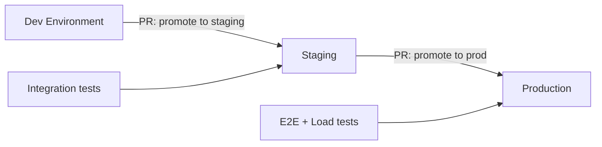

# Module 15: Multi-Environment Patterns
# மாடுல் 15: Multi-Environment Patterns (பல சூழல் முறைகள்)

---

## 🎯 What? | என்ன?

**English:** Strategies for managing dev/staging/production with minimal code duplication — workspaces, directory structure, Terragrunt, and promotion workflows.

**தமிழ்:** dev/staging/production manage செய்ய strategies — code duplication இல்லாமல்.

---

## ⚔️ Approaches Compared

| Approach | DRY | Isolation | Complexity | Best for |
|----------|-----|-----------|------------|----------|
| **Workspaces** | ✅ Same code | ❌ Same backend | Low | Same infra, different scale |
| **Directories** | ❌ Some duplication | ✅ Full isolation | Medium | Different infra per env |
| **Terragrunt** | ✅ Very DRY | ✅ Full isolation | High | Large orgs, many envs |

---

## 🛠️ Directory-Based (Recommended for most teams)

```
terraform/
├── modules/                    # Shared modules
│   ├── networking/
│   ├── aks/
│   └── database/
├── environments/
│   ├── dev/
│   │   ├── main.tf            # Uses modules with dev values
│   │   ├── variables.tf
│   │   ├── terraform.tfvars   # dev-specific values
│   │   └── backend.tf         # dev state file
│   ├── staging/
│   │   ├── main.tf
│   │   ├── terraform.tfvars   # staging values
│   │   └── backend.tf         # staging state file
│   └── production/
│       ├── main.tf            # May have extra resources (WAF, DR)
│       ├── terraform.tfvars
│       └── backend.tf         # production state file
└── global/                     # Shared resources (DNS, IAM)
    └── main.tf
```

```hcl
# environments/production/main.tf
module "networking" {
  source = "../../modules/networking"
  
  environment   = "production"
  address_space = ["10.1.0.0/16"]     # Larger for prod
  # ...
}

module "aks" {
  source = "../../modules/aks"
  
  environment = "production"
  node_count  = 5                      # More nodes for prod
  vm_size     = "Standard_D4s_v3"      # Bigger VMs
  # ...
}
```

```hcl
# environments/dev/main.tf  
module "networking" {
  source = "../../modules/networking"
  
  environment   = "dev"
  address_space = ["10.100.0.0/16"]    # Different CIDR
}

module "aks" {
  source = "../../modules/aks"
  
  environment = "dev"
  node_count  = 2                      # Smaller for dev
  vm_size     = "Standard_D2s_v3"      # Cheaper VMs
}
```

---

## 🛠️ Terragrunt (DRY Wrapper)

```
terraform/
├── modules/
│   └── aks/
├── terragrunt.hcl              # Root config (backend, provider)
└── environments/
    ├── terragrunt.hcl          # Shared env config
    ├── dev/
    │   └── aks/
    │       └── terragrunt.hcl  # dev-specific inputs
    ├── staging/
    │   └── aks/
    │       └── terragrunt.hcl
    └── production/
        └── aks/
            └── terragrunt.hcl
```

```hcl
# environments/production/aks/terragrunt.hcl
include "root" {
  path = find_in_parent_folders()
}

terraform {
  source = "../../../modules/aks"
}

inputs = {
  environment = "production"
  node_count  = 5
  vm_size     = "Standard_D4s_v3"
  subnet_id   = dependency.networking.outputs.subnet_ids["aks"]
}

dependency "networking" {
  config_path = "../networking"
}
```

```hcl
# Root terragrunt.hcl (auto-configure backend per env)
remote_state {
  backend = "azurerm"
  config = {
    resource_group_name  = "rg-terraform-state"
    storage_account_name = "sttfstate"
    container_name       = "tfstate"
    key                  = "${path_relative_to_include()}/terraform.tfstate"
  }
}
```

---

## 🛠️ Promotion Workflow



```yaml
# Promotion via GitHub Actions
# When dev changes are validated → create PR to staging
# When staging validated → create PR to production
name: Promote to Staging
on:
  workflow_dispatch:
  push:
    branches: [main]
    paths: ['terraform/environments/dev/**']
jobs:
  promote:
    runs-on: ubuntu-latest
    steps:
    - name: Create promotion PR
      run: |
        # Copy tfvars changes to staging, create PR
        gh pr create --title "Promote: dev → staging" \
          --body "Auto-promotion after dev validation"
```

---

## 📋 Cheat Sheet | விரைவு குறிப்பு

```
┌──────────────────────────────────────────────────┐
│     MULTI-ENVIRONMENT CHEAT SHEET                │
├──────────────────────────────────────────────────┤
│ DECISION GUIDE:                                  │
│   Small team (1-3 envs) → Directories            │
│   Large org (5+ envs)   → Terragrunt             │
│   Same infra, diff size → Workspaces             │
│                                                  │
│ STATE ISOLATION (critical!):                     │
│   One state file per environment per component   │
│   dev/aks.tfstate ≠ prod/aks.tfstate             │
│   Never share state across environments!         │
│                                                  │
│ CIDR PLANNING:                                   │
│   Dev:     10.100.0.0/16                        │
│   Staging: 10.101.0.0/16                        │
│   Prod:    10.1.0.0/16                          │
│   (Don't overlap if peering needed!)             │
│                                                  │
│ COST OPTIMIZATION:                               │
│   Dev:  smallest VMs, spot, no HA, auto-shutdown │
│   Stg:  medium, test HA config                   │
│   Prod: full size, HA, reserved instances        │
└──────────────────────────────────────────────────┘
```

---

## 🎤 Interview Q&A | நேர்முகத் தேர்வு

**Q: How do you manage 3 environments with Terraform?**
- Directory structure: `environments/{dev,staging,prod}/` each with own state
- Shared modules: `modules/` reused across all environments
- Different values via `.tfvars` (size, count, features)
- CI/CD: separate pipelines per environment, promotion workflow
- State: isolated backends (different state files, same storage account)

**Q: Workspaces vs directories — what do you recommend?**
- Directories: clearer separation, different resources per env possible (prod has WAF, dev doesn't), independent state, easier to reason about
- Workspaces: less duplication but same state backend, harder to review changes, risky (accidentally running in wrong workspace)
- My choice: directories for isolation + modules for DRY

---

## ✅ Self-Check | சுய மதிப்பீடு

- [ ] Directory structure design முடியும்
- [ ] Terragrunt config write முடியும்
- [ ] Promotion workflow explain முடியும்
- [ ] State isolation strategy design முடியும்
