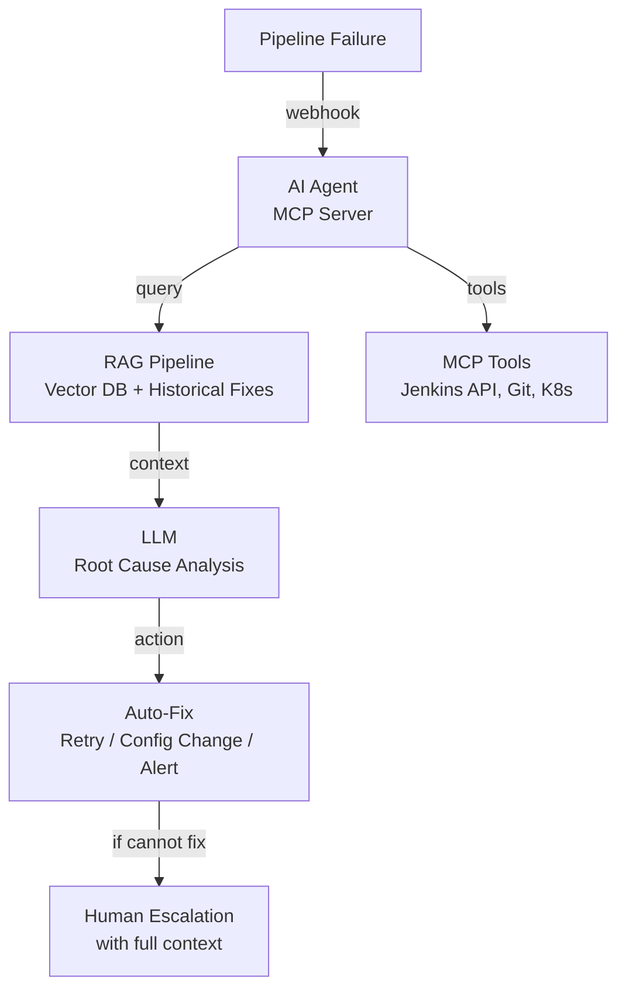

# Real Project: AI Self-Healing Pipeline

## 🏗️ What I Built (Interview Talking Points)

**English:**

Architecting an AI-assisted self-healing framework for CI/CD and CT pipelines. Uses RAG (Retrieval-Augmented Generation), MCP-based tool orchestration, vector embeddings for log similarity, and LLM-driven root cause analysis to automatically diagnose and fix pipeline failures.

**தமிழ்:**

CI/CD மற்றும் CT pipelines-க்கு AI-assisted self-healing framework-ஐ architect செய்கிறேன். RAG (Retrieval-Augmented Generation), MCP-based tool orchestration, log similarity-க்கு vector embeddings, LLM-driven root cause analysis ஆகியவற்றை பயன்படுத்தி pipeline failures-ஐ தானாகவே diagnose செய்து fix செய்யும்.

---

## 📊 Architecture

## 🔑 Infrastructure Decisions

| Decision | Why | Interview Answer |
|----------|-----|------------------|
| Terraform for vector DB infra (PostgreSQL + pgvector) | IaC for AI infrastructure too | "Same IaC principles for AI workloads — reproducible, version-controlled" |
| GKE for AI agents | GPU node pools, auto-scaling | "Separate node pool with GPU for embedding generation" |
| Secret Manager for API keys | LLM API keys secure | "No hardcoded keys — Workload Identity to Secret Manager" |
| Separate state for AI infra | Independent lifecycle from CI/CD infra | "AI platform evolves faster than core infra" |

## 🎤 How to Talk About This

> "I'm building an AI-driven self-healing framework for our CI/CD pipelines. When a build fails, an AI agent (using MCP protocol for tool access) queries a vector database of historical failures and fixes using RAG. The LLM analyzes the failure context and either auto-remediates (retry with fix, config change) or escalates to humans with full root-cause analysis. The infrastructure — vector DB on PostgreSQL+pgvector, GKE pods for agents, Secret Manager for API keys — is all Terraform-managed. Early results show 40% reduction in MTTR for common failure patterns."
