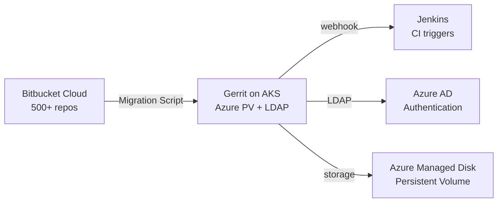

# Real Project: Bitbucket → Gerrit Migration on Azure

## 🏗️ What I Built (Interview Talking Points)

**English:**

Led migration of 500+ repositories from Bitbucket Cloud to self-hosted Gerrit on Azure AKS. Designed the infrastructure (AKS + persistent storage + authentication), migration tooling, and reviewer workflow governance.

**தமிழ்:**

500+ repositories-ஐ Bitbucket Cloud-லிருந்து Azure AKS-ல் self-hosted Gerrit-க்கு migrate செய்தேன். Infrastructure (AKS + persistent storage + authentication), migration tooling, reviewer workflow governance ஆகியவற்றை design செய்தேன்.

---

## 📊 Architecture

## 🔑 Key Terraform Decisions

| Decision | Why | Interview Answer |
|----------|-----|------------------|
| Gerrit on AKS (not VM) | HA, rolling updates, resource governance | "Containerized Gerrit with persistent volumes — survives pod restarts" |
| Azure Managed Disk for Git data | Persistent, snapshotable | "Daily snapshots for disaster recovery, ReadWriteOnce for data integrity" |
| Terraform for AKS + Helm for Gerrit deployment | Separation of concerns | "Infra layer (Terraform) vs app layer (Helm/Argo CD)" |
| LDAP/Azure AD integration | Centralized auth, RBAC | "Single identity across Gerrit + Jenkins + other tools" |
| Separate resource group for SCM tools | Lifecycle isolation | "SCM infra outlives individual project clusters" |

## 🎤 How to Talk About This

> "I led a Bitbucket-to-Gerrit migration for 500+ repos. The key challenge was ensuring zero downtime and maintaining CI integration. I provisioned the target infrastructure on AKS using Terraform — persistent storage for Git repos, Azure AD integration for SSO, and webhook configuration for Jenkins. The migration was scripted (Python + git commands), validated with checksum comparisons, and rolled out team-by-team over 3 weeks."
