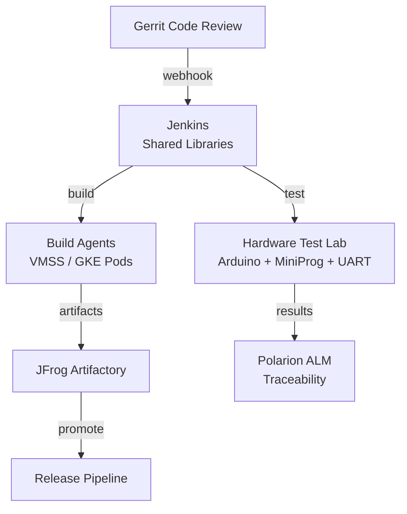

# Real Project: Elektrobit Embedded CI/CT Lab

## 🏗️ What I Built (Interview Talking Points)

**English:**

Architected CI/CD and Continuous Testing infrastructure for embedded automotive SoC programs (AOSP, QNX, AUTOSAR). Managed build environments, hardware-in-the-loop test labs, and release pipelines using Terraform + Ansible on both Azure cloud and on-premises Kubernetes.

**தமிழ்:**

Embedded automotive SoC programs-க்கு (AOSP, QNX, AUTOSAR) CI/CD மற்றும் Continuous Testing infrastructure-ஐ architect செய்தேன். Build environments, hardware-in-the-loop test labs, release pipelines ஆகியவற்றை Terraform + Ansible மூலம் Azure cloud மற்றும் on-premises Kubernetes-ல் நிர்வகித்தேன்.

---

## 📊 Architecture

## 🔑 Key Terraform Decisions

| Decision | Why | Interview Answer |
|----------|-----|------------------|
| VMSS for CI agents (Azure) | Auto-scale based on build queue | "Scale-to-zero on weekends, scale-up during code freeze testing" |
| Terraform for AKS hosting Jenkins/Gerrit | HA, GitOps managed | "Platform services on AKS with Argo CD for app deployment" |
| Separate state per component | Independent lifecycle | "Jenkins infra changes shouldn't risk Gerrit state" |
| Ansible for VM configuration + Terraform for provisioning | Right tool for each job | "Terraform provisions the VM, Ansible configures the build tools" |
| On-prem K8s for hardware labs | Physical device access needed | "Containers can't access USB/UART — we use privileged pods with device mounts" |

## 🎤 How to Talk About This

**When they ask "How do you handle infrastructure for embedded/hardware teams?":**

> "At Elektrobit, I architect CI/CT infrastructure for automotive SoC programs. The challenge is unique — we need both cloud scalability (for massive AOSP builds) and physical hardware access (for flashing SoCs and running CTS/VTS).
>
> I designed a hybrid approach: cloud-based build agents on Azure VMSS (auto-scaling, cost-optimized) provisioned via Terraform, plus on-premises Kubernetes for hardware test labs where pods have privileged access to Arduino power controllers, MiniProg programmers, and UART serial devices.
>
> All infrastructure is code — Terraform for provisioning, Ansible for configuration. The same Terraform modules provision dev and production environments."

## 📋 Terraform Components Used

- `azurerm_linux_virtual_machine_scale_set` — CI build agents
- `azurerm_kubernetes_cluster` — Platform services (Jenkins, Gerrit, monitoring)
- `azurerm_managed_disk` — Build cache storage
- `azurerm_monitor_autoscale_setting` — Queue-based scaling
- `google_container_cluster` — GKE for some workloads
- `google_compute_instance` — Dedicated build hosts
- State management: Separate states per team/component
