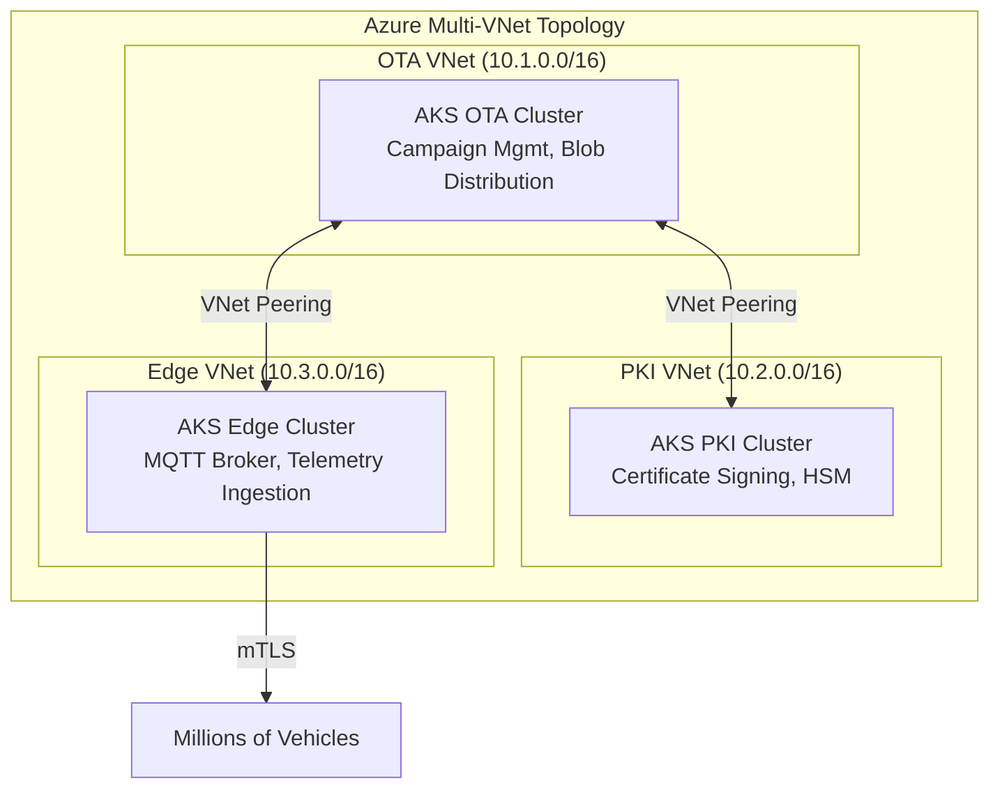

# Real Project: TVS Connected Vehicle & OTA Platform

## 🏗️ What I Built (Interview Talking Points)

**English:**

Architected a 3-cluster Azure AKS platform serving millions of connected two-wheelers (TVS Motor Company). The platform handles Over-The-Air (OTA) firmware updates, real-time MQTT telemetry, and PKI certificate management.

**தமிழ்:**

TVS Motor Company-க்கு millions of connected இரு-சக்கர வாகனங்களுக்கு சேவை செய்யும் 3-cluster Azure AKS platform-ஐ architect செய்தேன். இந்த platform Over-The-Air (OTA) firmware updates, real-time MQTT telemetry, மற்றும் PKI certificate management ஆகியவற்றை கையாளும்.

---

## 📊 Architecture

## 🔑 Key Terraform Decisions

| Decision | Why | What I'd Say in Interview |
|----------|-----|---------------------------|
| 3 separate clusters (not 1 big one) | Blast radius isolation — PKI compromise doesn't affect OTA | "We isolated security-critical PKI from operational OTA workloads" |
| Separate VNets with peering | Network segmentation, NSGs per cluster | "Defense in depth — even if one VNet is compromised, others are protected" |
| Private Endpoints for Blob/PostgreSQL | No public internet exposure | "Zero public endpoints — all traffic stays on Azure backbone" |
| Workload Identity (not Service Principals) | No credential rotation needed, no secrets | "Eliminated long-lived secrets — pod identity federation to Azure AD" |
| Terraform modules per cluster | Reuse across environments, consistent | "Same module, different tfvars — dev/staging/prod consistency" |
| Remote state in Azure Storage with locking | Team collaboration, prevent conflicts | "State file in Storage Account with blob lease locking" |

## 🎤 How to Talk About This

**When they ask "Tell me about a complex infrastructure you designed":**

> "I architected a 3-cluster AKS platform for TVS Motor's connected vehicle program. The platform serves millions of two-wheelers with OTA firmware updates. 
>
> I chose 3 separate clusters with isolated VNets for blast radius containment — PKI operations (HSM-backed certificate signing) were isolated from OTA campaign management and MQTT edge telemetry. 
>
> All provisioned via Terraform with shared modules. Each cluster had its own state file, workload identity for zero-secret access to Azure services, and private endpoints for all data services. 
>
> The entire platform was GitOps-managed — infra changes through PRs, plan on PR, apply on merge."

## 📋 Terraform Components Used

- `azurerm_kubernetes_cluster` — 3 AKS clusters
- `azurerm_virtual_network` + `azurerm_virtual_network_peering` — multi-VNet
- `azurerm_private_endpoint` — Blob, PostgreSQL, Key Vault
- `azurerm_user_assigned_identity` + `azurerm_federated_identity_credential` — Workload Identity
- `azurerm_key_vault` — PKI secrets, TLS certs
- `azurerm_postgresql_flexible_server` — OTA metadata
- `azurerm_storage_account` — firmware packages
- Remote state: `azurerm_storage_account` + `azurerm_storage_container` backend
